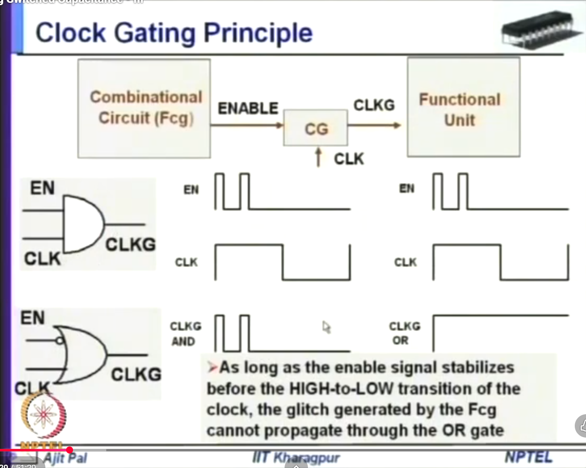
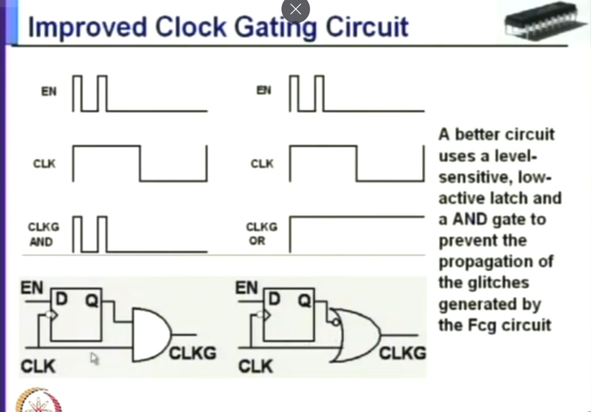
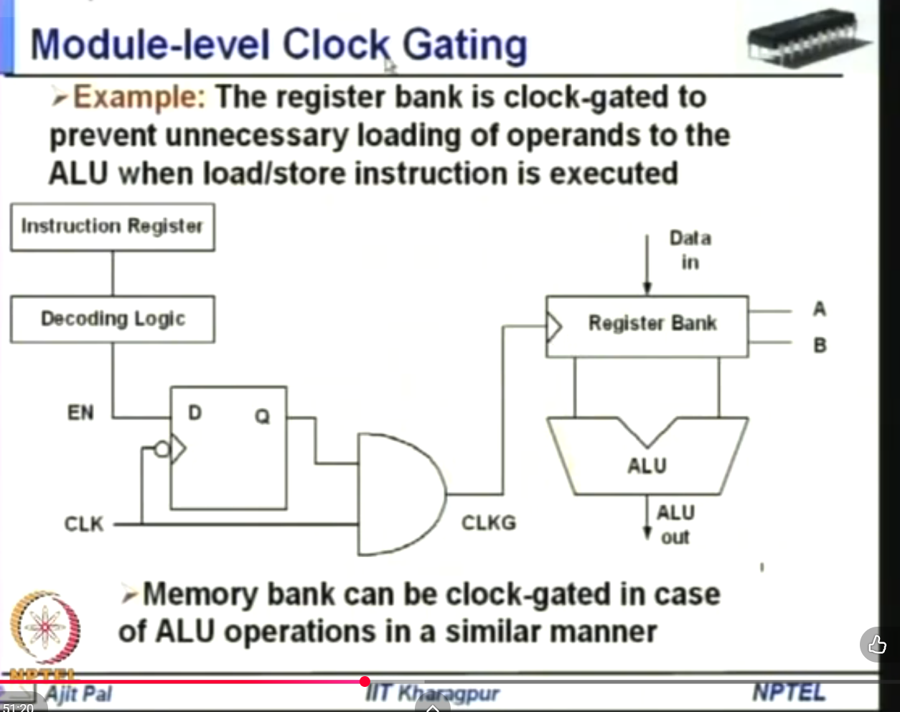
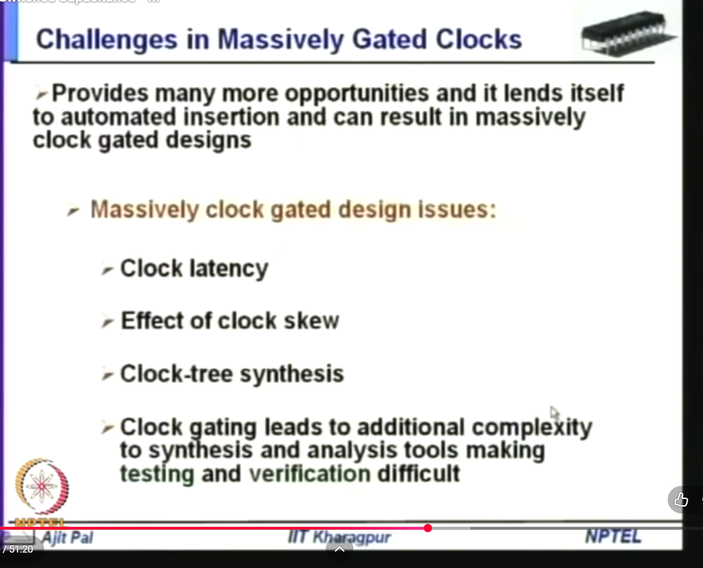
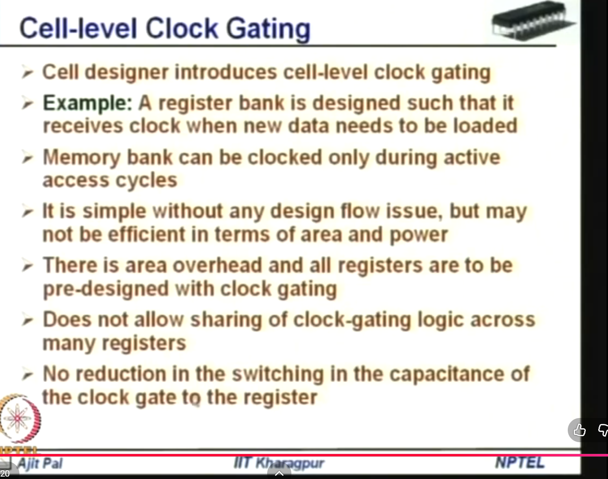
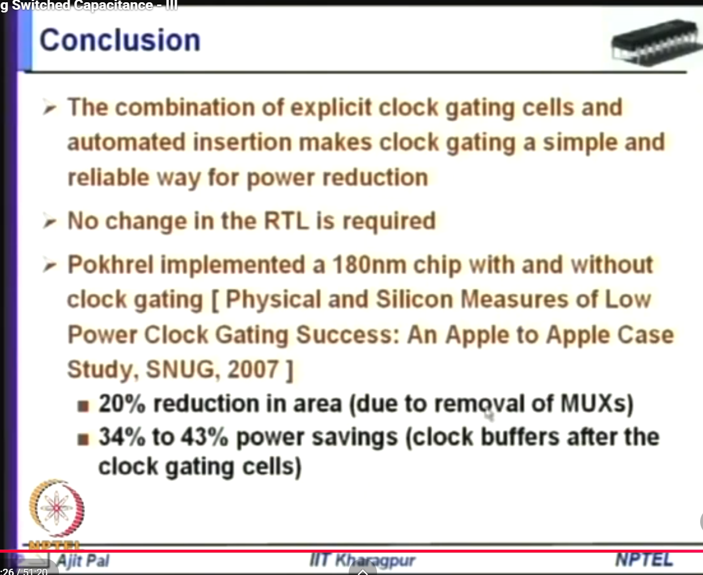

# Clock Gating

This file continues the notes after `reducing switched capacitance.md`.

## Related PPT And Video References

- Local PPT found in this workspace: `PPT/PVL 207 Lec 12 (Minimizing switched Capacitances) [Autosaved].pptx`. Slides 3-18 cover clock gating, including the principle, improved circuit, module-level gating, register-level gating, clock-tree issues, cell-level gating, and conclusion.
- YouTube video reference provided by you for clock gating: https://www.youtube.com/watch?v=5fd9p5cRgVc&list=PLTEh-62_zAfHmJE-pcjgREKiKyPSgjkxj&index=30

## Index

1. [Image 1: Clock gating principle](#image-1-clock-gating-principle)
2. [Why the glitch cannot propagate through the OR gate](#why-the-glitch-cannot-propagate-through-the-or-gate)
3. [What the bubble at the OR input means](#what-the-bubble-at-the-or-input-means)
4. [Image 2: Improved clock gating circuit](#image-2-improved-clock-gating-circuit)
5. [When we say active-low, is it clock or data?](#when-we-say-active-low-is-it-clock-or-data)
6. [Image 3: Module-level clock gating](#image-3-module-level-clock-gating)
7. [Image 4: Challenges in massively gated clocks](#image-4-challenges-in-massively-gated-clocks)
8. [Image 5: Cell-level clock gating](#image-5-cell-level-clock-gating)
9. [Cell-level vs register-level clock gating: deep differences](#cell-level-vs-register-level-clock-gating-deep-differences)
10. [Image 6: Clock gating conclusion](#image-6-clock-gating-conclusion)
11. [Exam answer](#exam-answer)
12. [Sources used](#sources-used)

## Image 1: Clock Gating Principle



### Definition Of Clock Gating

Clock gating is a low-power technique in which the clock signal is blocked from reaching a functional unit when that unit does not need to operate.

In simple form:

```text
if enable = 1:
    pass clock to functional unit

if enable = 0:
    stop clock to functional unit
```

This reduces dynamic power because the clock has high switching activity and drives large capacitance:

```text
P_dynamic = alpha * C * V_DD^2 * f
```

When the clock is gated, switching activity `alpha` is reduced in:

- the clock net
- flip-flop clock pins
- internal register nodes
- downstream combinational logic

### What This Image Shows

The upper diagram shows the clock gating idea:

```text
Combinational circuit Fcg -> ENABLE -> clock gating block -> CLKG -> functional unit
```

Signals:

- `CLK`: original clock
- `ENABLE` or `EN`: signal deciding whether the functional unit should get clock
- `CLKG`: gated clock
- `Fcg`: combinational circuit that generates enable
- `CG`: clock gating circuit

The lower diagrams compare two simple clock gating structures:

1. AND-gate clock gating
2. OR-gate clock gating with an inverted enable input

The slide is warning that enable can contain short glitches because it comes from combinational logic. If the clock gate is designed carelessly, those enable glitches can become false clock pulses.

## Why The Glitch Cannot Propagate Through The OR Gate

### Definition Of Glitch

A glitch is a short unwanted pulse or temporary transition caused by unequal delays in a circuit.

Example:

```text
expected signal:  0 ----------------
actual signal:    0 ---1---0--------
```

The short `1` pulse is a glitch.

### AND-Gate Case

For the AND clock gate:

```text
CLKG = CLK AND EN
```

Truth behavior:

```text
if CLK = 0:
    CLKG = 0

if CLK = 1:
    CLKG = EN
```

So when `CLK` is high, the AND gate output follows `EN`.

That means if `EN` glitches while `CLK = 1`, the glitch can appear at `CLKG`.

This is dangerous because `CLKG` is a clock signal. A narrow glitch on `CLKG` can look like an extra clock pulse to the functional unit.

### OR-Gate Case

The OR gate in the image has a bubble on the `EN` input. That means the OR gate receives inverted enable.

So the equation is:

```text
CLKG = CLK OR (NOT EN)
```

or:

```text
CLKG = CLK + EN_bar
```

Now consider what happens when `CLK = 1`:

```text
CLKG = 1 OR (NOT EN)
CLKG = 1
```

So while the clock is high, the output is forced high no matter what happens on `EN`.

That is why an enable glitch cannot propagate during the high phase of the clock. The OR gate masks it because one OR input is already `1`.

### Why The Slide Says "Before HIGH-To-LOW Transition"

The OR gate output only becomes sensitive to `EN` when the clock goes low.

When:

```text
CLK = 0
```

then:

```text
CLKG = 0 OR (NOT EN)
CLKG = NOT EN
```

So the enable signal must be stable before the clock goes from high to low.

If `EN` is already stable before the falling edge:

- if `EN = 1`, then `NOT EN = 0`, and `CLKG` follows the falling edge of `CLK`
- if `EN = 0`, then `NOT EN = 1`, and `CLKG` stays high

In both cases, no narrow false pulse is produced by a late enable glitch.

But if `EN` changes or glitches while `CLK` is already low, then the OR output can change because:

```text
CLKG = NOT EN
```

So the real rule is:

```text
For OR-based gating, EN glitches are masked while CLK is high, but EN must settle before CLK falls.
```

This is why practical clock gating cells use a latch to hold the enable stable during the unsafe clock phase.

## What The Bubble At The OR Input Means

### Your Question

You asked: if it is active low, why are we inverting? If `EN = 1`, does it become `EN = 0`, and then the OR gate responds to low enable? Or does the bar at the OR input mean `EN = 1` is inverted at the input?

### Correct Inference

The bubble at the OR input means inversion at that input.

So if the external signal is named `EN`, then the OR gate internally sees:

```text
NOT EN
```

The gate equation is:

```text
CLKG = CLK OR (NOT EN)
```

### Truth Table

| EN | NOT EN at OR input | CLK | CLKG | Meaning |
| --- | --- | --- | --- | --- |
| 1 | 0 | 0 | 0 | clock passes low level |
| 1 | 0 | 1 | 1 | clock passes high level |
| 0 | 1 | 0 | 1 | clock is blocked, held high |
| 0 | 1 | 1 | 1 | clock is blocked, held high |

So:

```text
EN = 1 -> NOT EN = 0 -> OR gate passes CLK
EN = 0 -> NOT EN = 1 -> OR gate forces CLKG = 1
```

Therefore, the external `EN` in this drawing is still active-high:

```text
EN = 1 means clock enabled
EN = 0 means clock disabled
```

The OR gate input is active-low because the bubble inverts `EN`.

### Important Point

Do not infer that the OR gate "responds to low enable" in a special way. The OR gate is just a normal OR gate.

The bubble means:

```text
invert this input before OR operation
```

So yes:

```text
EN = 1 becomes 0 at the OR input
```

but that `0` does not block the clock. In an OR gate, `0` is the non-controlling value.

That means:

```text
CLK OR 0 = CLK
```

So `EN = 1` allows the clock to pass.

When:

```text
EN = 0
```

the OR input becomes:

```text
NOT EN = 1
```

and `1` is the controlling value for OR:

```text
CLK OR 1 = 1
```

So the clock is blocked and the gated clock is held high.

### If The Signal Were Truly Active-Low

Sometimes a signal is named like:

```text
EN_bar
EN_N
ENABLE_N
```

That means the external enable itself is active-low.

In that case:

```text
EN_N = 0 means enabled
EN_N = 1 means disabled
```

Then the OR-gate equation can be written as:

```text
CLKG = CLK OR EN_N
```

But in this slide, the signal is drawn as `EN` with a bubble at the OR input. That usually means:

```text
external EN is active-high,
but the OR gate uses inverted EN.
```

### AND Gate Vs OR Gate Summary

AND-gate clock gating:

```text
CLKG = CLK AND EN
EN = 1 -> clock passes
EN = 0 -> CLKG held low
```

OR-gate clock gating with bubble on enable:

```text
CLKG = CLK OR (NOT EN)
EN = 1 -> clock passes
EN = 0 -> CLKG held high
```

Both can pass the clock when `EN = 1`. They differ in which inactive level they force when disabled:

```text
AND gate disabled level = 0
OR gate disabled level  = 1
```

## Image 2: Improved Clock Gating Circuit



### Definition Of Improved Clock Gating Circuit

An improved clock gating circuit is a clock gate that uses a latch before the final logic gate so that the enable signal becomes stable before it is allowed to control the gated clock.

The purpose of the latch is:

```text
sample EN only during the safe clock phase
hold EN constant during the unsafe clock phase
prevent EN glitches from becoming false clock pulses
```

### What This Image Shows

The image shows two improved clock gating circuits:

1. A low-active latch followed by an AND gate.
2. A low-active latch followed by an OR gate with an inverted input.

The waveform at the top shows that `EN` can contain narrow pulses or glitches. The latch prevents those glitches from directly reaching the final clock gate.

### Why A Latch Is Added

The enable signal `EN` is generated by combinational logic. Combinational logic can glitch because different paths have different delays.

If `EN` goes directly into a clock gate:

```text
EN glitch + active clock phase -> false CLKG pulse
```

That is dangerous because a false `CLKG` pulse can incorrectly clock registers in the functional unit.

The latch solves this by storing a stable value of `EN`.

### Low-Active Latch Meaning

The slide says:

```text
level-sensitive, low-active latch
```

This means the latch is transparent when its control input is low.

In this circuit, that control input is the clock level used to control the latch.

So:

```text
CLK = 0 -> latch is open/transparent, Q follows EN
CLK = 1 -> latch is closed/holding, Q keeps old stable EN
```

This is useful for AND-based clock gating because the AND gate is dangerous when `CLK = 1`. During `CLK = 1`, the final output is:

```text
CLKG = CLK AND Q = 1 AND Q = Q
```

So `Q` must not glitch while `CLK = 1`.

The low-active latch guarantees that:

```text
when CLK = 1, latch is closed, so Q is stable
```

### Why This Prevents Glitch Propagation

For the AND version:

```text
CLKG = CLK AND Q
```

During `CLK = 0`:

```text
CLKG = 0
```

Even if `EN` changes and the latch is transparent, the AND output stays `0`.

During `CLK = 1`:

```text
CLKG = Q
```

But now the latch is closed, so `Q` is stable.

Therefore, glitches in `EN` do not propagate as clock glitches.

### OR Version In The Image

For the OR version, the latch output goes into an OR gate input with a bubble. That bubble means the OR gate receives:

```text
NOT Q
```

The equation is:

```text
CLKG = CLK OR (NOT Q)
```

If `Q = 1`, clock is enabled:

```text
CLKG = CLK OR 0 = CLK
```

If `Q = 0`, clock is disabled:

```text
CLKG = CLK OR 1 = 1
```

So again, the external enable is active-high, but the OR gate input is inverted.

### How The Improved OR-Gated Clock Works Step By Step

The improved OR version has two parts:

1. A low-active latch.
2. An OR gate with a bubble on the latch output input.

The latch stores a clean version of `EN`.

Let:

```text
Q = latched enable
```

The OR gate receives:

```text
NOT Q
```

So:

```text
CLKG = CLK OR (NOT Q)
```

### Case 1: Enable Is 1

If the functional unit should receive the clock:

```text
EN = 1
```

During the low phase of clock:

```text
CLK = 0
low-active latch is transparent
Q follows EN
Q = 1
```

When clock later becomes high:

```text
CLK = 1
latch closes
Q stays 1
```

Now the OR gate sees:

```text
NOT Q = 0
```

So:

```text
CLKG = CLK OR 0 = CLK
```

Therefore, when `EN = 1`, the OR-gated clock is not blocked. It transmits the clock.

### Case 2: Enable Is 0

If the functional unit should not receive the clock:

```text
EN = 0
```

During the low phase of clock:

```text
CLK = 0
low-active latch is transparent
Q follows EN
Q = 0
```

When clock later becomes high:

```text
CLK = 1
latch closes
Q stays 0
```

Now the OR gate sees:

```text
NOT Q = 1
```

So:

```text
CLKG = CLK OR 1 = 1
```

That means `CLKG` is held high all the time.

This is still clock gating because no clock edges reach the functional unit.

Clock gating does not always mean:

```text
force gated clock to 0
```

It means:

```text
stop clock transitions
```

The AND version stops transitions by holding `CLKG = 0`.

The OR version stops transitions by holding `CLKG = 1`.

In both cases, the functional unit does not see clock edges.

### Why The OR-Gated Clock Is Useful

The OR-gated clock is useful when the design wants the disabled clock level to be high.

The key point is:

```text
disabled clock = constant value
```

For OR gating:

```text
disabled clock = constant 1
```

Because it is constant, it has no repeated rising and falling transitions.

Since dynamic clock power comes from transitions, this saves power.

### Why The Latch Makes The OR Version Safer

Without the latch, an `EN` glitch could change `NOT EN` when the clock is low, causing an unwanted transition at `CLKG`.

With the latch:

- `EN` is sampled only when `CLK = 0`
- `Q` is held stable when `CLK = 1`
- the final OR gate receives a stable control during the dangerous phase

So the latch prevents combinational glitches from becoming false gated-clock edges.

### Final Intuition

For the improved OR gate:

```text
EN = 1 -> Q = 1 -> NOT Q = 0 -> CLKG = CLK
EN = 0 -> Q = 0 -> NOT Q = 1 -> CLKG = 1 constant
```

So yes, when enabled, it transmits the clock.

When disabled, it holds the clock high and removes clock edges.

## When We Say Active-Low, Is It Clock Or Data?

### Short Answer

In this slide, "low-active latch" refers to the latch control input, not the data input.

So it means:

```text
the latch is active/transparent when its clock or enable control is LOW
```

It does not mean:

```text
data is active-low
```

### Latch Has Two Different Kinds Of Inputs

A latch has:

- `D`: data input
- control input: clock/enable/gate input
- `Q`: stored output

When someone says:

```text
low-active latch
```

they are talking about the control input.

So:

```text
control = 0 -> latch is transparent
control = 1 -> latch holds previous value
```

The data `D` can be either 0 or 1. It is not automatically active-low.

### In This Circuit

The latch data input is:

```text
D = EN
```

The latch control is driven by:

```text
CLK
```

Because the latch is low-active:

```text
CLK = 0 -> Q follows EN
CLK = 1 -> Q holds stable value
```

So the phrase "active-low" refers to:

```text
clock/control level of the latch
```

not:

```text
low value of data
```

### Difference Between Low-Active Latch And Bubble At OR Gate

There are two separate ideas:

1. Low-active latch:

```text
Latch is transparent when CLK/control = 0.
```

2. Bubble at OR input:

```text
OR gate receives NOT Q or NOT EN.
```

Do not mix them.

The latch being low-active tells you when it samples `EN`.

The bubble at the OR gate tells you that the signal is inverted before OR operation.

### What You Should Infer

If you see a bubble on the latch control input:

```text
active-low latch control
transparent when control is 0
```

If you see a bubble on a logic gate input:

```text
that input is inverted before entering the gate
```

If the slide says "low-active latch":

```text
it is talking about the latch's clock/control input
```

If the slide shows a bubble on the OR input:

```text
it is talking about inversion of the enable/latch output before the OR gate
```

## Image 3: Module-Level Clock Gating



### Definition Of Module-Level Clock Gating

Module-level clock gating is a clock gating technique in which the clock to an entire functional block or module is disabled when that block is not needed.

Instead of gating one flip-flop at a time, module-level gating controls the clock of a larger block such as:

- register bank
- ALU input register block
- memory bank
- multiplier unit
- peripheral block

The goal is:

```text
disable a whole idle module so its registers and internal logic stop switching
```

### What This Image Shows

The image shows a processor-style example.

Main blocks:

- `Instruction Register`
- `Decoding Logic`
- enable signal `EN`
- latch
- AND gate clock gate
- gated clock `CLKG`
- `Register Bank`
- `ALU`

The slide says:

```text
The register bank is clock-gated to prevent unnecessary loading of operands to ALU when load/store instruction is executed.
```

It also says memory banks can be clock-gated during ALU operations in a similar way.

### What Are We Clock Gating In This Image?

In this image, we are clock-gating the register bank.

More exactly:

```text
we are gating the clock input of the register bank
```

The gated clock signal is:

```text
CLKG
```

and it goes to the register bank clock input.

So the controlled block is:

```text
Register Bank
```

not the ALU directly.

The ALU is shown because the register bank outputs operands `A` and `B` to the ALU. If the register bank unnecessarily loads new operands, then the ALU inputs may also change, causing extra switching. By gating the register bank clock, we stop unnecessary operand loading.

So the power saving happens in two places:

1. The register bank does not get unnecessary clock edges.
2. The ALU input operands do not unnecessarily change, so ALU internal switching can also reduce.

But the actual clock-gated module drawn in the diagram is:

```text
Register Bank
```

### What Is Not Being Clock-Gated Here?

The diagram does not show the ALU clock being gated.

Actually, many ALUs are mostly combinational logic and may not even have a direct clock input. The registers around the ALU are clocked, but the combinational ALU itself computes whenever its inputs change.

Therefore, in this slide:

```text
clock gating register bank -> prevents unnecessary ALU input changes
```

not:

```text
directly clock gating the ALU
```

### Why Register Bank Clock Gating Is Useful

In a processor, not every instruction uses every hardware block.

For an ALU instruction:

```text
register operands are read and sent to ALU
ALU performs operation
```

But for a load/store instruction, the main activity is memory access.

The ALU may not need new operands from the register bank in the same way, or some operand-loading path may be unnecessary.

If the register bank continues receiving clock unnecessarily:

```text
registers toggle
operand paths switch
ALU inputs may switch
power is wasted
```

Clock gating prevents this.

### How The Circuit Works

1. The instruction register holds the current instruction.
2. The decoding logic identifies the instruction type.
3. If the register bank or ALU operand path is needed, decoding logic generates:

```text
EN = 1
```

4. The latch captures a stable enable value.
5. The AND gate produces:

```text
CLKG = CLK AND latched_EN
```

6. `CLKG` is connected to the register bank clock input.
7. If `latched_EN = 1`, the register bank receives the clock.
8. If `latched_EN = 0`, the register bank clock is stopped.

So:

```text
needed module -> clock passes
idle module   -> clock blocked
```

### Example: Load/Store Instruction

For a load/store instruction:

```text
instruction type = memory operation
register-bank-to-ALU operand loading may not be needed
EN = 0 for that path
CLKG = 0
register bank is not unnecessarily clocked
```

This reduces dynamic power.

### Example: ALU Operation And Memory Bank

The slide also says:

```text
Memory bank can be clock-gated in case of ALU operations.
```

That means if the instruction is an ALU operation:

```text
ADD, SUB, AND, OR, XOR
```

then the memory bank may not be needed.

So:

```text
memory enable = 0
memory clock is gated
memory bank does not switch unnecessarily
```

### Low-Power Meaning

Module-level clock gating reduces switching activity `alpha`.

Since:

```text
P_dynamic = alpha * C * V_DD^2 * f
```

blocking the clock to a large module can save significant power because a module contains many registers and internal capacitances.

### Why It Is Called Module-Level

It is called module-level because the gating is applied to a large functional block, not only to one register.

Comparison:

```text
Register-level gating -> clock gate controls one register or small register group
Module-level gating   -> clock gate controls a whole block/module
```

### Advantages

- can save large power when a whole module is idle
- simple conceptually
- useful in processors and SoCs
- reduces clock tree switching inside the disabled module
- reduces downstream data switching

### Limitations

- the module must have enough idle cycles
- enable signal must be generated correctly
- clock gating must be glitch-free
- timing of enable is important
- verification becomes more complex
- gating a very large block may introduce clock skew or latency issues

## Image 4: Challenges In Massively Gated Clocks



### Definition Of Massively Gated Clocks

Massively gated clocks means a design contains a large number of clock gates inserted across many registers, register groups, modules, and clock-tree branches.

In simple words:

```text
many parts of the chip have their own local clock-enable/clock-gating logic
```

This gives many opportunities to save dynamic power, but it also makes clock design, timing, testing, and verification harder.

### What This Image Shows

The slide says that clock gating gives many more power-saving opportunities and can be inserted automatically by synthesis tools.

But when clock gates are inserted in many places, the design faces issues such as:

- clock latency
- effect of clock skew
- clock-tree synthesis
- added complexity in synthesis and analysis tools
- more difficult testing and verification

### Definition Of Clock Latency

Clock latency is the time taken by the clock signal to travel from the clock source to a clocked element, such as a flip-flop or latch.

Example:

```text
clock source -> buffers -> clock gate -> more buffers -> flip-flop
```

The delay through this path is clock latency.

Clock gates add extra delay because the clock must pass through gating cells.

If different registers receive clocks with different latencies, timing closure becomes harder.

### Definition Of Clock Skew

Clock skew is the difference in arrival time of the clock edge at two different clocked elements.

Example:

```text
Clock reaches FF1 at 1.00 ns
Clock reaches FF2 at 1.15 ns
Clock skew = 0.15 ns
```

Clock skew matters because registers are supposed to operate with a coordinated clock. If some registers see the clock much earlier or later, setup and hold timing can fail.

Clock gating can worsen skew if different gated branches have different gate delays or different clock-tree paths.

### Definition Of Clock-Tree Synthesis

Clock-tree synthesis, or CTS, is the physical design step that builds the clock distribution network.

Its job is to distribute the clock to many registers while controlling:

- clock delay
- clock skew
- clock transition time
- clock power
- clock gating placement

Clock gating affects CTS because the clock tree must now include clock gating cells, their fanout, their placement, and their timing constraints.

### Why Automated Clock Gating Creates Many Opportunities

Synthesis tools can automatically detect registers or blocks that do not need to update in some cycles.

Then they can insert clock gates automatically.

This is useful because:

```text
more gated registers -> less unnecessary clock switching -> lower dynamic power
```

But if this happens everywhere, the design becomes massively clock gated.

### Why It Becomes Difficult

Clock is not an ordinary data signal. It controls when the whole chip updates.

So adding many gates into the clock network creates risks:

1. The gated clock must be glitch-free.
2. Enable signals must arrive at the right time.
3. Clock latency must be managed.
4. Clock skew must be controlled.
5. Test tools must still be able to control and observe registers.
6. Static timing analysis must check both clock paths and enable paths.

### Testing And Verification Problem

Clock gating can hide registers during test if the clock is disabled.

During scan testing or debug, tools may need to force clocks active even when functional enable is off.

That means clock gating cells often need test controls such as:

```text
test enable
scan enable
clock gate override
```

Without these, some registers may not be testable.

### Exam Answer

Massively gated clocks provide many opportunities for power reduction because unnecessary clock switching can be suppressed in many parts of the chip. However, inserting many clock gates creates design challenges. Clock latency increases because clock gates add delay. Clock skew becomes harder to control because different clock paths may pass through different gating cells. Clock-tree synthesis becomes more complex because gating cells must be placed and balanced correctly. Testing and verification also become harder because gated clocks may prevent registers from being clocked during test unless special test-enable controls are added.

## Image 5: Cell-Level Clock Gating



### Definition Of Cell-Level Clock Gating

Cell-level clock gating is a clock gating method in which the gating capability is built directly into a cell or macro by the cell designer.

In simple words:

```text
the register, register bank, memory bank, or special cell is pre-designed with internal clock gating
```

So instead of the synthesis tool adding a separate clock gate outside the block, the cell itself contains the clock-gating structure.

### What This Image Shows

The slide says:

- cell designer introduces cell-level clock gating
- a register bank can be designed so that it receives clock only when new data needs to be loaded
- a memory bank can be clocked only during active access cycles
- it is simple from design flow point of view
- it may not be efficient in area and power
- all registers must be pre-designed with clock gating
- clock-gating logic cannot be shared across many registers
- there may be no reduction in switching capacitance from the clock gate to the register

### Why It Is Simple

Cell-level clock gating is simple because the clock gating is already inside the library cell or macro.

The designer can instantiate the cell and use its enable pin.

For example:

```text
register_bank_with_enable
memory_macro_with_clock_enable
integrated_clock_gated_register
```

This avoids manually adding separate latch-plus-gate structures in RTL or synthesis.

### Why It May Be Inefficient

If each register or small cell has its own internal gating logic, the design may contain many repeated gating circuits.

That can increase:

- area
- input capacitance
- internal switching power
- clock pin capacitance
- library complexity

The slide also says clock-gating logic cannot be shared across many registers. This means many cells may each contain their own gating hardware, instead of one shared clock gate driving a group of registers.

### Important Point About "No Reduction In Switching From Clock Gate To Register"

In cell-level gating, the clock may still reach the cell boundary or internal clock-gating part of the register.

So the capacitance before the internal gate may still switch.

The saving happens only after the internal gating point.

That is why the slide says there is no reduction in switching in the capacitance of the clock gate to the register.

In simpler words:

```text
clock still travels up to the cell's internal gate
only the internal register clocking is stopped after that point
```

So the power saved may be less than a shared external gate placed earlier in the clock tree.

## Cell-Level Vs Register-Level Clock Gating: Deep Differences

### Definition Of Register-Level Clock Gating

Register-level clock gating is a method where the clock to one register or a group of registers is gated using a clock gating cell inserted outside the register.

Usually:

```text
one integrated clock gate -> drives many flip-flops/registers
```

The gating condition is generated by RTL, synthesis, or sequential analysis.

### Definition Of Cell-Level Clock Gating

Cell-level clock gating means the gating is already built inside the cell or macro.

Usually:

```text
each register/macro has its own internal clock-gating support
```

### 1. Location Of Clock Gate

Register-level clock gating:

```text
clock gate is outside the register
```

The gate is inserted in the clock path before the clock reaches the register or register group.

Cell-level clock gating:

```text
clock gate is inside the cell
```

The clock enters the cell, and gating happens internally.

Main difference:

```text
register-level gates before the register;
cell-level gates inside the register/macro.
```

### 2. Sharing Of Gating Logic

Register-level clock gating can share one clock gate across many registers.

Example:

```text
one clock gate -> 32 flip-flops
```

Cell-level clock gating usually cannot share gating logic across cells because each cell has its own internal gating circuit.

This is why the slide says:

```text
Does not allow sharing of clock-gating logic across many registers.
```

### 3. Area Overhead

Register-level clock gating can be area-efficient when one gate controls many registers.

Cell-level clock gating can have higher area overhead because gating hardware may be repeated inside many cells.

Example:

```text
register-level: 1 gate for 32 registers
cell-level: gating structure repeated in many registers
```

### 4. Power Saving Point

Register-level clock gating can stop the clock before it reaches a group of registers.

That saves switching in:

- downstream clock wires
- register clock pins
- internal register clock nodes

Cell-level clock gating may still allow the clock to reach the cell before it is gated internally.

So it may not save the capacitance from the clock source to the cell.

This is the meaning of:

```text
No reduction in switching in the capacitance of the clock gate to the register.
```

### 5. Design Flow Complexity

Register-level clock gating requires synthesis and timing tools to insert, place, and verify clock gates.

This can create design-flow issues:

- clock-gate insertion
- enable timing checks
- clock-tree synthesis constraints
- test-enable handling

Cell-level clock gating is simpler from a design-flow perspective because the gating is pre-built into the cell.

The designer mostly uses the cell interface.

### 6. Flexibility

Register-level clock gating is more flexible because synthesis tools can choose where to insert gates and how many registers to group.

Cell-level clock gating is less flexible because the gating structure is fixed by the cell designer.

If the cell was not designed with clock gating, you cannot easily add internal gating later.

### 7. Granularity

Register-level clock gating usually works at the level of:

- one register
- a group of registers
- register bank section

Cell-level clock gating works at the level of:

- individual library cell
- special register cell
- memory macro
- custom register bank cell

So cell-level gating is tied to the granularity provided by the cell library.

### 8. Automation

Register-level clock gating is often automatically inserted by synthesis tools.

The tool can detect enable conditions and replace a recirculating mux/register enable structure with a clock gate.

Cell-level clock gating depends on the availability of special cells already designed by the library/cell designer.

The automation is more about selecting the special cell, not inventing new internal gating.

### 9. Timing And Skew Impact

Register-level clock gating affects the clock tree externally. It must be handled carefully in clock-tree synthesis because the gate delay and placement affect clock latency and skew.

Cell-level clock gating hides some gating details inside the cell, but the cell still has timing arcs and constraints. The external clock tree may be simpler, but the cell itself has internal timing behavior.

So:

```text
register-level: more CTS-visible gating structure
cell-level: more library-cell-dependent timing behavior
```

### 10. Testability

Register-level clock gating usually requires explicit test-enable or scan-enable controls so that scan testing can force the gated clock active.

Cell-level clock gating must also support test mode, but this support must be built into the cell or macro.

If the cell-level design does not include proper test bypass, testing becomes difficult.

### 11. Best Use Case

Register-level clock gating is best when many registers share the same enable condition.

Example:

```text
one enable controls a 64-bit register bank
```

Cell-level clock gating is best when a macro naturally knows when it is active.

Example:

```text
memory bank clocked only during read/write access
custom register bank with built-in load enable
```

### 12. Power Efficiency

Register-level clock gating can be more power-efficient when it gates the clock early and shares one gate across many registers.

Cell-level clock gating can be less power-efficient if many internal gates are duplicated and the clock still switches up to each cell.

But cell-level gating can be good when the cell designer optimizes the internal circuit carefully.

### 13. Summary Table

| Point | Register-Level Clock Gating | Cell-Level Clock Gating |
| --- | --- | --- |
| Gate location | Outside register/register group | Inside cell or macro |
| Sharing | One gate can drive many registers | Usually no sharing across cells |
| Area | Lower if shared | Higher if repeated in many cells |
| Power saving | Can stop clock before register group | Saves only after internal gating point |
| Clock wire saving | Better if gate is placed earlier | Less for clock path up to cell |
| Design flow | Needs synthesis/CTS handling | Simpler to instantiate |
| Flexibility | More flexible | Fixed by cell design |
| Automation | Synthesis can insert gates | Requires pre-designed cells |
| Timing | Clock gate visible to CTS | Timing hidden in library cell arcs |
| Test | Needs test-enable handling | Test support must be built into cell |
| Best for | Shared enables across many registers | Custom registers/memories/macros |
| Main drawback | CTS/skew/verification complexity | Area/power overhead and less sharing |

### Exam Answer

Register-level clock gating inserts a clock gate outside a register or group of registers, so one gating circuit can be shared by many registers. It can save clock wire and register clock-pin switching, but it creates clock-tree synthesis, skew, latency, and verification issues. Cell-level clock gating is built into the cell or macro by the cell designer. It is simple from a design-flow point of view, but every register or macro must be pre-designed with gating, the gating logic may not be shared across many registers, and the clock may still switch up to the cell. Therefore, cell-level gating is simpler but may be less efficient in area and power, while register-level gating is more flexible and often more power-efficient when many registers share the same enable.

## Image 6: Clock Gating Conclusion



### Definition Of Explicit Clock Gating Cell

An explicit clock gating cell is a library cell specifically designed to gate a clock safely.

It usually contains:

- latch-based enable control
- glitch-free gating logic
- timing arcs for synthesis and timing analysis
- test-enable support

The slide says that using explicit clock-gating cells together with automated insertion makes clock gating reliable and practical.

### What This Image Shows

The slide concludes:

- explicit clock-gating cells plus automated insertion make clock gating simple and reliable
- no RTL change may be required
- a 180 nm chip case study compared designs with and without clock gating
- area reduced by about 20 percent due to removal of muxes
- power saving was about 34 percent to 43 percent in clock buffers after the clock gating cells

### Meaning Of "Explicit Clock Gating Cells"

Explicit clock gating cells means the design uses standard library cells made specifically for clock gating.

These cells are not ordinary random AND/OR gates. They are designed for clock paths.

They normally include:

```text
latch + clock gate + test enable support
```

This is important because clock gating must be glitch-free. A normal combinational gate can create false clock pulses if the enable signal changes at a bad time.

So the slide's meaning is:

```text
use proper clock-gating cells, not random logic gates, for reliable low-power clock gating
```

### Meaning Of "Automated Insertion"

Automated insertion means the synthesis tool automatically inserts clock-gating cells where it detects enable conditions.

For example, RTL may describe a register like this:

```text
if enable:
    q <= d
else:
    q <= q
```

The synthesis tool can recognize:

```text
this register does not need a clock when enable = 0
```

Then it can replace the recirculating mux structure with a clock gate.

So the designer may not manually draw every clock gate. The tool can insert many of them automatically.

### Why No RTL Change Is Required

The slide says:

```text
No change in the RTL is required
```

This means the RTL can still be written using normal enable-style register code.

Example:

```text
always_ff @(posedge clk) begin
    if (en)
        q <= d;
end
```

The RTL does not need to explicitly instantiate a clock gate.

The synthesis tool can transform this into a clock-gated implementation.

So:

```text
RTL behavior remains same
gate-level implementation changes
```

That is why clock gating can be added without rewriting the functional RTL.

### Why Removal Of MUXs Can Reduce Area

Before clock gating, a load-enabled register is often implemented using a feedback mux:

```text
if load = 1:
    register gets new data
else:
    register reloads old data through mux feedback
```

That mux costs area and power.

Clock gating can replace this structure:

```text
if load = 1:
    clock reaches register
else:
    clock is stopped
```

So the recirculating mux can be removed in some designs.

That is why the slide says:

```text
20 percent reduction in area due to removal of MUXs
```

### Why Power Savings Are Seen In Clock Buffers

Clock buffers after a clock-gating cell switch only when the gated clock is active.

If the block is idle:

```text
clock gate blocks clock
downstream clock buffers do not toggle
register clock pins do not toggle
```

So the clock tree after the gate consumes less dynamic power.

That is why the slide reports:

```text
34 percent to 43 percent power savings in clock buffers after clock gating cells
```

### Why The Slide Says "After The Clock Gating Cells"

The power saving is mainly in the part of the clock tree after the clock gate.

Before the clock gate:

```text
main clock network still toggles
```

After the clock gate:

```text
clock toggles only when enable is active
```

So if a clock gate disables a block, the downstream clock buffers and register clock pins stop switching.

That is why the measured saving is described as:

```text
clock buffers after the clock gating cells
```

The buffers before the gate may still switch because they carry the main clock.

### Why Area Can Reduce Even Though Clock Gates Are Added

At first it may look strange:

```text
adding clock-gating cells should increase area
```

But if clock gating lets the tool remove many recirculating muxes, the mux area saved can be larger than the area added by clock-gating cells.

So area can reduce when:

```text
area removed by mux removal > area added by clock gates
```

This is what the slide means by 20 percent area reduction due to removal of muxes.

### Important Exam Interpretation

The conclusion is not saying clock gating is free.

It is saying clock gating becomes practical when:

- proper library clock-gating cells are used
- synthesis tools insert them automatically
- test and timing support are handled
- the removed muxes and reduced clock switching compensate for overhead

### Exam Answer

Clock gating is effective when explicit clock-gating cells are used with automated insertion by synthesis tools. It can reduce power without changing RTL because tools can replace enable-mux register structures with clock gates. Removing recirculating muxes can reduce area, and stopping the clock after clock-gating cells reduces switching in downstream clock buffers and registers. However, the design must still handle clock latency, skew, CTS, testability, and verification.

## Exam Answer

Clock gating reduces dynamic power by preventing the clock from reaching idle functional units. In simple AND-based gating, `CLKG = CLK AND EN`; when `CLK` is high, any glitch on `EN` can propagate to `CLKG`, creating a false clock pulse. In OR-based gating with an inverted enable input, `CLKG = CLK OR NOT(EN)`. During the high phase of the clock, `CLKG` is forced high regardless of `EN`, so enable glitches are masked. If `EN` stabilizes before the high-to-low transition of `CLK`, no false pulse appears at the gated clock output. The improved circuit adds a low-active latch before the gate. Low-active means the latch is transparent when its clock/control input is low; it does not mean the data input is active-low. The latch samples `EN` during the safe low phase and holds it stable during the high phase, preventing glitches from propagating to the gated clock. In module-level clock gating, an entire block such as a register bank, ALU path, or memory bank is clock-gated when it is not required by the current instruction. In massively gated designs, clock gating saves more power but creates challenges in clock latency, clock skew, clock-tree synthesis, testing, and verification. Register-level clock gating inserts gates outside registers and can share one gate across many registers. Cell-level clock gating builds the gate into the cell itself, which simplifies usage but may increase area and reduce sharing. Explicit clock-gating cells and automated insertion make clock gating practical and can reduce mux area and downstream clock-buffer power.

## Sources Used

- Local slide deck: `PPT/PVL 207 Lec 12 (Minimizing switched Capacitances) [Autosaved].pptx`
- NPTEL course page, Low Power VLSI Circuits & Systems, IIT Kharagpur: https://nptel.ac.in/courses/106105034
- YouTube video reference provided by user for clock gating: https://www.youtube.com/watch?v=5fd9p5cRgVc&list=PLTEh-62_zAfHmJE-pcjgREKiKyPSgjkxj&index=30
- YouTube video reference provided by user, playlist index 29: https://www.youtube.com/watch?v=t64bIY20X4M&list=PLTEh-62_zAfHmJE-pcjgREKiKyPSgjkxj&index=29
