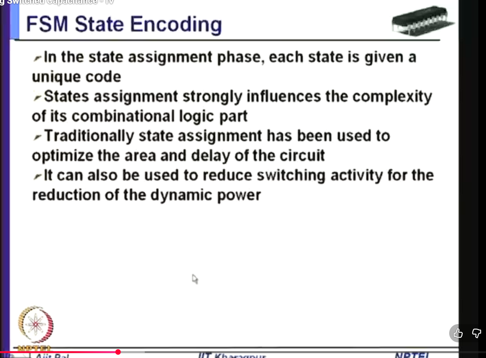
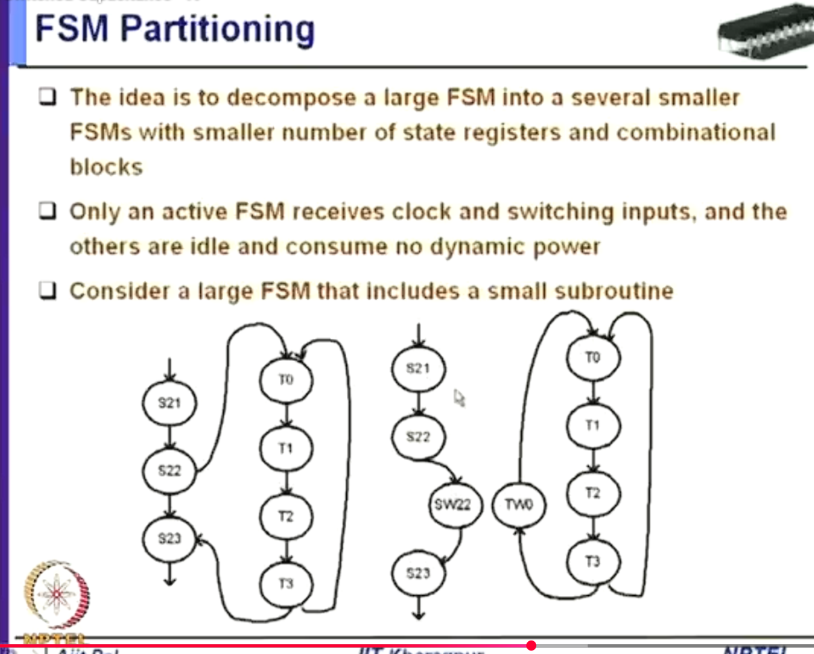
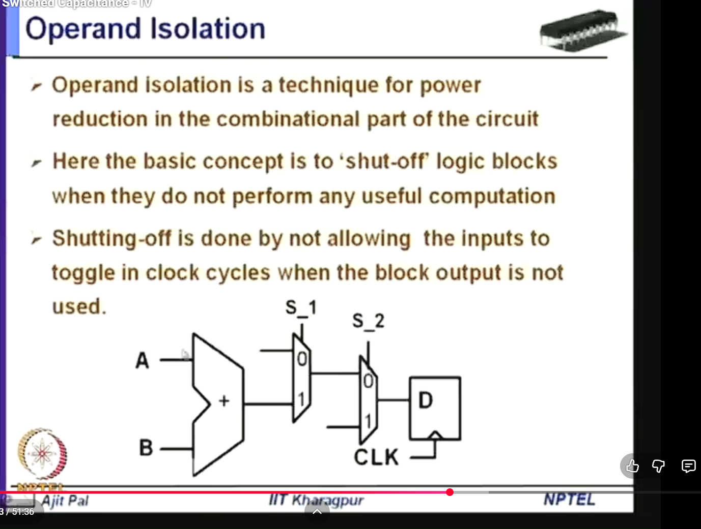
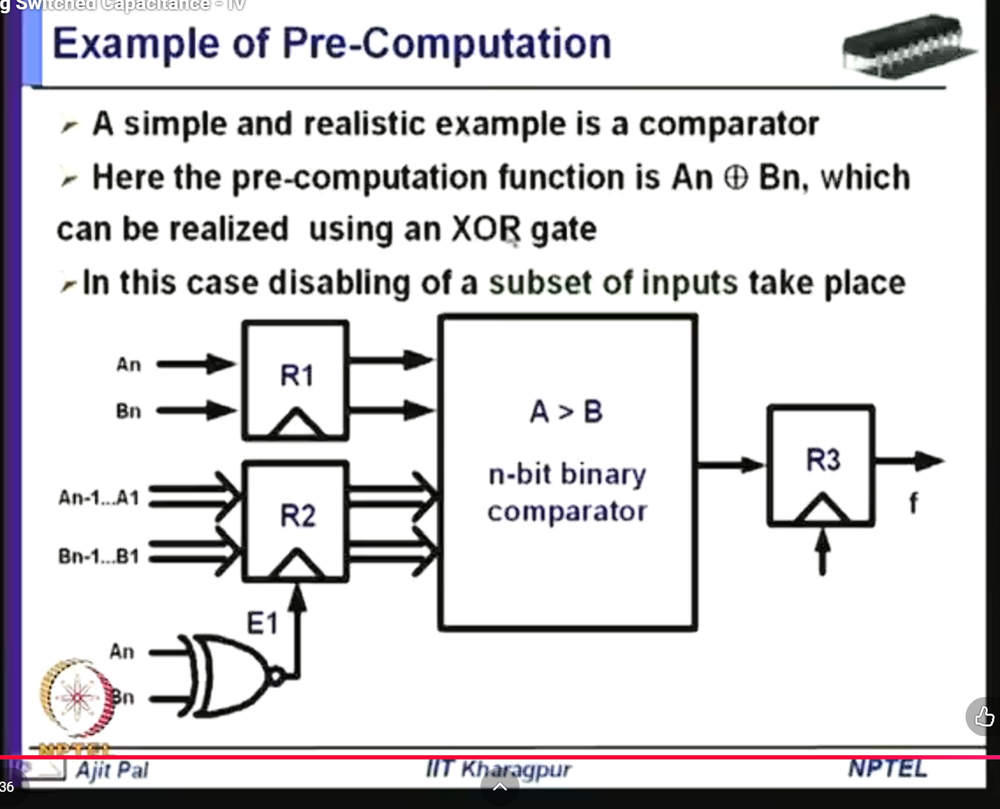
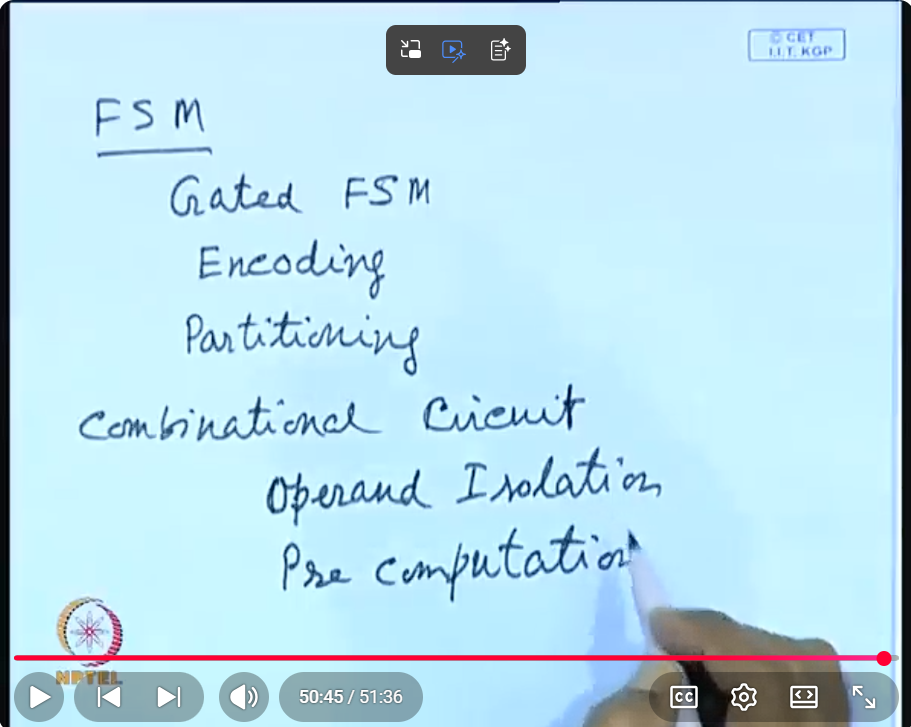

# FSM

This file continues the low-power notes for finite state machines.

## Related PPT And Video References

- Local PPT found in this workspace: `PPT/PVL 207 Lec 13 (Minimizing Switched capacitances) [Autosaved].pptx`. Slides 3-17 cover clock-gated FSM, FSM partitioning, operand isolation, and pre-computation.
- YouTube video reference provided by you for FSM/combinational low-power techniques: https://www.youtube.com/watch?v=cNsHV9rsCzE&list=PLTEh-62_zAfHmJE-pcjgREKiKyPSgjkxj&index=30

## Index

1. [Image 1: FSM state encoding](#image-1-fsm-state-encoding)
2. [Image 2: FSM partitioning](#image-2-fsm-partitioning)
3. [Image 3: Operand isolation](#image-3-operand-isolation)
4. [Image 4: Pre-computation comparator example](#image-4-pre-computation-comparator-example)
5. [Image 5: Summary of FSM and combinational low-power techniques](#image-5-summary-of-fsm-and-combinational-low-power-techniques)
6. [Final conclusion image summary](#final-conclusion-image-summary)
7. [Combined exam answer](#combined-exam-answer)
8. [Sources used](#sources-used)

## Image 1: FSM State Encoding



### Definition Of FSM

An FSM, or finite state machine, is a sequential circuit that moves between a finite number of states based on inputs and the present state.

An FSM usually contains:

- state register
- next-state combinational logic
- output combinational logic

Basic structure:

```text
present state + inputs -> next-state logic -> next state
present state + inputs -> output logic     -> outputs
```

The state register stores the current state.

### Definition Of FSM State Encoding

FSM state encoding is the process of assigning a unique binary code to each state of the finite state machine.

Example:

```text
S0 -> 00
S1 -> 01
S2 -> 10
S3 -> 11
```

Each symbolic state must get a code so that the hardware can store and process it using flip-flops.

### What This Image Shows

The slide says:

- during state assignment, each state is given a unique code
- state assignment strongly influences the complexity of the combinational logic part
- traditionally, state assignment is used to optimize area and delay
- state assignment can also reduce switching activity
- reducing switching activity reduces dynamic power

### Why Each State Needs A Unique Code

An FSM designer may draw states symbolically:

```text
IDLE
READ
WRITE
DONE
```

But actual hardware cannot store words like `IDLE` directly.

Hardware stores bits.

So each state must be encoded:

```text
IDLE  -> 00
READ  -> 01
WRITE -> 10
DONE  -> 11
```

The state register then stores these bits.

If there are `N` states, the minimum number of state bits for compact binary encoding is:

```text
ceil(log2(N))
```

Example:

```text
4 states -> 2 bits
8 states -> 3 bits
16 states -> 4 bits
```

### Why State Assignment Affects Combinational Logic

The next-state logic and output logic depend on state bits.

If we choose one encoding, the Boolean equations may be simple.

If we choose another encoding, the Boolean equations may be more complex.

Example:

```text
Encoding A may produce simple equations with fewer gates.
Encoding B may produce larger equations with more gates.
```

So state encoding affects:

- area
- delay
- number of gates
- fanout
- switching activity
- power

That is why the slide says state assignment strongly influences the combinational logic part.

### Traditional Goal: Area And Delay

Traditionally, FSM state assignment was used to optimize:

```text
area
delay
```

Area means how much hardware is needed.

Delay means how fast the FSM can compute the next state and outputs.

If encoding reduces the complexity of the next-state logic, fewer gates may be needed, and the critical path may become shorter.

### Low-Power Goal: Reduce Switching Activity

For low power, state encoding can also be chosen to reduce switching.

Dynamic power is:

```text
P_dynamic = alpha * C * V_DD^2 * f
```

State encoding mainly targets:

```text
alpha
```

the switching activity.

If common state transitions change fewer bits, the state register and the logic driven by state bits switch less.

### Example: Bad Encoding Vs Low-Power Encoding

Suppose an FSM frequently moves like this:

```text
S0 -> S1 -> S2 -> S3 -> S0
```

One encoding:

```text
S0 = 00
S1 = 01
S2 = 10
S3 = 11
```

Transitions:

```text
00 -> 01 : 1 bit changes
01 -> 10 : 2 bits change
10 -> 11 : 1 bit changes
11 -> 00 : 2 bits change
```

Another encoding:

```text
S0 = 00
S1 = 01
S2 = 11
S3 = 10
```

Transitions:

```text
00 -> 01 : 1 bit changes
01 -> 11 : 1 bit changes
11 -> 10 : 1 bit changes
10 -> 00 : 1 bit changes
```

The second encoding is Gray-like. It reduces bit changes for this sequence.

### Why Fewer State Bit Transitions Save Power

State bits drive:

- state register outputs
- next-state logic inputs
- output logic inputs
- sometimes control signals across the datapath

If state bits toggle less:

```text
state register switching reduces
next-state logic switching reduces
output logic switching may reduce
glitches may reduce
```

So low-power state encoding can reduce dynamic power in more than just the state flip-flops.

### Common FSM Encoding Styles

Binary encoding:

```text
uses minimum number of flip-flops
may create more complex combinational logic
```

One-hot encoding:

```text
uses one flip-flop per state
simple decoding
often fast
may use more registers
```

Gray encoding:

```text
adjacent/frequent transitions differ by one bit
good for reducing switching activity
```

Low-power custom encoding:

```text
assigns codes based on transition probabilities
frequent transitions get small Hamming distance
```

### Important Term: Hamming Distance

Hamming distance is the number of bit positions that differ between two binary codes.

Example:

```text
00 and 01 -> Hamming distance = 1
00 and 11 -> Hamming distance = 2
```

For low-power FSM encoding:

```text
frequent transition -> assign low Hamming distance
rare transition     -> can tolerate higher Hamming distance
```

### How To Design Low-Power State Encoding

1. Find the FSM state transition graph.
2. Identify which transitions happen most often.
3. Assign codes so frequent transitions have small Hamming distance.
4. Check that next-state and output logic do not become too complex.
5. Compare power, area, and delay.

The goal is not only fewer state-bit transitions. The final design must still be good in:

- area
- delay
- power
- verification simplicity

### Tradeoff

Low-power state encoding may reduce switching but increase logic complexity.

Example:

```text
encoding reduces state-register toggles
but increases next-state logic gates
```

If the extra combinational logic switches a lot, total power may not reduce.

So the best encoding depends on the full circuit.

### Short Exam Answer For This Image

FSM state encoding is the process of assigning a unique binary code to each state of a finite state machine. The chosen state assignment strongly affects the next-state and output combinational logic, so it influences area and delay. For low-power design, state encoding can also reduce switching activity by assigning codes with small Hamming distance to frequently occurring transitions. Since dynamic power is proportional to `alpha*C*V_DD^2*f`, reducing state-bit transitions reduces switching activity and hence dynamic power. However, the encoding must be chosen carefully because reducing switching in the state register may increase combinational logic complexity.

## Image 2: FSM Partitioning



### Definition Of FSM Partitioning

FSM partitioning means decomposing one large finite state machine into two or more smaller FSMs, also called sub-FSMs, so that only the required part is active at a given time.

In low-power design, the purpose is:

```text
large FSM -> several smaller FSMs
only active sub-FSM gets clock/input switching
inactive sub-FSMs stay idle
dynamic power reduces
```

The key idea is not only to make the diagram neat. The real low-power reason is that switching activity is reduced.

Dynamic power is:

```text
P_dynamic = alpha * C * V_DD^2 * f
```

FSM partitioning mainly tries to reduce:

```text
alpha = switching activity
C     = effective switched capacitance of the active logic
```

If a sub-FSM is not being used, its state register does not need to receive clock edges, and its next-state logic does not need to receive changing inputs. So that inactive part ideally contributes no dynamic switching power during that time.

Practical note: the slide says the idle FSMs consume no dynamic power. That is the ideal low-power explanation. In real silicon, there can still be leakage power and small overhead from the clock-gating/control logic.

### What This Image Shows

The slide says:

- a large FSM can be decomposed into several smaller FSMs
- each smaller FSM has fewer state registers and smaller combinational blocks
- only the active FSM receives clock and switching inputs
- inactive FSMs are idle
- this is useful when a large FSM contains a small subroutine

The bottom diagram is showing a large FSM that contains a small internal routine:

```text
main states:       S21 -> S22 -> S23
subroutine states: T0  -> T1  -> T2  -> T3
```

Before partitioning, the main FSM and the subroutine are part of one big state-transition graph.

After partitioning, the design is separated into:

```text
main FSM
subroutine FSM
activation/control logic between them
```

The main FSM runs normally. When it reaches the point where the subroutine is needed, it enables the subroutine FSM. The subroutine FSM then runs through `T0`, `T1`, `T2`, and `T3`. When the subroutine finishes, it returns control to the main FSM.

### What Is Being Decomposed

The decomposition is done on the FSM state-transition graph.

A normal FSM has:

```text
state register
next-state logic
output logic
```

After partitioning, we may have:

```text
main state register
main next-state/output logic

sub-FSM state register
sub-FSM next-state/output logic

enable/call/return control logic
```

So the original large state register and combinational logic are split into smaller blocks.

### How The Partitioned FSM Works

Step-by-step:

1. The main FSM is active.
2. The subroutine FSM is inactive, so its clock can be gated.
3. The main FSM reaches a state where the subroutine is required.
4. The main FSM asserts a start/enable signal for the subroutine FSM.
5. The subroutine FSM receives clock and input signals.
6. The subroutine FSM transitions through its internal states.
7. When the subroutine is complete, it asserts a done/return signal.
8. The subroutine FSM is disabled again.
9. The main FSM resumes from the correct next state.

Simple view:

```text
main FSM active     sub-FSM off
main calls sub-FSM  sub-FSM on
sub-FSM finishes    sub-FSM off
main FSM resumes    main FSM on
```

This is why the slide uses the word subroutine. It is similar to a software subroutine call, but implemented in hardware state machines.

### Based On What Conditions Will We Decompose An FSM?

You decompose an FSM when the state-transition graph has natural groups of states that do not all need to be active at the same time.

The main conditions are:

| Condition | Why It Supports Partitioning |
|---|---|
| Clear subroutine exists | A group like `T0 -> T1 -> T2 -> T3` can be separated from the main controller. |
| Only one part is active at a time | If main FSM and sub-FSM are mutually exclusive, the inactive part can be clock-gated. |
| Few entry points into a group | It is easier to enable the sub-FSM if control enters through one or a few states. |
| Few exit points from a group | Return logic stays simple if the sub-FSM exits through one or a few states. |
| Many transitions inside the group | A tightly connected group is worth keeping as a separate sub-FSM. |
| Few transitions between groups | Too many cross-transitions would create heavy control overhead. |
| One group has low duty cycle | If a subroutine runs rarely, it can stay idle most of the time and save power. |
| Different state groups use different inputs | Inputs to idle groups can be disabled, reducing switching in combinational logic. |
| Different groups control different outputs | Output logic can be localized instead of making one large always-active block. |
| Large FSM has high state-register switching | Splitting can reduce the number of active state bits switching per cycle. |
| Large FSM has large next-state logic | Smaller combinational blocks can switch less and may be easier to optimize. |
| Power saved is larger than overhead | Extra enable, call, return, and gating logic must not cost more than it saves. |

The most important exam line is:

```text
Partition when the FSM contains clusters of states with high internal activity,
few transitions between clusters, and only one cluster needs to be active at a time.
```

This condition is also found in low-power FSM literature: the power saved by partitioning depends strongly on how well strongly connected states are clustered together and how much power overhead is paid when moving from one sub-FSM to another.

### What "Only Active FSM Receives Clock And Switching Inputs" Means

It means the active sub-FSM gets:

```text
clock
changing input signals
state updates
output activity
```

Inactive sub-FSMs are held still by:

```text
clock gating
input gating
holding state registers
disabling local combinational activity
```

If the inactive FSM's clock is stopped, its state register does not toggle. If its inputs are also held stable, its next-state logic does not glitch or switch unnecessarily.

That reduces power because:

```text
no clock edge -> no state register toggle
stable inputs -> less combinational switching
less switching -> lower alpha
lower alpha -> lower dynamic power
```

### Why This Reduces State Registers And Combinational Blocks

A single large FSM may require many state bits and a large next-state function.

Example:

```text
large FSM with many states
state bits drive one large next-state logic network
many signals can switch every cycle
```

After partitioning:

```text
main FSM has fewer states
subroutine FSM has fewer states
only one smaller network is active at a time
```

So the active capacitance can be smaller.

This does not always mean the total chip area becomes smaller. Sometimes partitioning adds control logic and extra registers. The power saving comes from reducing switching during operation, not necessarily from reducing total transistor count.

### Why A Small Subroutine Is A Good Candidate

The slide specifically says:

```text
Consider a large FSM that includes a small subroutine
```

This is a good candidate because the subroutine may be used only occasionally.

If the subroutine remains inside the large FSM:

```text
the full controller logic remains active all the time
```

If the subroutine is separated:

```text
subroutine FSM is active only when called
main FSM can wait or reduce activity during subroutine execution
```

So a rarely used subroutine can be kept quiet most of the time.

### How To Read The Diagram

Left side:

```text
S21 -> S22 -> S23
```

This is the main flow of the FSM.

Middle/right side:

```text
T0 -> T1 -> T2 -> T3
```

This is the subroutine-like part.

The curved arrows show that the main FSM can enter the subroutine and later return.

After partitioning, the call/return behavior is handled using interface states or control signals.

You can understand it as:

```text
S22 calls subroutine
subroutine starts at T0
subroutine completes at T3
control returns to main FSM near S23
```

The exact names in the slide are less important than the structure:

```text
main controller + subroutine controller + enable/return interface
```

### Why This Is Similar To Clock Gating

FSM partitioning is often combined with clock gating.

Clock gating asks:

```text
Which register block should receive the clock?
```

FSM partitioning asks:

```text
Can the controller be split so that only one controller block needs the clock?
```

So partitioning creates the opportunity for clock gating.

Without partitioning, there may be one big FSM that is always clocked.

With partitioning:

```text
main FSM clock enable = 1 when main is active
sub-FSM clock enable  = 1 when subroutine is active
```

Inactive FSMs can have their clocks disabled.

### Important Tradeoffs

FSM partitioning is useful, but it has costs.

| Advantage | Cost/Risk |
|---|---|
| Reduces switching activity | Adds enable/call/return control logic |
| Lets inactive FSMs be clock-gated | Clock-gating logic must be glitch-free |
| Smaller active combinational logic | Total area may increase |
| Can reduce dynamic power | Leakage may still remain |
| May simplify local logic | Verification becomes more complex |
| Good for rarely used subroutines | Too many partitions can add overhead |

So the designer must check:

```text
power saving > partitioning overhead
```

If the sub-FSM is used almost every cycle, partitioning may not save much. If the boundary between two groups has many transitions, partitioning may create too much communication/control overhead.

### Short Exam Answer For This Image

FSM partitioning is a low-power technique in which a large FSM is decomposed into smaller sub-FSMs. Only the active sub-FSM receives the clock and switching inputs, while inactive sub-FSMs are idle or clock-gated, reducing dynamic power. It is most useful when the FSM has natural clusters of states, such as a small subroutine, with many internal transitions and few transitions to other state groups. The technique reduces switching activity in state registers and next-state logic, but it adds control overhead for enable, call, return, and verification.

## Image 3: Operand Isolation



### Definition Of Operand Isolation

Operand isolation is a low-power technique where the inputs, or operands, of a combinational logic block are prevented from toggling when the output of that block is not needed.

Simple meaning:

```text
if a logic block's result will not be used,
do not let its inputs keep switching
```

It is called operand isolation because the operands going into the functional unit are isolated from unnecessary transitions.

This is different from clock gating:

```text
clock gating       -> stops clock switching in sequential elements
operand isolation  -> stops data/input switching in combinational logic
```

Both reduce dynamic power, but they attack different parts of the circuit.

### What This Image Shows

The slide says:

- operand isolation reduces power in the combinational part of the circuit
- the basic idea is to shut off logic blocks when they do not perform useful computation
- shut-off is done by not allowing inputs to toggle in clock cycles where the block output is not used
- the diagram shows an arithmetic block, multiplexers controlled by select signals, and a register

The combinational block in the diagram receives operands:

```text
A
B
```

and performs an operation such as addition:

```text
A + B
```

But there may be cycles where this adder result is not selected by the later logic. In those cycles, allowing `A` and `B` to keep toggling wastes power inside the adder.

### Why Combinational Logic Wastes Power Even If Output Is Not Used

Combinational logic has no clock input, but it still consumes dynamic power when its internal nodes switch.

Example:

```text
A changes
B changes
adder internal carries change
adder sum bits change
```

Even if the final adder result is ignored by a multiplexer later, the adder has already switched internally.

So the mistake is:

```text
"output not used" does not automatically mean "logic did not consume power"
```

Operand isolation fixes this by preventing the input changes from entering the unused block.

### How Operand Isolation Works

The usual implementation adds isolation logic at the input of the combinational block.

Common isolation elements:

```text
multiplexers
AND gates
OR gates
latches
input holding registers
```

When the block is useful:

```text
isolation disabled
real operands pass into the block
block computes normally
```

When the block is not useful:

```text
isolation enabled
block inputs are forced to constant values
or held at previous values
block internal nodes stop toggling
```

The power saving comes from reducing switching activity:

```text
P_dynamic = alpha * C * V_DD^2 * f
```

Operand isolation reduces:

```text
alpha
```

because fewer internal nodes toggle.

### How To Read The Diagram

The diagram contains:

```text
A, B inputs
combinational arithmetic block
S_1 controlled mux
S_2 controlled mux
D register
CLK
```

The important idea is that the mux/select logic decides whether the result of the arithmetic block is needed by the downstream register.

If the downstream register is not going to load the arithmetic result, then toggling inside the arithmetic block is useless. The control signals can therefore isolate the block from changing operands.

Conceptually:

```text
result needed     -> pass A and B into adder
result not needed -> keep adder inputs stable
```

### What Does "Shut Off Logic Blocks" Mean Here?

In this slide, "shut off" does not necessarily mean power gating or removing the supply voltage.

It usually means:

```text
do not allow switching activity to enter the block
```

The logic block may still be physically powered, but if its inputs are held constant, its internal gates do not keep switching. So dynamic power reduces.

This is why operand isolation is often called an input-gating technique.

### When Should Operand Isolation Be Used?

Operand isolation is useful when:

| Condition | Explanation |
|---|---|
| The block is large | Large adders, multipliers, comparators, shifters, and ALUs have high switched capacitance. |
| The block is often unused | If the output is ignored for many cycles, isolating it can save power. |
| Input activity is high | Frequently changing operands cause many internal transitions. |
| The isolation control is already known | If select/enable signals already indicate whether the result is used, isolation is easy. |
| Isolation overhead is small | Added muxes/gates must consume less power than the logic they quiet. |

Operand isolation is usually not worth it for very small blocks, because the extra mux/gate overhead may be larger than the saved power.

### Cost And Limitation

Operand isolation adds extra hardware.

Costs:

```text
extra muxes/gates
extra delay on input paths
extra area
extra control logic
```

So the designer must compare:

```text
power saved inside isolated block
versus
power/delay/area added by isolation logic
```

This matches the low-power datapath literature: operand isolation can reduce redundant switching in datapath modules, but the isolation circuitry itself has delay, power, and area overhead.

### Short Exam Answer For This Image

Operand isolation is a low-power technique used in the combinational part of a circuit. It prevents operands from toggling at the inputs of a logic block when that block's output is not required. Since combinational gates consume dynamic power whenever internal nodes switch, holding unused block inputs stable reduces switching activity and hence dynamic power. The technique is useful for large datapath blocks such as adders, multipliers, comparators, and ALUs, but the extra isolation muxes or gates must not introduce excessive area, delay, or power overhead.

## Image 4: Pre-Computation Comparator Example



### Definition Of Pre-Computation

Pre-computation is a low-power sequential logic technique where a small amount of logic predicts or determines the output early for some input conditions. If the output can be determined early, part of the original larger logic can be disabled in the next cycle.

Simple meaning:

```text
use a small helper function to decide early
whether the large logic block is needed
```

If the large block is not needed:

```text
disable some inputs
reduce internal switching
save dynamic power
```

Classic pre-computation research describes it as computing output values for a subset of input conditions one clock cycle before they are required, so the main logic can have much lower switching activity in the succeeding cycle.

### What This Image Shows

The slide gives a comparator example.

The main block is:

```text
n-bit binary comparator
```

Its output is:

```text
f = 1 if A > B
```

The inputs are divided into:

```text
most significant bits: An, Bn
remaining lower bits: An-1...A1, Bn-1...B1
```

The slide says the pre-computation function is:

```text
An XOR Bn
```

This can be built using an XOR gate.

### Why An XOR Bn Is Useful For A Comparator

For binary comparison, the most significant bit has the highest priority.

If:

```text
An = 1 and Bn = 0
```

then:

```text
A > B
```

No lower bits are needed.

If:

```text
An = 0 and Bn = 1
```

then:

```text
A < B
```

Again, no lower bits are needed.

So when the most significant bits are different, the comparator result is already decided.

That condition is:

```text
An XOR Bn = 1
```

Meaning:

```text
MSBs are different
lower bits are irrelevant
```

### When Are Lower Bits Needed?

Lower bits are needed only when the most significant bits are equal.

That condition is:

```text
An XOR Bn = 0
```

Meaning:

```text
An = Bn
```

Then the MSB cannot decide the comparison, so the comparator must inspect:

```text
An-1...A1
Bn-1...B1
```

So the rule is:

| Condition | Meaning | Lower Bits Needed? |
|---|---|---|
| `An XOR Bn = 1` | MSBs differ | No |
| `An XOR Bn = 0` | MSBs equal | Yes |

This is why the slide says disabling of a subset of inputs takes place.

The subset being disabled is:

```text
lower-bit inputs through R2
```

### How The Circuit Works

The diagram has:

```text
R1 -> stores/passes MSB inputs An and Bn
R2 -> stores/passes lower-bit inputs
n-bit comparator -> checks A > B
R3 -> stores final comparator output f
XOR logic -> pre-computation/control signal
```

Step-by-step:

1. `An` and `Bn` are checked by the XOR gate.
2. If `An XOR Bn = 1`, the MSBs are different.
3. The final comparison can be decided from only `An` and `Bn`.
4. Therefore the lower-bit inputs do not need to toggle inside the comparator.
5. The control signal disables `R2` or blocks the lower-bit input path.
6. If `An XOR Bn = 0`, the MSBs are equal.
7. The lower bits are required, so `R2` is enabled and the comparator receives the lower-bit inputs.

### Why The Slide May Show A Bubble Near The XOR Output

The bubble means inversion.

The raw pre-computation condition is:

```text
An XOR Bn
```

But the enable for the lower-bit register `R2` should be active when lower bits are needed.

Lower bits are needed when:

```text
An XOR Bn = 0
```

So the enable can be:

```text
E1 = NOT(An XOR Bn)
```

That means:

```text
E1 = 1 -> MSBs equal, enable lower bits
E1 = 0 -> MSBs differ, disable lower bits
```

So if you see an XOR followed by a bubble, infer that the circuit is generating an equality-like enable for the lower-bit register/path.

### Is It XOR Or XNOR In The Latest Image?

Both appear, depending on exactly which signal you are naming.

The gate shape is an XOR gate:

```text
An XOR Bn
```

But the output has a bubble, and a bubble means inversion. So the signal after the bubble is:

```text
NOT(An XOR Bn)
```

That is the same as:

```text
An XNOR Bn
```

So the correct interpretation is:

```text
inside the gate: XOR
after the output bubble: XNOR
E1 = An XNOR Bn
```

Why does this make sense?

`E1` enables the lower-bit register/path `R2`. The lower bits are needed only when the MSBs are equal:

```text
An = Bn
```

Equality is detected by XNOR:

```text
An XNOR Bn = 1 when An and Bn are equal
```

So the slide text says the pre-computation function is `An XOR Bn`, but the enable signal `E1` drawn after the bubble is effectively `An XNOR Bn`.

### Why This Saves Power

An n-bit comparator can have many internal gates. If all input bits switch every cycle, the comparator internal nodes also switch.

But in many cases, the MSB alone decides the result.

When:

```text
An != Bn
```

the lower bits cannot change the answer.

So switching the lower-bit comparator logic is redundant.

By disabling the lower input subset, the circuit reduces:

```text
unnecessary lower-bit switching
internal comparator switching
dynamic power
```

Again, the power equation is:

```text
P_dynamic = alpha * C * V_DD^2 * f
```

Pre-computation reduces `alpha` by preventing unnecessary switching in the large logic block.

### Relation To Operand Isolation

Pre-computation and operand isolation are closely related.

Operand isolation says:

```text
if block output is not needed, stop its inputs from switching
```

Pre-computation says:

```text
use a small logic function to know early whether the big block, or part of it, is needed
```

So pre-computation often creates the control signal used for operand isolation.

In this comparator:

```text
pre-computation function: An XOR Bn
isolation target: lower-bit comparator input path
```

### When Is Pre-Computation Useful?

Pre-computation is useful when:

| Condition | Explanation |
|---|---|
| A small input subset can decide the output often | Example: MSBs decide many comparator outcomes. |
| The helper logic is much smaller than the main logic | XOR/equality logic must be cheaper than switching the full comparator. |
| The disable condition occurs frequently | If lower bits are almost always needed, savings are small. |
| The disabled part has high capacitance | Large lower-bit datapaths offer more power saving. |
| Timing overhead is acceptable | The pre-computation logic must not hurt the critical path badly. |
| Control timing is safe | The enable must arrive early enough to block switching correctly. |

### Short Exam Answer For This Image

Pre-computation is a low-power technique in which a small logic function determines early whether a larger logic block, or part of it, needs to be active. In the comparator example, the function `An XOR Bn` checks whether the most significant bits of `A` and `B` differ. If `An XOR Bn = 1`, the MSBs already decide whether `A > B`, so the lower-bit inputs can be disabled. If `An XOR Bn = 0`, the MSBs are equal and the lower bits are needed. This reduces switching activity inside the comparator and therefore reduces dynamic power.

## Image 5: Summary Of FSM And Combinational Low-Power Techniques



### What This Image Shows

This handwritten summary groups the techniques from this part of the lecture into two broad areas:

```text
FSM techniques:
1. Gated FSM
2. Encoding
3. Partitioning

Combinational-circuit techniques:
1. Operand isolation
2. Pre-computation
```

This is a useful exam map. It tells you which method applies to which part of the circuit.

### FSM-Side Techniques

FSM techniques mainly target the controller.

The controller contains:

```text
state register
next-state logic
output/control logic
```

Low-power FSM design tries to reduce switching in these parts.

#### 1. Gated FSM

A gated FSM disables the clock or input switching of an FSM when that FSM is idle.

Meaning:

```text
FSM active -> receives clock and inputs
FSM idle   -> clock/input activity is stopped
```

This is closely related to clock gating. If the state machine does not need to change state, there is no benefit in toggling its state register.

#### 2. FSM Encoding

FSM encoding assigns binary codes to states.

Low-power encoding tries to make frequent transitions have low Hamming distance.

Example:

```text
frequent transition S0 -> S1
choose codes that differ by 1 bit
```

This reduces state-register switching and can reduce switching in logic driven by state bits.

#### 3. FSM Partitioning

FSM partitioning splits one large FSM into smaller FSMs.

Meaning:

```text
large FSM -> main FSM + sub-FSMs
```

Only the active FSM receives the clock and switching inputs. The inactive FSMs remain idle. This is useful when the FSM has natural subroutines or separate modes.

### Combinational-Circuit Techniques

Combinational-circuit techniques mainly target datapath logic.

Datapath blocks include:

```text
adders
multipliers
comparators
shifters
ALUs
mux networks
```

These blocks do not need a clock to consume dynamic power. They consume dynamic power whenever their inputs change and internal nodes toggle.

#### 1. Operand Isolation

Operand isolation stops unnecessary input transitions from entering a combinational block.

Meaning:

```text
block result needed     -> pass operands
block result not needed -> hold/block operands
```

The logic stays powered, but its inputs are stable, so internal switching reduces.

#### 2. Pre-Computation

Pre-computation uses a small helper function to decide early whether a large block, or a subset of its inputs, needs to be active.

In the comparator example:

```text
helper function = An XOR Bn
```

If the MSBs differ, the lower bits are not required, so lower-bit switching can be disabled.

### Difference Between FSM Techniques And Combinational Techniques

| Point | FSM Techniques | Combinational Techniques |
|---|---|---|
| Main target | Controller/state logic | Datapath/combinational blocks |
| Main switching source | State register and control logic | Data inputs and internal gate nodes |
| Common methods | gated FSM, encoding, partitioning | operand isolation, pre-computation |
| Main control idea | Stop idle states/FSMs from switching | Stop unused operands/logic from switching |
| Example | inactive sub-FSM gets no clock | unused adder inputs are held stable |
| Power term reduced | mainly `alpha`, sometimes active `C` | mainly `alpha`, sometimes active `C` |

### Best Way To Remember

Use this classification:

```text
Controller power reduction:
FSM gating, FSM encoding, FSM partitioning

Datapath/combinational power reduction:
operand isolation, pre-computation
```

If the question is about state transitions, state bits, or sub-FSMs, think FSM technique.

If the question is about adders, comparators, ALUs, or unnecessary operands, think combinational-circuit technique.

### Short Exam Answer For This Image

The lecture groups low-power techniques into FSM techniques and combinational-circuit techniques. FSM techniques such as gated FSM, state encoding, and partitioning reduce switching in state registers, next-state logic, and controller outputs. Combinational techniques such as operand isolation and pre-computation reduce switching inside datapath logic by preventing unused inputs or unnecessary lower-level logic from toggling. Both categories reduce dynamic power by reducing switching activity in `P_dynamic = alpha*C*V_DD^2*f`.

## Final Conclusion Image Summary


### Final Meaning Of This Conclusion Image

This image is the end-map for the topic. It says that low-power switched-capacitance reduction at this stage is mainly handled in two places:

```text
1. FSM/controller part
2. combinational/datapath part
```

For the FSM/controller part, the important techniques are:

```text
gated FSM
state encoding
FSM partitioning
```

For the combinational/datapath part, the important techniques are:

```text
operand isolation
pre-computation
```

The common goal of all these techniques is:

```text
reduce unnecessary switching activity
```

So the conclusion is not that all techniques reduce capacitance in the physical sense. More precisely, they reduce the effective switched capacitance by reducing which nodes toggle in each cycle.

### One-Line Final Conclusion

Low-power design reduces dynamic power by ensuring that only useful state registers, FSM blocks, and combinational logic blocks switch; unused clocks, unused FSM partitions, and unused operands are prevented from toggling.

## Combined Exam Answer

State encoding assigns a unique binary code to every FSM state. It affects combinational logic complexity, area, delay, and switching activity. For low power, frequently connected states should be assigned codes that differ in fewer bits, so fewer state bits switch during common transitions.

FSM partitioning reduces power by decomposing a large FSM into smaller sub-FSMs. Only the currently active sub-FSM receives the clock and switching inputs; inactive sub-FSMs are held idle using clock gating or input gating. It is best when the FSM contains natural state clusters or subroutines with high internal transition activity and few transitions to other clusters. Both techniques target dynamic power by reducing switching activity, but both must be checked against area, delay, and control-overhead costs.

Operand isolation reduces power in combinational datapath logic by preventing operands from toggling when a block's output is not used. Pre-computation uses a small helper function to decide early whether a larger block, or a subset of its inputs, needs to be active. In the comparator example, `An XOR Bn` tells whether the MSBs differ. If they differ, the lower bits cannot affect the comparison result, so the lower-bit input path can be disabled to save dynamic power.

## Sources Used

- Local slide deck: `PPT/PVL 207 Lec 13 (Minimizing Switched capacitances) [Autosaved].pptx`
- NPTEL course page, Low Power VLSI Circuits & Systems, IIT Kharagpur: https://nptel.ac.in/courses/106105034
- YouTube video reference provided by user for FSM/combinational low-power techniques: https://www.youtube.com/watch?v=cNsHV9rsCzE&list=PLTEh-62_zAfHmJE-pcjgREKiKyPSgjkxj&index=30
- YouTube video reference provided by user, playlist index 29: https://www.youtube.com/watch?v=t64bIY20X4M&list=PLTEh-62_zAfHmJE-pcjgREKiKyPSgjkxj&index=29
- DBLP bibliography entry, Wai-Kwong Lee and Chi-Ying Tsui, "Finite state machine partitioning for low power", ISCAS 1999: https://dblp.uni-trier.de/rec/conf/iscas/LeeT99.html
- Mid Sweden University low-power FSM design notes: https://apachepersonal.miun.se/~benoel/bengtwww/lp_fsm.htm
- IEEE Xplore, "Novel Low-Overhead Operand Isolation Techniques for Low-Power Datapath Synthesis": https://ieeexplore.ieee.org/document/1715335/
- ResearchGate metadata/PDF page for the same operand isolation paper, DOI `10.1109/TVLSI.2006.884054`: https://www.researchgate.net/publication/3337843_Novel_Low-Overhead_Operand_Isolation_Techniques_for_Low-Power_Datapath_Synthesis
- University of Lisbon research portal, "Precomputation-Based Sequential Logic Optimization for Low Power": https://researchportal.ulisboa.pt/en/publications/precomputation-based-sequential-logic-optimization-for-low-power-2
- Columbia University hosted PDF of Alidina et al., "Precomputation-Based Sequential Logic Optimization for Low Power": https://www.cs.columbia.edu/~cs4823/handouts/alidina-low-power-TVLSI-94.pdf
