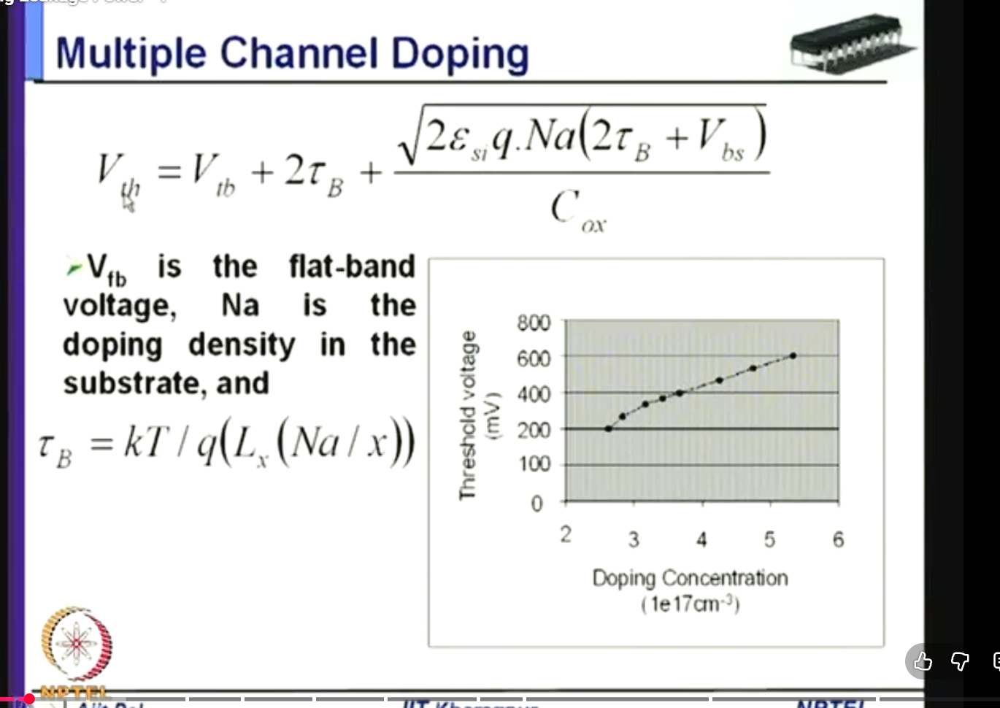
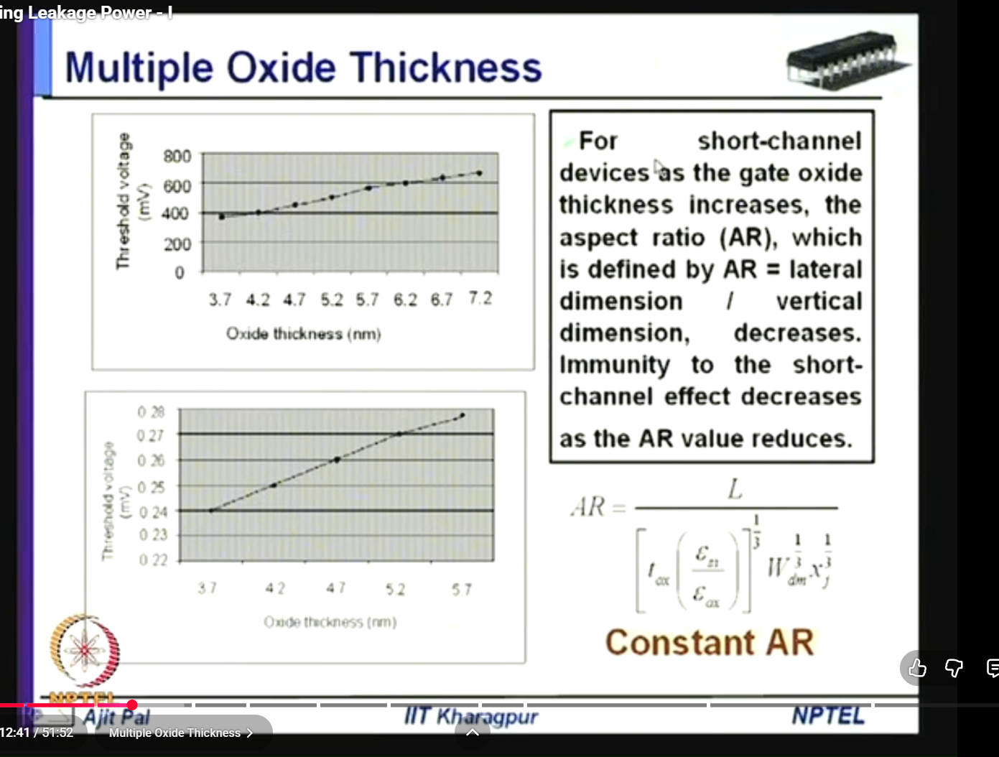
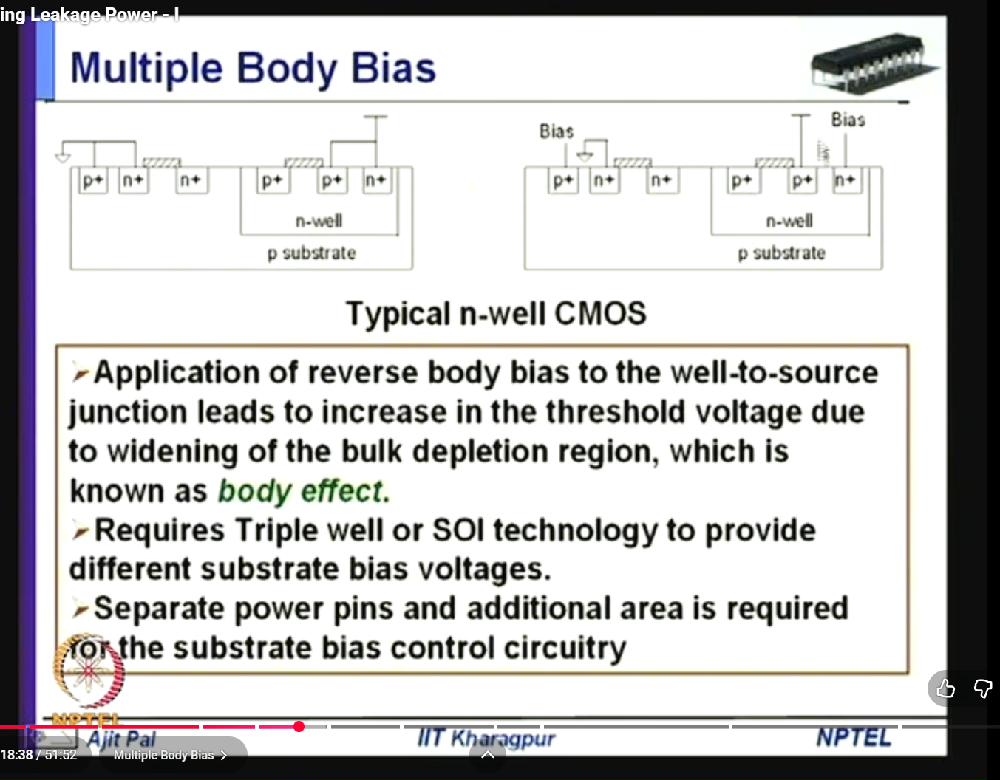
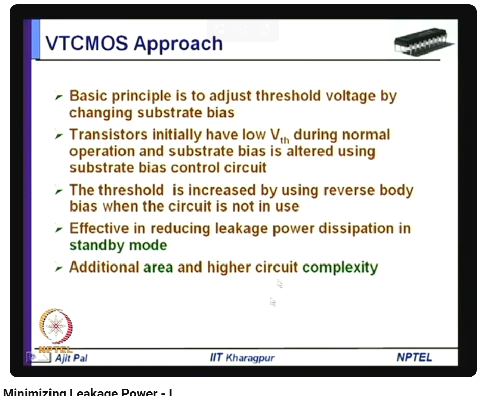
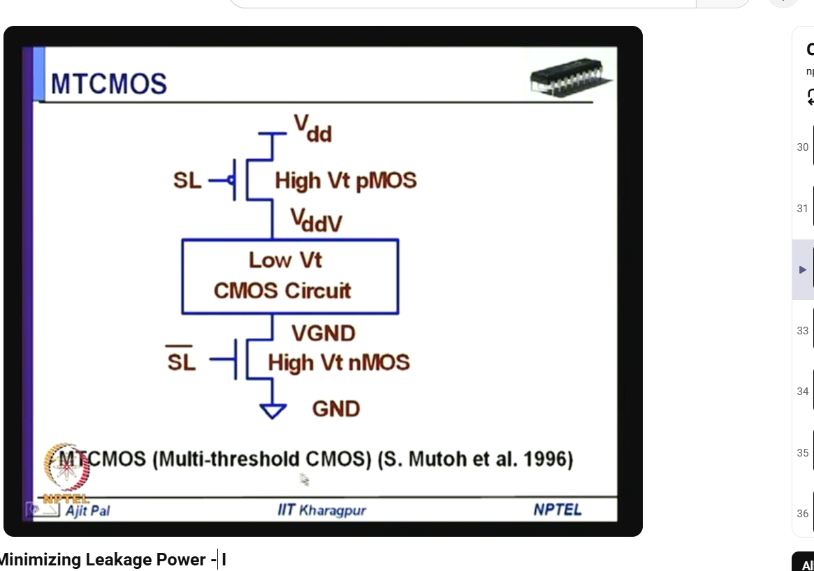
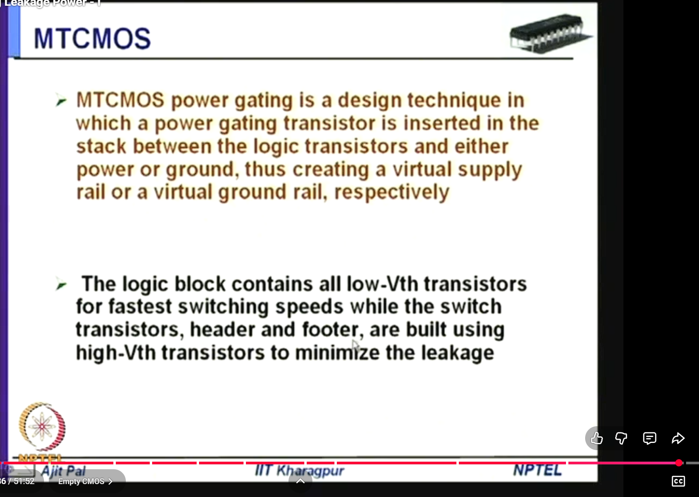
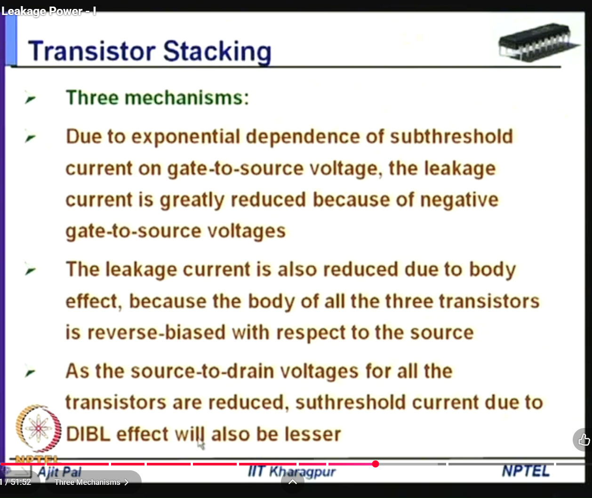
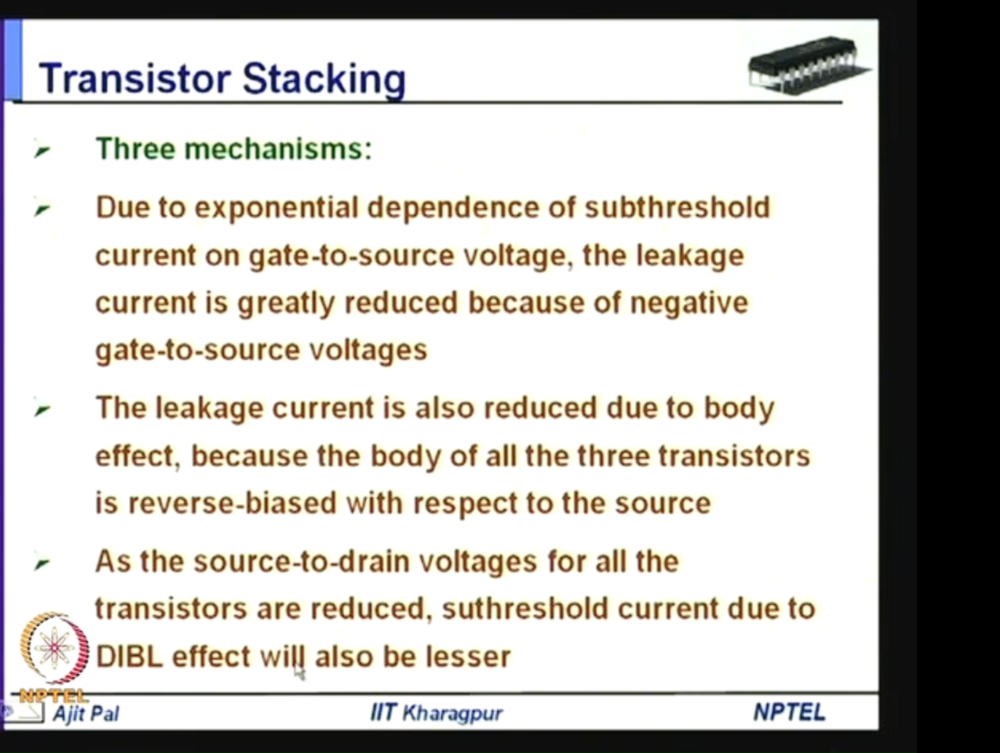
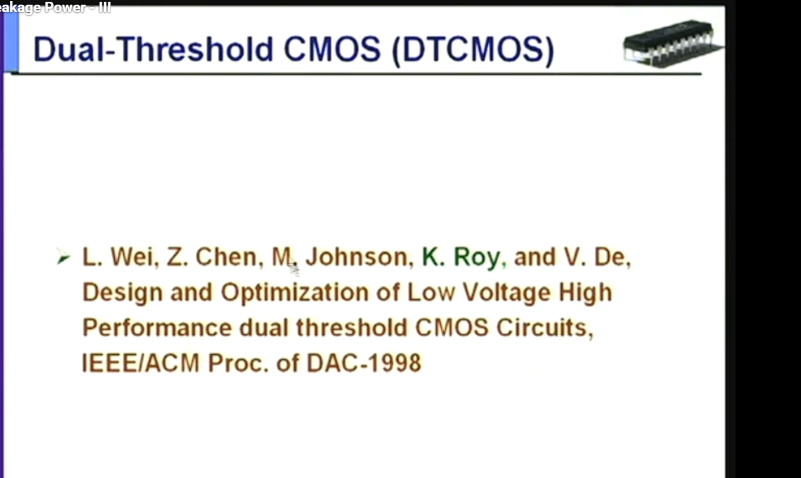
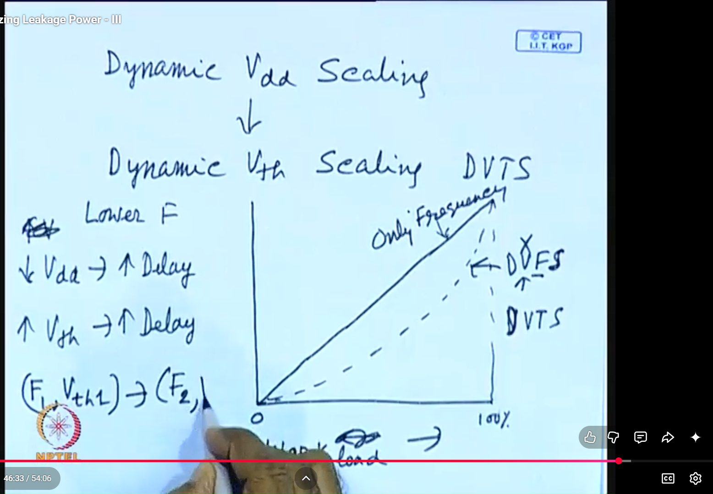

# Reducing Leakage Power

This file is for leakage-power minimization in low-power VLSI design.

## Screenshot Update Status

All leakage-power screenshots currently present in `Images/` have been renamed with meaningful filenames and linked below.

The images covered in this update are:

```text
Images/leakage-multiple-channel-doping-threshold-voltage.png
Images/leakage-multiple-oxide-thickness-threshold-short-channel.png
Images/leakage-multiple-body-bias-reverse-body-effect.png
Images/leakage-vtcmos-approach-substrate-bias.png
Images/leakage-mtcmos-sleep-transistor-header-footer-schematic.png
Images/leakage-mtcmos-power-gating-virtual-rail-definition.png
Images/leakage-transistor-stacking-three-mechanisms.png
Images/leakage-transistor-stacking-three-mechanisms-clear.png
Images/leakage-dual-threshold-cmos-dtcmos-dac-1998-reference.png
Images/leakage-dynamic-threshold-scaling-dvts-vs-dvfs.png
```

## Related PPT And Video References

- No dedicated leakage-power PPT is currently present in the local `PPT/` folder.
- NPTEL syllabus for `Low Power VLSI Circuits & Systems` lists leakage-power minimization as a separate module.
- NPTEL/Digimat video reference: `Lecture 32 - Minimizing Leakage Power - I`.
- NPTEL/Digimat video reference: `Lecture 33 - Minimizing Leakage Power - II`.

## Index

1. [Definition of leakage power](#definition-of-leakage-power)
2. [Why leakage power matters](#why-leakage-power-matters)
3. [Leakage power equation](#leakage-power-equation)
4. [Main sources of leakage current](#main-sources-of-leakage-current)
5. [Threshold voltage as the central control knob](#threshold-voltage-as-the-central-control-knob)
6. [Image 1: Multiple channel doping](#image-1-multiple-channel-doping)
7. [Image 2: Multiple oxide thickness](#image-2-multiple-oxide-thickness)
8. [Image 3: Multiple body bias](#image-3-multiple-body-bias)
9. [Image 4: VTCMOS approach](#image-4-vtcmos-approach)
10. [Image 5: MTCMOS sleep-transistor schematic](#image-5-mtcmos-sleep-transistor-schematic)
11. [Image 6: MTCMOS power gating and virtual rails](#image-6-mtcmos-power-gating-and-virtual-rails)
12. [Image 7: Transistor stacking](#image-7-transistor-stacking)
13. [Image 8: Dual-threshold CMOS](#image-8-dual-threshold-cmos)
14. [Image 9: Dynamic threshold-voltage scaling](#image-9-dynamic-threshold-voltage-scaling)
15. [Main leakage reduction techniques](#main-leakage-reduction-techniques)
16. [Technique comparison](#technique-comparison)
17. [Short exam answer](#short-exam-answer)
18. [Sources used](#sources-used)

## Definition Of Leakage Power

Leakage power is the power consumed by a CMOS circuit even when it is not doing useful switching.

In simple words:

```text
dynamic power -> power due to charging/discharging capacitances
leakage power -> power lost even when the circuit is idle
```

Leakage exists because a MOS transistor is not an ideal open switch in the OFF state. Even when the gate voltage says "OFF", small current can still pass through device leakage paths.

So:

```text
leakage current = unwanted current in OFF or standby condition
leakage power   = power consumed because of that leakage current
```

The most important leakage idea for these slides is:

```text
threshold voltage controls the OFF current very strongly
```

Higher threshold voltage usually means lower leakage, but also slower switching.

Lower threshold voltage usually means higher speed, but much higher leakage.

## Why Leakage Power Matters

In older CMOS technologies, dynamic switching power was usually dominant.

But as technology scaled:

```text
channel length reduced
oxide thickness reduced
VDD reduced
VTH reduced
device count increased
temperature became harder to manage
```

leakage became a major part of total chip power.

This matters especially in:

```text
mobile processors
IoT devices
SRAM caches
standby-mode circuits
always-on blocks
battery-operated systems
```

If a block is idle but still powered, it can keep leaking.

So leakage reduction is mainly about:

```text
reducing standby power
reducing idle power
reducing wasted current in OFF transistors
```

## Leakage Power Equation

The basic leakage-power equation is:

```text
P_leakage = I_leakage * VDD
```

where:

| Symbol | Meaning |
|---|---|
| `P_leakage` | leakage/static power |
| `I_leakage` | total leakage current |
| `VDD` | supply voltage |

This is different from dynamic switching power:

```text
P_dynamic = alpha * C_L * VDD^2 * f
```

where:

| Symbol | Meaning |
|---|---|
| `alpha` | switching activity |
| `C_L` | load capacitance |
| `VDD` | supply voltage |
| `f` | clock frequency |

Important:

```text
dynamic power becomes very small when alpha = 0 or f = 0
leakage power can still exist when alpha = 0 and f = 0
```

That is why clock gating reduces dynamic power, but does not fully remove leakage if the block remains powered.

## Main Sources Of Leakage Current

### 1. Subthreshold Leakage

Subthreshold leakage is drain-to-source current when the transistor is nominally OFF.

For an NMOS:

```text
OFF condition: VGS < VTH
```

But the current does not abruptly become zero below `VTH`.

A simplified form is:

```text
I_sub approximately proportional to exp((VGS - VTH) / (n * V_T))
```

This means:

```text
small decrease in VTH -> large increase in leakage
small increase in VTH -> large decrease in leakage
```

That exponential dependence is why the lecture spends so much time on `VTH`.

### 2. Gate Leakage

Gate leakage is current that tunnels through the gate oxide.

When oxide thickness becomes very small:

```text
thin oxide -> stronger tunneling -> larger gate leakage
```

This is why thick-oxide devices can reduce leakage, but they are slower and usually occupy special roles.

### 3. Junction Leakage

Junction leakage comes from reverse-biased source/body and drain/body junctions.

The source and drain form p-n junctions with the body. When those junctions are reverse biased, small current flows.

### 4. GIDL And Other Short-Channel Leakages

`GIDL` means Gate-Induced Drain Leakage.

Short-channel effects such as DIBL also increase leakage because the drain voltage can lower the channel barrier and make the OFF transistor leak more.

For exam notes:

```text
main leakage types -> subthreshold, gate, junction, GIDL / short-channel leakage
```

## Threshold Voltage As The Central Control Knob

Most screenshots here are about changing or using `VTH`.

Threshold voltage can be influenced by:

```text
channel doping
oxide capacitance / oxide thickness
body bias
device type in the process library
sleep transistor threshold choice
```

The body-effect equation is commonly written as:

```text
VTH = VTH0 + gamma * (sqrt(2*phi_F + VSB) - sqrt(2*phi_F))
```

where:

| Symbol | Meaning |
|---|---|
| `VTH0` | threshold voltage when source-body bias is zero |
| `gamma` | body-effect coefficient |
| `phi_F` | Fermi potential term |
| `VSB` | source-to-body voltage |

For an NMOS, increasing reverse body bias increases `VSB`, which increases `VTH`.

That is the reason:

```text
reverse body bias -> higher VTH -> lower leakage -> slower device
```

## Image 1: Multiple Channel Doping



### What This Image Is Saying

This slide explains that threshold voltage can be changed by changing channel doping concentration.

The equation shown is a threshold-voltage expression. In simplified form, it says:

```text
VTH depends on:
VFB
surface potential
substrate/channel doping
oxide capacitance
body bias
```

The important part for this slide is the square-root term:

```text
sqrt(2 * epsilon_si * q * Na * (...)) / Cox
```

where:

| Symbol | Meaning |
|---|---|
| `Na` | acceptor/channel doping concentration for p-type body in NMOS |
| `epsilon_si` | permittivity of silicon |
| `q` | electronic charge |
| `Cox` | oxide capacitance per unit area |

If `Na` increases, the depletion charge term increases. That pushes `VTH` upward.

So:

```text
higher channel doping -> higher VTH -> lower subthreshold leakage
```

### Why It Reduces Leakage

Subthreshold leakage depends exponentially on `VTH`.

So if channel doping is used to create a high-`VTH` transistor:

```text
OFF transistor has a larger barrier
less current flows below threshold
leakage current reduces
```

### Why Not Make All Devices High-VTH

Because higher `VTH` also reduces drive current.

That means:

```text
higher VTH -> slower switching -> larger delay
```

Therefore a chip may use multiple channel doping options:

```text
low-VTH devices  -> critical paths needing speed
high-VTH devices -> non-critical paths needing low leakage
```

### Exam Point

Multiple channel doping is a process/device-level method for creating multiple threshold-voltage devices. It helps leakage reduction because high-`VTH` devices leak less, but it hurts speed and can increase process complexity and variability.

## Image 2: Multiple Oxide Thickness



### Definition

Multiple oxide thickness means using transistors with different gate-oxide thicknesses on the same chip.

For a MOS transistor:

```text
Cox = epsilon_ox / tox
```

where:

| Symbol | Meaning |
|---|---|
| `Cox` | gate oxide capacitance per unit area |
| `epsilon_ox` | permittivity of oxide |
| `tox` | oxide thickness |

Increasing `tox` reduces `Cox`.

### What The Graph Means

The graph says:

```text
oxide thickness increases -> threshold voltage increases
```

This is because the threshold-voltage equation contains a depletion-charge term divided by `Cox`.

If oxide is thicker:

```text
tox increases
Cox decreases
depletion charge produces a larger voltage term
VTH increases
```

### Why It Reduces Leakage

There are two leakage benefits:

```text
higher VTH reduces subthreshold leakage
thicker oxide reduces direct gate tunneling leakage
```

So thick-oxide devices are useful for low-leakage and high-voltage-tolerant parts of a chip.

### Why The Slide Mentions Short-Channel Effect

The slide says that increasing oxide thickness reduces aspect ratio and increases short-channel effects.

The physical meaning is:

```text
thin oxide -> gate has strong control over channel
thick oxide -> gate has weaker electrostatic control
```

If the gate cannot control the channel strongly, the drain field can influence the channel more. That worsens short-channel effects such as:

```text
DIBL
VTH roll-off
larger OFF current
```

So oxide thickness has a tradeoff:

```text
thicker oxide -> lower gate leakage and higher VTH
too thick oxide -> weaker gate control and worse short-channel behavior
```

### Exam Point

Multiple oxide thickness can create low-leakage devices by increasing `VTH` and reducing gate tunneling, but excessive oxide thickness weakens gate control and worsens short-channel effects.

## Image 3: Multiple Body Bias



### Definition

Multiple body bias means applying different substrate/body bias voltages to different devices, wells, or operating modes in order to change effective threshold voltage.

For NMOS:

```text
reverse body bias -> body is more negative than source
VSB increases
VTH increases
leakage reduces
```

For PMOS, the polarity is opposite, but the idea is the same:

```text
increase reverse source-body bias -> increase |VTH| -> reduce leakage
```

### What The Slide Means

The slide says:

```text
reverse body bias increases threshold voltage because of body effect
```

That is exactly what the body-effect equation shows:

```text
VTH = VTH0 + gamma * (sqrt(2*phi_F + VSB) - sqrt(2*phi_F))
```

When `VSB` increases, the square-root term increases, so `VTH` increases.

### Why Triple Well Or SOI Is Needed

In ordinary bulk CMOS, many NMOS bodies may share the same substrate and many PMOS bodies share wells.

If you want separate body bias for different blocks:

```text
each body/well must be electrically isolated
```

That is why the slide says this approach needs:

```text
triple-well process
or SOI process
```

These allow body terminals to be biased more independently.

### Cost

The slide mentions:

```text
separate pins
larger area
extra design complexity
```

That is because body-bias networks need:

```text
bias generators
well isolation
control routing
verification for junction bias limits
```

### Exam Point

Multiple body bias reduces leakage by increasing `VTH` through reverse body bias during low-performance or standby modes. It needs well isolation and bias-control circuitry, so it costs area and design complexity.

## Image 4: VTCMOS Approach



### Definition

`VTCMOS` means Variable-Threshold-Voltage CMOS.

It changes the effective threshold voltage dynamically by changing substrate/body bias.

The slide says:

```text
threshold voltage is adjusted by changing substrate bias
```

### How It Works

In normal active operation:

```text
use low effective VTH
transistors switch faster
performance is maintained
```

In standby mode:

```text
apply reverse body bias
increase effective VTH
reduce subthreshold leakage
```

So the circuit has two personalities:

```text
active  -> speed mode
standby -> low-leakage mode
```

### Why It Works

The OFF current is very sensitive to threshold voltage.

So:

```text
standby reverse body bias -> VTH rises -> I_leakage falls sharply
```

### What The Figure Is Showing

The slide is summarizing the mode switch:

```text
normal operation: low VTH device behavior
standby operation: reverse body bias gives high VTH behavior
```

This is why it is called variable-threshold CMOS.

### Limitation

VTCMOS needs:

```text
body-bias generator
separate well/body control
extra area
body-bias timing and reliability checks
```

Also, body bias cannot be increased without limit because junction breakdown and latch-up constraints must be respected.

## Image 5: MTCMOS Sleep-Transistor Schematic



### Definition

`MTCMOS` means Multi-Threshold CMOS.

It uses:

```text
low-VTH transistors for fast logic
high-VTH transistors for sleep/control devices
```

In this image:

```text
low-VTH CMOS circuit -> main logic block
high-VTH PMOS        -> header sleep transistor
high-VTH NMOS        -> footer sleep transistor
```

### What Are Virtual Rails

The internal logic is not connected directly to ideal `VDD` and ground.

Instead it uses:

```text
VddV -> virtual VDD
VGND -> virtual ground
```

These are called virtual rails because they behave like supply rails in active mode, but can float/collapse in sleep mode.

### Active Mode

In active mode:

```text
PMOS header is ON
NMOS footer is ON
virtual VDD is close to VDD
virtual ground is close to GND
low-VTH logic runs fast
```

For the header PMOS:

```text
gate low -> PMOS ON
```

For the footer NMOS:

```text
gate high -> NMOS ON
```

The exact sleep-signal naming depends on the slide, but the functional idea is:

```text
active mode -> both sleep transistors conduct
sleep mode  -> both sleep transistors turn off
```

### Sleep Mode

In sleep mode:

```text
PMOS header OFF
NMOS footer OFF
logic block disconnected from real supply/ground
internal virtual rails float
leakage current path is strongly reduced
```

Because the sleep devices are high-`VTH`, they leak much less than low-`VTH` logic devices.

### Why This Particular Circuit Is Doing Leakage Reduction

The logic block uses low-`VTH` transistors because they are fast but leaky.

If those transistors stayed connected directly between `VDD` and ground during standby, many OFF devices would leak.

The high-`VTH` header/footer act like big series cut-off switches:

```text
active:  connect power rails -> high speed
sleep:   disconnect power rails -> low leakage
```

So MTCMOS keeps speed in active mode and saves leakage in standby mode.

### Costs

MTCMOS has overhead:

```text
sleep transistor area
wakeup delay
rush current during wakeup
virtual-rail noise
possible state loss
need for isolation/retention cells
```

## Image 6: MTCMOS Power Gating And Virtual Rails



### What The Slide Says

The slide defines power gating:

```text
insert a transistor between logic and VDD/GND
turn it off in sleep mode
create virtual supply or virtual ground
```

This is the practical circuit-level form of MTCMOS.

### Header And Footer

Two common versions are:

```text
header switch -> PMOS between VDD and logic
footer switch -> NMOS between logic and ground
```

Header creates:

```text
virtual VDD
```

Footer creates:

```text
virtual ground
```

### Why High-VTH Sleep Transistors Are Used

The sleep transistor is the only remaining main leakage path in sleep mode.

So it should leak very little.

Therefore:

```text
sleep transistor -> high VTH
logic transistor -> low VTH if speed-critical
```

This is the key MTCMOS idea.

### Why Low-VTH Logic Is Still Allowed

Low-`VTH` logic gives:

```text
high speed
low active delay
```

Its leakage is controlled by turning off the high-`VTH` sleep transistor during sleep.

So the design separates the two needs:

```text
speed handled by low-VTH logic
standby leakage handled by high-VTH sleep switch
```

## Image 7: Transistor Stacking



Clearer duplicate capture:



### Definition

Transistor stacking means placing two or more OFF transistors in series so that leakage is smaller than through one OFF transistor.

Simple idea:

```text
one OFF NMOS leaks more
two OFF NMOS in series leak less
```

This is called the stack effect.

### What The Image Says

The slide lists three leakage-reduction mechanisms:

```text
1. negative gate-source voltage
2. body effect
3. less DIBL because VDS is reduced
```

These are all happening inside an OFF stack.

### Mechanism 1: Negative Gate-Source Voltage

Consider two OFF NMOS transistors in series.

The internal node between them can rise above ground because of leakage currents.

For the upper OFF NMOS:

```text
gate = 0
source = internal node above 0
VGS = gate - source < 0
```

So the upper transistor has negative `VGS`.

Since subthreshold current depends on:

```text
exp((VGS - VTH) / (n * V_T))
```

making `VGS` more negative greatly reduces leakage.

### Mechanism 2: Body Effect

For the upper NMOS, the source rises while the body is still tied near ground.

So:

```text
VSB increases
VTH increases
```

Higher `VTH` means lower leakage.

This is the same body-effect idea used in body bias, but here it happens naturally due to the stacked internal node voltage.

### Mechanism 3: Lower DIBL Due To Lower VDS

`DIBL` means Drain-Induced Barrier Lowering.

In a short-channel transistor, a large drain voltage can lower the source-channel barrier and increase OFF current.

In a stack, the total voltage is divided across multiple OFF transistors:

```text
each OFF transistor sees smaller VDS
```

Smaller `VDS` means less DIBL, so threshold lowering is reduced and leakage falls.

### Why Stacking Is Useful

Stacking is useful because it can reduce leakage without requiring a different process option.

It can be exploited by:

```text
input vector control
logic restructuring
sleep stack circuits
choosing standby input patterns that turn off series devices
```

### Cost

Series devices also increase resistance during active operation.

So:

```text
more stacking -> lower leakage but potentially higher delay
```

## Image 8: Dual-Threshold CMOS



### Definition

In this slide, `DTCMOS` means Dual-Threshold CMOS.

Be careful: in some books, `DTMOS` means dynamic-threshold MOSFET. But this lecture image is specifically about dual-threshold CMOS.

Dual-threshold CMOS means using two threshold-voltage classes:

```text
low-VTH cells/devices  -> fast but leaky
high-VTH cells/devices -> slower but low leakage
```

### What The Slide Is Referring To

The slide cites:

```text
L. Wei, Z. Chen, M. Johnson, K. Roy, V. De,
Design and Optimization of Low Voltage High Performance Dual Threshold CMOS Circuits,
DAC 1998
```

That paper uses high-`VTH` devices on non-critical paths and low-`VTH` devices on critical paths.

### Critical Path And Non-Critical Path

A critical path is a timing path with little or no slack.

```text
critical path -> must be fast -> use low-VTH
```

A non-critical path has extra timing margin.

```text
non-critical path -> can tolerate delay -> use high-VTH
```

### What Is Slack

Slack means available timing margin.

```text
slack = required arrival time - actual arrival time
```

If slack is positive:

```text
path is faster than required
some gates can be slowed down safely
```

So dual-`VTH` optimization uses slack like this:

```text
large positive slack -> replace low-VTH gate with high-VTH gate
leakage reduces
timing still passes
```

### Why It Works

Leakage is reduced because high-`VTH` devices have much lower subthreshold current.

Performance is preserved because low-`VTH` devices are kept only where timing needs them.

The goal is:

```text
meet timing with minimum leakage
```

## Image 9: Dynamic Threshold-Voltage Scaling



### Definition

`DVTS` means Dynamic Threshold-voltage Scaling.

It dynamically changes `VTH`, usually by body-bias control, according to workload or timing requirement.

This is different from `DVFS`:

```text
DVFS -> changes supply voltage and frequency
DVTS -> changes threshold voltage by body bias
```

### What The Handwritten Notes Mean

The screenshot says:

```text
Dynamic VDD scaling -> Dynamic VTH scaling
lower frequency
decrease VDD -> increase delay
increase VTH -> increase delay
```

The meaning is:

```text
if workload is low, the system does not need maximum speed
there is timing slack
so we can slow the circuit down to save power
```

DVFS slows the circuit by lowering `VDD` and `f`.

DVTS slows the circuit by increasing `VTH`.

Both save power in different ways:

```text
lower VDD -> saves dynamic power strongly because P_dynamic depends on VDD^2
higher VTH -> saves leakage power strongly because I_sub depends exponentially on VTH
```

### Why Lower VDD Increases Delay

MOS drive current reduces when supply voltage is reduced.

Less drive current means the circuit charges and discharges capacitances more slowly.

So:

```text
lower VDD -> lower current -> slower gates -> larger delay
```

### Why Higher VTH Increases Delay

Gate drive roughly depends on:

```text
VDD - VTH
```

If `VTH` increases:

```text
VDD - VTH decreases
drive current decreases
delay increases
```

So DVTS can only increase `VTH` when timing slack exists.

### What The Graph Is Trying To Compare

The graph compares power-saving styles as workload changes.

The intuition is:

```text
only frequency scaling:
  lowers dynamic switching rate, but leakage remains high

DVFS:
  lowers frequency and supply voltage, saving dynamic power strongly

DVTS:
  raises VTH when full speed is not needed, saving leakage power
```

At low workload, the system has more slack, so it can choose a higher `VTH` and still meet timing.

At high workload, there is less slack, so `VTH` must be lower to keep performance.

### Exam Point

DVTS is useful when leakage power is important, especially in scaled technologies. It uses body bias to raise threshold voltage when workload is low. The tradeoff is that increasing `VTH` increases delay, so DVTS must track workload and timing margin.

## Main Leakage Reduction Techniques

The NPTEL low-power syllabus lists leakage-power minimization as a topic, and the lecture screenshots cover these main methods:

```text
device/process-level threshold control:
  multiple channel doping
  multiple oxide thickness

body-bias-level threshold control:
  multiple body bias
  VTCMOS
  DVTS

circuit-level leakage blocking:
  MTCMOS
  power gating
  transistor stacking

timing-driven cell selection:
  dual-VTH assignment
```

### VTCMOS

```text
active mode  -> lower effective VTH for speed
standby mode -> reverse body bias raises VTH for low leakage
```

### MTCMOS

```text
low-VTH logic      -> fast computation
high-VTH sleep FET -> low standby leakage
```

### Power Gating

```text
idle block disconnected from VDD or GND
virtual rail floats
leakage path is cut
```

### Transistor Stacking

```text
multiple OFF devices in series
internal node shifts
negative VGS, body effect, and lower DIBL reduce leakage
```

### Dual-VTH Assignment

```text
critical paths -> low-VTH
non-critical paths with slack -> high-VTH
```

### DVTS

```text
low workload -> raise VTH by body bias -> save leakage
high workload -> lower VTH -> keep speed
```

## Technique Comparison

| Technique | Main control knob | How leakage reduces | Main cost |
|---|---|---|---|
| Multiple channel doping | channel doping / `Na` | creates higher-`VTH` devices | process complexity, delay, variability |
| Multiple oxide thickness | `tox`, `Cox` | higher `VTH`, lower gate tunneling | weaker gate control if too thick, process cost |
| Multiple body bias | source-body bias | reverse bias raises `VTH` | well isolation, bias generator, area |
| VTCMOS | dynamic body bias | high `VTH` in standby | body-bias control and reliability limits |
| MTCMOS | high-`VTH` sleep FETs | cuts leakage path in sleep | wakeup delay, area, virtual-rail noise |
| Power gating | header/footer switch | disconnects idle block | state retention, isolation, rush current |
| Transistor stacking | OFF series devices | negative `VGS`, body effect, lower DIBL | active delay and sizing impact |
| Dual-`VTH` assignment | cell threshold choice | high-`VTH` on slack paths | timing optimization and library support |
| DVTS | runtime `VTH` control | raises `VTH` at low workload | feedback/control circuit, delay tradeoff |

## Short Exam Answer

Leakage power is the static power consumed by a CMOS circuit even when it is not switching. It is given by `P_leakage = I_leakage * VDD`. The main leakage sources are subthreshold leakage, gate leakage, reverse-biased junction leakage, and GIDL/short-channel leakage. Threshold voltage is the central leakage-control parameter because subthreshold leakage depends exponentially on `VTH`. Leakage can be reduced by increasing `VTH` through channel doping, oxide-thickness choice, reverse body bias, VTCMOS, or DVTS. It can also be reduced by circuit methods such as MTCMOS power gating, transistor stacking, and dual-`VTH` assignment. MTCMOS uses low-`VTH` logic for speed and high-`VTH` sleep transistors for standby leakage reduction. Transistor stacking reduces leakage by negative `VGS`, body effect, and reduced DIBL. Dual-`VTH` assignment keeps low-`VTH` cells on critical paths and uses high-`VTH` cells on non-critical paths with positive slack.

## Sources Used

- NPTEL syllabus for `Low Power VLSI Circuits & Systems`, which lists leakage-power minimization as a module: https://archive.nptel.ac.in/content/syllabus_pdf/106105034.pdf
- University of Toronto lecture notes on MOS body effect and threshold-voltage body-bias equation: https://www.eecg.toronto.edu/~johns/ece331/lecture_notes/07b_bodyEffect.pdf
- University of New Mexico MOS transistor notes on threshold voltage dependence on oxide thickness, channel doping, and body bias: https://ece-research.unm.edu/jimp/vlsi/slides/chap2_1.html
- S. Narendra, S. Borkar, V. De, D. Antoniadis, and A. Chandrakasan, `Scaling of stack effect and its application for leakage reduction`: https://www.researchgate.net/publication/3911888_Scaling_of_stack_effect_and_its_application_for_leakage_reduction
- S. Mutoh et al., `1-V Power Supply High-Speed Digital Circuit Technology with Multithreshold-Voltage CMOS`, IEEE JSSC 1995, DBLP metadata: https://dblp.uni-trier.de/rec/journals/jssc/MutohDMASY95.html
- MTCMOS summary explaining low-`VTH` devices for speed and high-`VTH` devices for standby leakage suppression: https://eurekamag.com/research/104/823/104823931.php
- L. Wei, Z. Chen, M. Johnson, K. Roy, and V. De, `Design and Optimization of Low Voltage High Performance Dual Threshold CMOS Circuits`, DAC 1998: https://www.researchgate.net/publication/2432083_Design_and_Optimization_of_Low_Voltage_High_Performance_Dual_Threshold_CMOS_Circuits
- C. H. Kim and K. Roy, `Dynamic VTH Scaling Scheme for Active Leakage Power Reduction`, DATE 2002: https://www.cecs.uci.edu/~papers/compendium94-03/papers/2002/date02/pdffiles/02c_2.pdf
- Kaushik Roy, Amit Agarwal, and Chris H. Kim, `Circuit techniques for leakage reduction`: https://experts.umn.edu/en/publications/circuit-techniques-for-leakage-reduction/
