# Reducing Switched Capacitance

This is the single master file for your notes. I am keeping it focused on only the things you asked for:

- the images you placed in the folder
- deep explanation of each image
- the difference between pipelining and parallelism

Note writing rule: whenever a new image is added, start that image section with the definition of the exact concept in the image. For example, if the image is about Gray coding, begin with the definition of Gray coding, then explain what the image shows, why it matters, how it works, and the exam answer.

## Related PPT And Video References

- Local PPT found in this workspace: `PPT/PVL 207 Lec 12 (Minimizing switched Capacitances) [Autosaved].pptx`, slide 2 lists `Bus encoding` and `State encoding` under switched-capacitance minimization techniques.
- Local PPT found in this workspace: `PPT/PVL 207 Lec 13 (Minimizing Switched capacitances) [Autosaved].pptx`, slide 2 continues the same switched-capacitance minimization topic list.
- Video references already used for the bus/encoding notes are listed again in [Sources Used](#sources-used).

## Index

1. [Core idea of switched capacitance](#core-idea-of-switched-capacitance)
2. [Image 0: Dynamic power dissipation components](#image-0-dynamic-power-dissipation-components)
3. [Image 0A: CMOS inverter switching-energy derivation](#image-0a-cmos-inverter-switching-energy-derivation)
4. [Definition of encoding](#definition-of-encoding)
5. [Image 1: Switched capacitance dynamic power formula](#image-1-switched-capacitance-dynamic-power-formula)
6. [Image 2: Input gating / operand isolation](#image-2-input-gating--operand-isolation)
7. [Image 3: 8-bit ADC hardware vs software approach](#image-3-8-bit-adc-hardware-vs-software-approach)
8. [Image 4: Software ADC using DAC and comparator sketch](#image-4-software-adc-using-dac-and-comparator-sketch)
9. [Pipelining vs parallelism](#pipelining-vs-parallelism)
10. [Image 5: Bus encoding sender and receiver](#image-5-bus-encoding-sender-and-receiver)
11. [Image 6: Bus charge equation](#image-6-bus-charge-equation)
12. [Image 7: Encoding techniques classification](#image-7-encoding-techniques-classification)
13. [Image 8: One-hot coding](#image-8-one-hot-coding)
14. [Image 9: Bus inversion coding](#image-9-bus-inversion-coding)
15. [Image 10: Grouped bus inversion coding](#image-10-grouped-bus-inversion-coding)
16. [Image 11: T0 encoding consecutive address example](#image-11-t0-encoding-consecutive-address-example)
17. [Image 12: T0 encoding zero-transition address bus](#image-12-t0-encoding-zero-transition-address-bus)
18. [Short exam answer](#short-exam-answer)
19. [Sources used](#sources-used)

## Core Idea Of Switched Capacitance

In CMOS digital circuits, dynamic power is mainly consumed when capacitances are charged and discharged. These capacitances exist at:

- gate outputs
- internal transistor nodes
- long wires
- buses
- clock lines
- register inputs
- I/O pads

The basic dynamic power equation is:

```text
P_dynamic = alpha * C * V_DD^2 * f
```

Meaning:

- `P_dynamic` = dynamic power consumed during switching
- `alpha` = switching activity factor
- `C` = capacitance being switched
- `V_DD` = supply voltage
- `f` = clock frequency

The product:

```text
alpha * C
```

is called switched capacitance.

So, if we reduce the number of transitions or reduce the capacitance that is being charged and discharged, dynamic power reduces.

In simple words:

```text
Reducing switched capacitance = reduce unnecessary switching of capacitive nodes.
```

## Image 0: Dynamic Power Dissipation Components

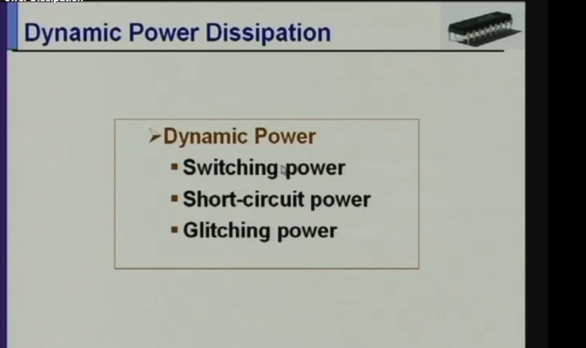

### Definition

Dynamic power dissipation is the power consumed by a CMOS circuit while signals are changing with time.

It has three important parts:

```text
dynamic power = switching power + short-circuit power + glitching power
```

The slide is saying that dynamic power is not only the ideal load-capacitance charging term. Real circuits also waste power because inputs have finite rise/fall time and because unwanted temporary transitions can occur.

### 1. Switching Power

Switching power is the power used to charge and discharge capacitances.

For a CMOS output node:

```text
0 -> 1 transition: load capacitance charges from VDD
1 -> 0 transition: stored charge discharges to ground
```

The standard average switching-power expression is:

```text
P_switching = alpha * C_L * VDD^2 * f
```

where `alpha` is switching activity.

This is the main reason reducing switched capacitance works:

```text
reduce alpha -> fewer transitions
reduce C_L   -> less capacitance charged
```

### 2. Short-Circuit Power

Short-circuit power happens during input transitions.

In an ideal inverter, PMOS and NMOS would never conduct at the same time. But with a real input slope, there is a short time when:

```text
PMOS partly ON
NMOS partly ON
```

So a direct current path exists:

```text
VDD -> PMOS -> NMOS -> GND
```

That current does not store useful energy in a load capacitor. It is wasted as short-circuit power.

Short-circuit power increases when:

```text
input transition is slow
output load is poorly matched
both transistors stay partially ON longer
```

### 3. Glitching Power

Glitching power is power consumed by unwanted temporary transitions.

Example:

```text
final output should remain 0
but due to unequal path delays it briefly becomes 1 and returns to 0
```

That temporary pulse still charges and discharges capacitance.

So even though the final logic value did not change, energy was wasted.

Glitching is common in combinational logic when different input paths arrive at different times.

### Why This Slide Matters For Low Power

The slide gives the full dynamic-power target:

```text
switching power    -> reduce switched capacitance and activity
short-circuit power -> use sharp transitions and proper sizing
glitching power    -> balance delays, gate unused inputs, pipeline/retime carefully
```

So "reducing switched capacitance" mainly attacks switching and glitching power by reducing unnecessary transitions. It does not directly eliminate leakage power, and it only indirectly helps short-circuit power.

### Exam Answer

Dynamic power dissipation in CMOS consists of switching power, short-circuit power, and glitching power. Switching power is caused by charging/discharging node capacitances and is given by `alpha*C_L*VDD^2*f`. Short-circuit power occurs during input transitions when PMOS and NMOS conduct simultaneously, creating a temporary path from `VDD` to ground. Glitching power is caused by unwanted temporary transitions due to unequal path delays. Low-power design reduces dynamic power by reducing switching activity, capacitance, glitches, and unnecessary evaluation of idle logic.

## Image 0A: CMOS Inverter Switching-Energy Derivation

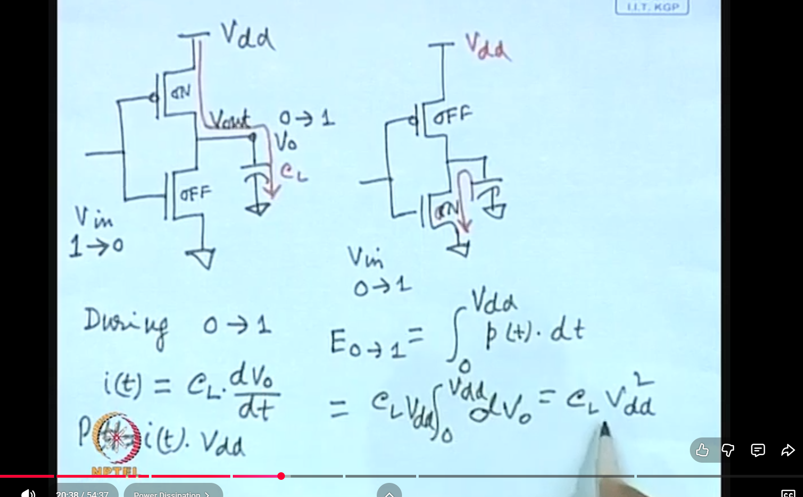

### Definition

Switching energy is the energy drawn from the supply when a capacitive node changes logic value.

For a CMOS inverter, the output node has load capacitance:

```text
C_L
```

This capacitance represents:

```text
wire capacitance
input gate capacitance of fanout gates
diffusion capacitance at the output node
```

### Case 1: Output Goes From 0 To 1

When the input changes:

```text
Vin: 1 -> 0
```

the PMOS turns ON and the NMOS turns OFF.

The output capacitance charges:

```text
Vout: 0 -> VDD
```

The current through the PMOS is:

```text
i(t) = C_L * dVo/dt
```

Instantaneous power drawn from the supply is:

```text
p(t) = VDD * i(t)
```

Energy drawn from the supply during charging is:

```text
E_0->1 = integral p(t) dt
       = integral VDD * C_L * dVo
       = C_L * VDD * integral from 0 to VDD of dVo
       = C_L * VDD^2
```

So the source supplies:

```text
C_L * VDD^2
```

energy during a 0-to-1 output transition.

### Where That Energy Goes

After charging, the capacitor stores:

```text
E_stored = 1/2 * C_L * VDD^2
```

The other half is dissipated as heat in the PMOS channel resistance during charging.

So:

```text
energy drawn from supply = C_L * VDD^2
energy stored on capacitor = 1/2 * C_L * VDD^2
energy lost during charging = 1/2 * C_L * VDD^2
```

### Case 2: Output Goes From 1 To 0

When the input changes:

```text
Vin: 0 -> 1
```

the PMOS turns OFF and the NMOS turns ON.

The charged capacitor discharges to ground:

```text
Vout: VDD -> 0
```

The stored capacitor energy:

```text
1/2 * C_L * VDD^2
```

is dissipated in the NMOS.

### Complete 0 -> 1 -> 0 Cycle

Over a full output switching cycle:

```text
0 -> 1: supply provides C_L * VDD^2
1 -> 0: no new supply energy, stored capacitor energy is dissipated
```

The net energy consumed from the supply per full output cycle is:

```text
E_cycle = C_L * VDD^2
```

If the node switches with activity factor `alpha` at clock frequency `f`, average switching power becomes:

```text
P_switching = alpha * C_L * VDD^2 * f
```

### Why This Matters

This derivation is the base reason for all switched-capacitance reduction methods:

```text
less C_L -> less energy per transition
less alpha -> fewer transitions
less VDD -> much less energy because of VDD^2
less f -> fewer transitions per second
```

In this file, bus encoding, T0 encoding, one-hot coding, bus inversion, and operand isolation mainly reduce `alpha`. Clock gating mainly reduces unnecessary clocked switching. Supply voltage scaling reduces the `VDD^2` term.

### Exam Answer

For a CMOS inverter, during an output 0-to-1 transition the load capacitance charges through the PMOS. Since `i(t)=C_L*dVo/dt`, the supply energy is `E_0->1 = integral VDD*i(t)dt = C_L*VDD^2`. Half is stored on the capacitor and half is dissipated in the PMOS. During the 1-to-0 transition, the stored capacitor energy is dissipated through the NMOS. Therefore, the energy per complete output cycle is `C_L*VDD^2`, and the average switching power is `alpha*C_L*VDD^2*f`.

## Definition Of Encoding

Encoding means representing the same information using a particular code or symbol system.

NIST CSRC defines `encode` as using a system of symbols to represent information that may originally have another representation, with Morse code as an example. The Federal Agencies Digitization Guidelines Initiative defines encoding as transforming a signal or data into a code by means of a programmed algorithm. TechTarget also explains that, in computers, encoding changes content into a specialized format for efficient transmission or storage.

So a clean definition is:

```text
Encoding is the process of converting information, data, or a signal from one representation into another coded representation so that it can be stored, transmitted, processed, compressed, protected, or interpreted correctly.
```

Decoding is the reverse process:

```text
Decoding converts the encoded representation back into the original or intended information.
```

### Encoding In Digital Design

In digital systems, information is represented using bits. Encoding decides which bit pattern represents which value, state, character, instruction, or signal condition.

Examples:

```text
Decimal number 5        -> binary encoding 0101
Character A             -> ASCII encoding 1000001
FSM state S0            -> state code 00
FSM state S1            -> state code 01
Analog voltage level    -> ADC digital code
```

### Encoding In Low-Power Design

In low-power VLSI, encoding can be used to reduce switching activity. The information remains the same, but the bit representation is chosen so that fewer bits toggle during common transitions.

Example:

```text
Normal binary count:
3  = 0011
4  = 0100
bits toggled = 3

Gray-code count:
only one bit changes between consecutive values
bits toggled = 1
```

This matters because dynamic power depends on:

```text
P_dynamic = alpha * C * V_DD^2 * f
```

Encoding mainly tries to reduce `alpha`, the switching activity factor. If fewer bits change, less capacitance is charged and discharged, so switched capacitance reduces.

### Exam Answer

Encoding is the process of representing information or data in a particular code. In digital design, encoding maps values, states, or signals to bit patterns. In low-power design, a suitable encoding can reduce switching activity by choosing bit patterns so that frequently occurring transitions cause fewer bit changes. Since dynamic power is proportional to `alpha*C*V_DD^2*f`, reducing bit transitions reduces switched capacitance and hence dynamic power.

## Image 1: Switched Capacitance Dynamic Power Formula

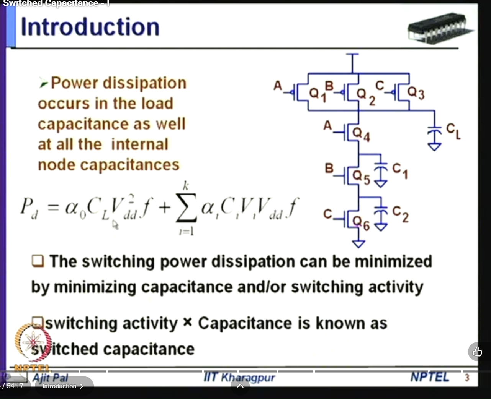

### What This Image Shows

This image explains that power dissipation in CMOS does not occur only at the final output load capacitance `C_L`. It also occurs at internal node capacitances such as `C_1` and `C_2`.

The circuit contains:

- PMOS transistors at the top
- NMOS transistors at the bottom
- logic inputs `A`, `B`, and `C`
- output load capacitance `C_L`
- internal node capacitances `C_1` and `C_2`

The formula shown is essentially saying:

```text
Total dynamic power = power at output load + power at internal nodes
```

### Proper Definition

Switched capacitance is the effective capacitance that actually switches during operation.

For one node:

```text
C_switched = alpha * C
```

For many nodes:

```text
C_switched,total = sum(alpha_i * C_i)
```

Then:

```text
P_dynamic = C_switched,total * V_DD^2 * f
```

### Why Internal Node Capacitance Matters

In basic examples, we often calculate power only using the output capacitance. But in real CMOS gates, internal nodes also have capacitance.

For example, in a stacked NMOS network, even if the final output does not change, an internal node may still charge or discharge because some input changed. That means power is consumed even though the output value looks unchanged from outside.

This is why internal capacitances are important in low-power design.

### What The Formula Means

The image shows:

```text
P_d = alpha_0 * C_L * V_DD^2 * f + sum(alpha_i * C_i * V_i * V_DD * f)
```

The first term:

```text
alpha_0 * C_L * V_DD^2 * f
```

is the output load switching power.

The summation term:

```text
sum(alpha_i * C_i * V_i * V_DD * f)
```

represents power consumed by internal node capacitances.

The important exam point is:

```text
Power depends on both capacitance and switching activity.
```

So even a large capacitance does not waste much dynamic power if it rarely switches. But a smaller capacitance can consume significant power if it switches every clock cycle, like a clock line.

### Why This Is Important For Low Power Design

To reduce power, we can reduce:

- `alpha`, the switching activity
- `C`, the capacitance
- `V_DD`, the supply voltage
- `f`, the frequency

But this topic specifically focuses on reducing:

```text
alpha * C
```

That means reducing switched capacitance.

### Exam Answer

In CMOS circuits, dynamic power is consumed when load and internal capacitances charge and discharge. The dynamic power is proportional to `alpha*C*V_DD^2*f`, where `alpha` is switching activity and `C` is capacitance. The product `alpha*C` is called switched capacitance. Therefore, power can be reduced by reducing unnecessary switching activity or by reducing the capacitance of nodes that switch frequently.

## Image 2: Input Gating / Operand Isolation

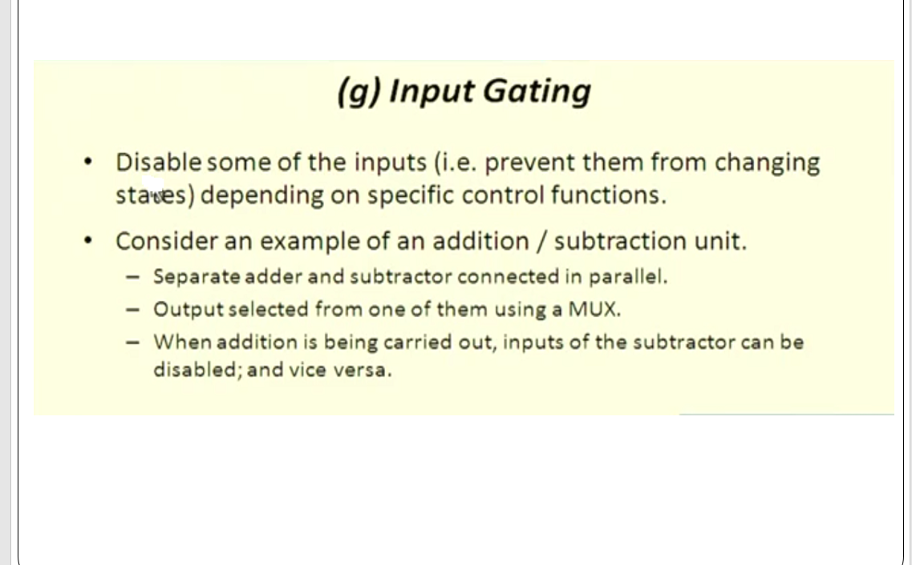

### What This Image Shows

This image explains input gating using an addition/subtraction unit.

The example has:

- one adder
- one subtractor
- both connected in parallel
- a multiplexer selecting the final output

The slide says:

- when addition is being performed, the subtractor is not needed
- when subtraction is being performed, the adder is not needed
- therefore, the unused unit can be disabled

### Proper Definition

Input gating is a low-power technique where inputs to an unused block are prevented from changing.

Operand isolation is the same idea applied to datapath units. It blocks operands from entering a functional unit when that unit's result will not be used.

### Why This Reduces Power

Suppose both adder and subtractor receive changing inputs all the time.

Even if only the adder output is selected, the subtractor still performs internal switching. Its internal nodes charge and discharge unnecessarily.

That wastes dynamic power.

With input gating:

```text
During addition:
adder is active
subtractor input is held constant
subtractor internal nodes do not switch much

During subtraction:
subtractor is active
adder input is held constant
adder internal nodes do not switch much
```

This reduces `alpha`, the switching activity.

The physical capacitance `C` of the unused block still exists, but because it does not switch, its switched capacitance becomes small.

### Simple Before And After

Without input gating:

```text
Inputs change -> adder switches
Inputs change -> subtractor also switches
MUX chooses only one output
Power is wasted in unused unit
```

With input gating:

```text
Inputs change -> only selected unit switches
Unused unit input is disabled or held
Less internal switching
Lower dynamic power
```

### How Input Gating Can Be Implemented

Input gating can be implemented using:

- AND gates to force inputs to 0
- OR gates to force inputs to 1
- multiplexers to select a constant value
- latches to hold previous values
- enable-controlled registers

The control signal decides which block is active.

### Important Tradeoff

Input gating is useful only if:

```text
power saved in the disabled block > power consumed by the gating logic
```

If the disabled block is small, the extra gates may waste more power than they save.

So input gating is most useful for large datapath units like:

- adders
- subtractors
- multipliers
- shifters
- comparators
- ALUs

### Exam Answer

Input gating or operand isolation reduces switched capacitance by preventing unnecessary input transitions from entering an unused functional unit. In an adder/subtractor unit, when addition is selected, the subtractor inputs are disabled; when subtraction is selected, the adder inputs are disabled. This reduces switching activity inside the unused unit and hence reduces dynamic power. The limitation is extra gating hardware and possible delay overhead.

## Image 3: 8-bit ADC Hardware Vs Software Approach

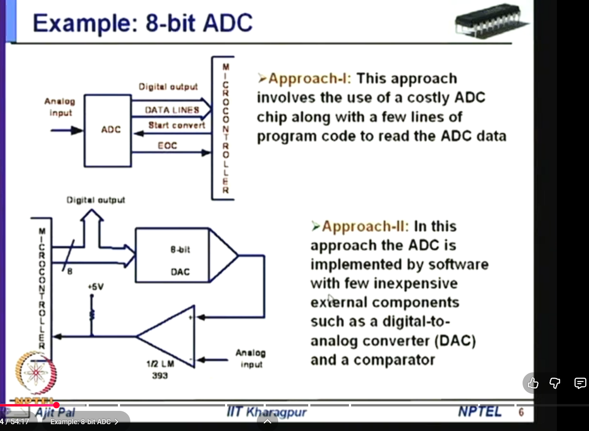

### What This Image Shows

This image compares two ways to build an 8-bit ADC system.

Approach I:

```text
Analog input -> ADC chip -> digital output -> microcontroller
```

Approach II:

```text
microcontroller -> DAC -> comparator
analog input -> comparator
comparator output -> microcontroller
```

The first approach uses a dedicated ADC chip.

The second approach implements ADC-like behavior using:

- software
- DAC
- comparator
- microcontroller

### Proper Definition

This is an example of hardware-software tradeoff.

Hardware-software tradeoff means deciding whether a function should be implemented using dedicated hardware or using software running on a processor/microcontroller with simpler external hardware.

### Approach I: Dedicated ADC Chip

In the dedicated ADC approach:

- analog input is given to the ADC
- ADC converts it into digital output
- microcontroller reads the data lines
- control signals like `Start Convert` and `EOC` are used

`EOC` means End Of Conversion.

This approach is fast and simple from the software side, but it needs a separate ADC chip. That may increase:

- hardware cost
- board area
- active power
- interface switching

### Approach II: Software ADC Using DAC And Comparator

In the second approach:

- microcontroller sends a digital trial value to the DAC
- DAC converts it into an analog voltage
- comparator compares DAC output with the unknown analog input
- comparator gives a 1-bit result to the microcontroller
- software adjusts the trial value

This process can be done using successive approximation.

### Successive Approximation Idea

For an 8-bit value:

1. Start with the most significant bit.
2. Try a digital code.
3. DAC generates the corresponding analog voltage.
4. Comparator checks whether the input is greater or smaller.
5. Keep or clear the bit.
6. Repeat for all 8 bits.

After 8 comparisons, the microcontroller gets an approximate 8-bit digital value.

### Why This Is Related To Low Power

The second approach may reduce hardware cost and hardware switching if the conversion speed requirement is low.

It is useful when:

- analog signal changes slowly
- conversion is needed only sometimes
- high-speed ADC is not required
- microcontroller is already present
- DAC and comparator can be turned off when not used

But it is not always lower power.

If software takes many cycles and keeps the microcontroller active for too long, energy may increase.

### Important Tradeoff

Dedicated ADC:

```text
faster
less software work
more dedicated hardware
possibly higher cost
```

Software ADC:

```text
slower
more software work
less dedicated hardware
possibly lower cost and lower power for slow applications
```

### Exam Answer

The ADC example shows hardware-software tradeoff. A dedicated ADC chip gives fast conversion but requires extra hardware. Alternatively, a microcontroller with a DAC and comparator can implement conversion in software by successive approximation. This reduces dedicated hardware but increases conversion time and software activity. It is useful for low-speed, low-cost, low-power applications.

## Image 4: Software ADC Using DAC And Comparator Sketch

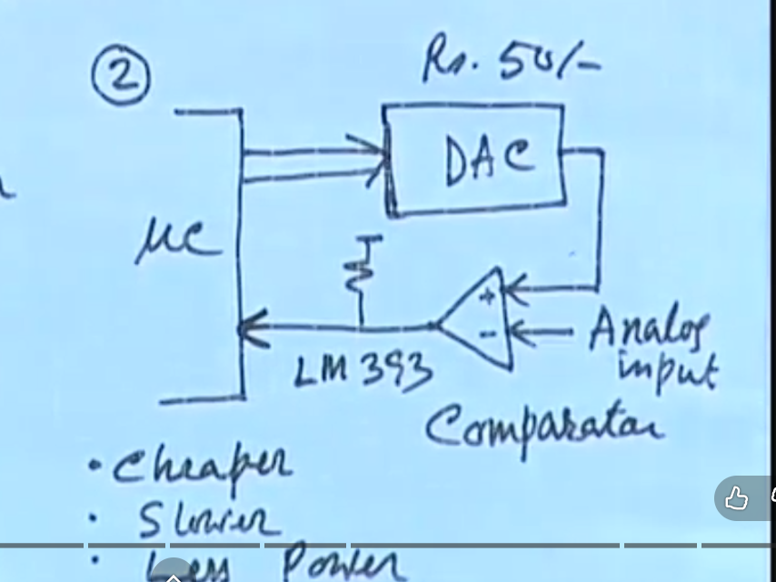

### What This Image Shows

This is a handwritten sketch of the second ADC approach.

It contains:

- microcontroller
- DAC
- LM393 comparator
- pull-up resistor
- analog input
- comparator output returning to the microcontroller

### Block Explanation

Microcontroller:

```text
generates digital test values
reads comparator output
runs the conversion algorithm
```

DAC:

```text
converts microcontroller digital value into analog voltage
```

Comparator:

```text
compares DAC voltage with analog input
outputs high or low depending on which voltage is larger
```

LM393:

```text
a common comparator IC
usually uses open-collector output
needs a pull-up resistor
```

Analog input:

```text
the unknown voltage to be converted into digital form
```

### Why The Pull-Up Resistor Is Needed

The LM393 comparator output is usually open collector.

That means it can pull the output low, but it cannot strongly drive the output high by itself.

So a pull-up resistor is connected to the supply.

When the comparator output transistor is OFF:

```text
pull-up resistor makes output high
```

When the comparator output transistor is ON:

```text
output is pulled low
```

### How Conversion Happens

The microcontroller performs a binary search:

```text
1. Send trial digital value to DAC.
2. DAC creates trial analog voltage.
3. Comparator compares trial voltage with input voltage.
4. Microcontroller reads comparator output.
5. If trial voltage is too high, reduce code.
6. If trial voltage is too low, increase code.
7. Repeat until 8-bit result is found.
```

### Why This Can Be Low Power

This can be low power if:

- DAC is low power
- comparator is low power
- conversion is not frequent
- microcontroller sleeps between conversions
- external circuit is disabled when not needed

It may not be low power if:

- conversions are very frequent
- software loop keeps CPU active
- DAC/comparator draw current continuously

### Exam Answer

The circuit uses a DAC and comparator to implement ADC conversion using software. The microcontroller sends trial digital codes to the DAC. The DAC output is compared with the analog input using the comparator. Based on the comparator output, the microcontroller adjusts the digital code until the final 8-bit approximation is obtained. This is a low-cost hardware-software tradeoff, but it is slower than a dedicated ADC.

## Pipelining Vs Parallelism

### Core Idea

Pipelining and parallelism both improve performance by doing more useful work per unit time, but they do it in different ways.

```text
Pipelining overlaps different stages of different operations.
Parallelism executes multiple operations or tasks at the same time using multiple hardware/software resources.
```

Simple intuition:

```text
Pipelining  = one assembly line with many stages
Parallelism = many workers or many assembly lines working simultaneously
```

### Definition Of Pipelining

Pipelining is a technique where a task is divided into sequential stages, and different inputs or instructions occupy different stages at the same time.

In processor design, several instructions are in progress simultaneously, but each instruction is at a different pipeline stage.

Classic 5-stage instruction pipeline:

```text
IF  ->  ID  ->  EX  ->  MEM  ->  WB
Fetch   Decode  Execute  Memory  Writeback
```

Timing view:

```text
Cycle:       1      2      3      4      5      6      7
I1:          IF     ID     EX     MEM    WB
I2:                 IF     ID     EX     MEM    WB
I3:                        IF     ID     EX     MEM    WB
I4:                               IF     ID     EX     MEM    WB
```

At cycle 4:

```text
I1 is in MEM
I2 is in EX
I3 is in ID
I4 is in IF
```

So multiple instructions are active, but each instruction is in a different stage.

### Definition Of Parallelism

Parallelism means executing multiple computations simultaneously by using multiple processing resources.

Simple diagram:

```text
Serial execution:

Task 1 -> Task 2 -> Task 3 -> Task 4

Parallel execution:

Processor 1: Task 1
Processor 2: Task 2
Processor 3: Task 3
Processor 4: Task 4
```

Parallelism can appear as:

- multiple ALUs
- multiple CPU cores
- SIMD/vector lanes
- GPU threads
- multiple memory banks
- multiple functional units

### Main Difference

| Concept | Main idea |
| --- | --- |
| Pipelining | Split one operation path into stages and overlap different operations in time |
| Parallelism | Use multiple resources so multiple operations happen at the same time |

In short:

```text
Pipelining  = temporal overlap
Parallelism = spatial duplication
```

### Pipelined Architecture

```text
Input stream
    |
    v
+---------+   reg   +---------+   reg   +---------+   reg   +---------+
| Stage 1 | ------> | Stage 2 | ------> | Stage 3 | ------> | Stage 4 |
+---------+         +---------+         +---------+         +---------+
    ^                   ^                   ^                   ^
 works on            works on            works on            works on
 item N              item N-1            item N-2            item N-3
```

One operation still passes through all stages.

### Parallel Architecture

```text
                 +-------------+
Task A --------> | Processor 1 |
                 +-------------+

                 +-------------+
Task B --------> | Processor 2 |
                 +-------------+

                 +-------------+
Task C --------> | Processor 3 |
                 +-------------+
```

Different tasks are processed independently at the same time.

### Throughput And Latency

Pipelining mainly improves throughput.

Suppose one operation has 4 stages, each taking 1 ns.

Without pipelining:

```text
One operation time = 4 ns
Throughput = 1 result every 4 ns
```

With pipelining:

```text
Latency of one operation = about 4 ns
Throughput after filling = 1 result every 1 ns
```

So pipelining does not necessarily make one operation finish faster. It makes results come out more frequently after the pipeline is full.

Parallelism can reduce total time if tasks are independent.

If four independent tasks each take 4 ns:

Without parallelism:

```text
Total time = 4 + 4 + 4 + 4 = 16 ns
```

With four processors:

```text
Total time is about 4 ns
```

### Performance Equations

For pipelining:

```text
T_pipeline = (k + n - 1) * T_clk
```

where:

- `k` = number of pipeline stages
- `n` = number of tasks/instructions
- `T_clk` = pipeline clock period

For ideal balanced pipelining:

```text
Speedup is approximately k for large n
```

But practical speedup is reduced by:

- pipeline register delay
- unbalanced stages
- stalls
- data hazards
- control hazards
- structural hazards

For parallelism, Amdahl's law is used:

```text
S(N) = 1 / (s + ((1 - s) / N))
```

where:

- `S(N)` = speedup using `N` processors
- `s` = serial fraction
- `1-s` = parallel fraction
- `N` = number of processors

If 10 percent of a program is serial:

```text
s = 0.1
S_max = 1 / 0.1 = 10
```

Even with infinite processors, maximum speedup is only 10 times.

### Comparison Table

| Feature | Pipelining | Parallelism |
| --- | --- | --- |
| Basic idea | Divide one path into stages | Use multiple resources |
| Type of concurrency | Overlap in time | Simultaneous execution |
| Main benefit | Higher throughput | Lower total time for independent work |
| Latency of one task | Usually not improved; may increase | Can improve if task is split |
| Hardware cost | Pipeline registers and control | Extra ALUs, cores, memories |
| Main limitation | Hazards and stalls | Serial fraction and communication |
| VLSI cost | More clock/register power | More area, leakage, routing, power |
| Best use | Stream of similar operations | Independent tasks/data |

### VLSI Example: Pipelined Multiplier

Without pipelining:

```text
Input -> partial product generation -> reduction tree -> final adder -> output
```

This has a long combinational delay.

With pipelining:

```text
Input -> PP Gen -> reg -> Reduction -> reg -> Final Adder -> reg -> Output
```

Benefits:

- shorter critical path
- higher clock frequency
- higher throughput

Costs:

- extra flip-flops
- extra clock power
- extra latency
- more control complexity

### VLSI Example: Parallel Multipliers

Instead of one multiplier, use four:

```text
Data0 -> Multiplier0 -> Result0
Data1 -> Multiplier1 -> Result1
Data2 -> Multiplier2 -> Result2
Data3 -> Multiplier3 -> Result3
```

Benefits:

- four operations execute at the same time
- higher throughput for independent data

Costs:

- more area
- more switching power
- more leakage power
- more routing
- more memory bandwidth demand

### Important Point

Pipelining has concurrency, but it is not the same as full parallelism.

```text
All pipelining uses overlap.
Not all overlap is full parallel processing.
```

A pipelined processor may have only one execute stage. It cannot execute four ALU operations in the same cycle unless it also has multiple execution units.

A superscalar processor combines both:

```text
pipelining + parallel functional units
```

### Exam Answer

Pipelining divides a task into stages and overlaps the execution of different tasks in different stages. It mainly improves throughput after the pipeline is filled, but the latency of one task may remain same or increase slightly due to register overhead. Parallelism uses multiple hardware resources to execute multiple independent tasks at the same time. It can reduce total execution time, but its speedup is limited by dependencies, communication overhead, memory bandwidth, and the serial part of the program.

## Image 5: Bus Encoding Sender And Receiver

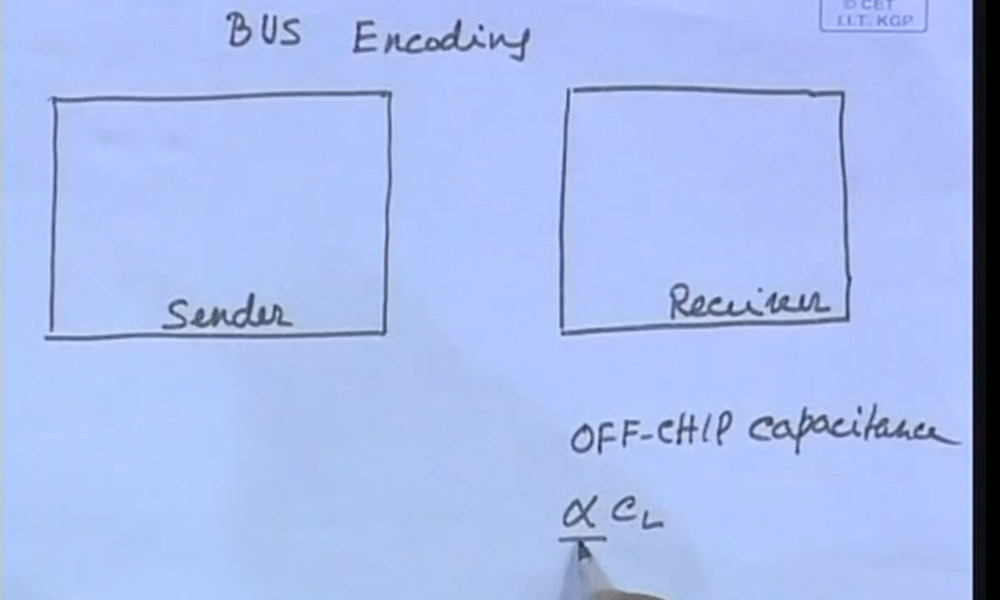

### What This Image Shows

This image introduces bus encoding.

It shows:

- a sender chip
- a receiver chip
- an off-chip bus between them
- large off-chip capacitance
- switching activity factor `alpha`
- load/bus capacitance `C_L` or `C_bus`

The important idea is that buses, especially off-chip buses, have large capacitance. Every time a bus line switches from 0 to 1 or 1 to 0, that capacitance is charged or discharged, and dynamic power is consumed.

### Proper Definition

Bus encoding is a low-power technique in which data is converted into another bit representation before transmission over a bus so that the number of bus transitions is reduced. At the receiver side, a decoder converts the encoded bus value back to the original data.

In simple form:

```text
Original data -> encoder -> bus -> decoder -> original data
```

The information does not change. Only the transmitted representation changes.

### Why Bus Encoding Is Important

Off-chip buses usually have higher capacitance than many internal nodes because they include:

- chip I/O pad capacitance
- package capacitance
- PCB trace capacitance
- receiver input capacitance
- sometimes connector or cable capacitance

Because dynamic power is:

```text
P_dynamic = alpha * C * V_DD^2 * f
```

a large `C_bus` makes bus transitions expensive.

So even a small reduction in switching activity `alpha` can save noticeable power.

### What Happens Without Encoding

Suppose the sender directly transmits data:

```text
Data(t-1) -> bus
Data(t)   -> bus
```

If many bits differ between `Data(t-1)` and `Data(t)`, many bus lines switch. Each switching line charges or discharges a large capacitance.

That increases:

- dynamic power
- peak current
- noise
- simultaneous switching problems

### What Happens With Encoding

With bus encoding:

```text
Data(t) -> encoder -> encoded bus value
encoded bus value -> decoder -> Data(t)
```

The encoder chooses a representation that causes fewer transitions on the high-capacitance bus.

The decoder restores the original data at the receiver.

### Important Tradeoff

Bus encoding is useful only when:

```text
power saved on the bus > power consumed by encoder and decoder
```

This condition is usually easier to satisfy for off-chip buses because `C_bus` is large.

For very small on-chip wires, the encoder/decoder overhead may be too high.

### Exam Answer

Bus encoding reduces switched capacitance by reducing the number of transitions on high-capacitance bus lines. The sender encodes the original data before transmission, and the receiver decodes it back. Since off-chip buses have large capacitance, reducing bus switching activity can significantly reduce dynamic power. The limitation is the extra area, delay, and power of encoder and decoder circuits.

## Image 6: Bus Charge Equation

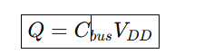

### What This Image Shows

This image shows the charge equation:

```text
Q = C_bus * V_DD
```

It means that when a bus line with capacitance `C_bus` is charged from 0 to `V_DD`, the amount of charge supplied is proportional to the capacitance and the supply voltage.

### Proper Definition

Capacitance is the ability of a node or conductor to store charge.

The basic capacitor relation is:

```text
Q = C * V
```

For a bus line charged to `V_DD`:

```text
Q = C_bus * V_DD
```

where:

- `Q` = charge supplied to the bus line
- `C_bus` = bus capacitance
- `V_DD` = supply voltage

### Why This Matters For Power

If `C_bus` is large, more charge is needed for every 0-to-1 transition.

Charging the bus line also requires energy from the supply. For a CMOS transition, the energy drawn from the supply for a 0-to-1 charging event is proportional to:

```text
C_bus * V_DD^2
```

When the line later discharges, the stored energy is dissipated.

So repeated bus switching leads to dynamic power:

```text
P_bus = alpha * C_bus * V_DD^2 * f
```

### Link With Bus Encoding

Bus encoding does not usually reduce `C_bus` physically. The bus wire and pad capacitance remain the same.

Instead, bus encoding reduces `alpha`.

That means:

```text
fewer transitions -> less charging/discharging -> lower dynamic power
```

### Exam Answer

The equation `Q = C_bus * V_DD` shows that the charge required to charge a bus line depends on bus capacitance and supply voltage. Since off-chip buses have large capacitance, each transition consumes significant dynamic energy. Bus encoding reduces the number of transitions, so the bus capacitance is charged and discharged fewer times, reducing switched capacitance and dynamic power.

## Image 7: Encoding Techniques Classification

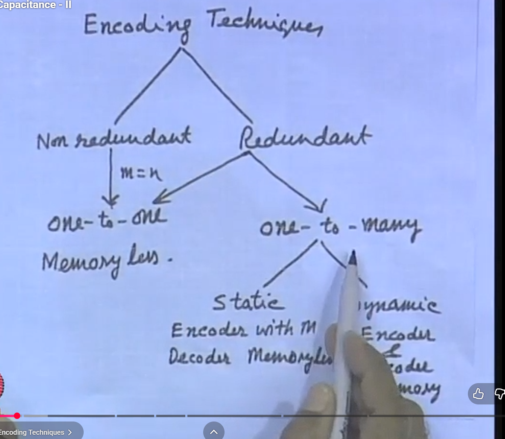

### What This Image Shows

This image classifies encoding techniques into:

- non-redundant encoding
- redundant encoding

It also shows ideas such as:

- one-to-one mapping
- one-to-many mapping
- static encoding
- dynamic encoding
- memoryless encoder/decoder
- encoder/decoder with memory

### Non-Redundant Encoding

In non-redundant encoding, an `n`-bit data word is mapped to another `n`-bit code word.

```text
m = n
```

That means no extra bus lines are added.

Example:

```text
Original n-bit data -> encoded n-bit data
```

The mapping is usually one-to-one, so every original word has one encoded word and the decoder can uniquely recover the original data.

### Why Non-Redundant Encoding Is Useful

Non-redundant encoding is useful when we cannot add extra pins or bus lines.

It can reduce switching if the code assignment is chosen carefully.

Example:

```text
Binary count transition:
0011 -> 0100
3 bits switch

Gray code transition:
only 1 bit switches between adjacent values
```

So Gray coding is a common non-redundant encoding example for sequential addresses or counters.

### Redundant Encoding

In redundant encoding, an `n`-bit data word is mapped to an `m`-bit code word where:

```text
m > n
```

That means extra bus lines are used.

The advantage is that extra code words become available. Because there are more possible transmitted patterns than original data values, the encoder can choose patterns that reduce transitions.

### One-To-One Mapping

One-to-one mapping means:

```text
one original data word -> one encoded word
```

This is simple because the receiver can decode directly.

It is usually memoryless if the encoded output depends only on the current input.

### One-To-Many Mapping

One-to-many mapping means:

```text
one original data word -> many possible encoded words
```

The encoder chooses one of the possible encoded forms depending on which one gives fewer transitions from the previous bus value.

This can reduce switching more than a fixed one-to-one code, but it usually requires more control and sometimes memory of previous bus state.

### Static Encoding

Static encoding uses a fixed mapping.

```text
current data word -> fixed encoded word
```

It does not depend on previous bus values.

Because of that, static encoders and decoders are often simpler and can be memoryless.

### Dynamic Encoding

Dynamic encoding changes the encoded value depending on previous activity or bus history.

```text
current data word + previous bus value -> chosen encoded word
```

This is useful because dynamic power depends on transitions, not only on the present value.

The encoder may choose the code word that produces the least Hamming distance from the previous bus value.

### Example: Bus-Invert Coding

Bus-invert coding is a common redundant bus encoding technique.

For an `n`-bit bus:

1. Compare the new data with the previous bus value.
2. Count how many bits would toggle.
3. If more than half the bits would toggle, send the inverted data instead.
4. Send an extra invert bit to tell the receiver whether inversion was used.

This uses:

```text
m = n + 1
```

The extra bit tells the decoder how to reconstruct the original data.

IEEE CEDA's page for the original bus-invert coding paper explains that bus-invert coding lowers bus activity and is especially useful for buses because buses often have large capacitances.

### Exam Answer

Encoding techniques for low-power buses are classified as non-redundant and redundant. In non-redundant encoding, an `n`-bit word is mapped to another `n`-bit word, so no extra bus lines are used. In redundant encoding, an `n`-bit word is mapped to an `m`-bit code word with `m > n`, so extra lines are used. Redundant encoding gives more possible code words, allowing the encoder to choose a low-transition representation. Static encoding uses a fixed mapping, while dynamic encoding chooses the transmitted code based on previous bus activity. These methods reduce switching activity and hence reduce switched capacitance.

## Image 8: One-Hot Coding

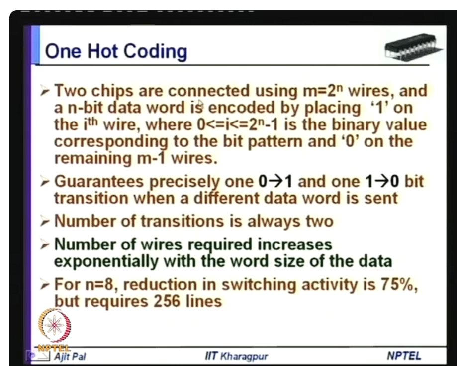

### Definition Of One-Hot Coding

One-hot coding is an encoding method in which exactly one bit is `1` and all remaining bits are `0`.

For example, four possible values can be represented as:

```text
Value 0 -> 0001
Value 1 -> 0010
Value 2 -> 0100
Value 3 -> 1000
```

In general, if there are `M` possible values, one-hot coding uses `M` wires or bits. Only one wire is active at a time.

For an `n`-bit binary data word, the number of possible values is:

```text
2^n
```

So one-hot bus coding requires:

```text
m = 2^n wires
```

This is why the image says that two chips are connected using `m = 2^n` wires.

### What This Image Shows

The image explains one-hot coding as a bus encoding technique.

It says:

- an `n`-bit data word is converted into one of `2^n` bus wires
- if the data value is `i`, then the `i`th wire is set to `1`
- all other wires are set to `0`
- when a different data word is sent, exactly one wire goes from `1` to `0` and one wire goes from `0` to `1`
- therefore, the number of bit transitions is always two
- the disadvantage is that the number of wires increases exponentially

### Why One-Hot Coding Reduces Switching

In normal binary coding, many bits can change at the same time.

Example:

```text
Binary:
0111 -> 1000
```

Here, all four bits change.

In one-hot coding, a transition from one value to another only changes two wires:

```text
Old value wire: 1 -> 0
New value wire: 0 -> 1
All other wires remain 0
```

So for every change to a different data word:

```text
number of transitions = 2
```

This is the main power-saving idea.

### Why It Is Called Redundant Encoding

One-hot coding is redundant for bus transmission because it uses more wires than the original binary data.

For an `n`-bit data word:

```text
original binary bus width = n
one-hot bus width = 2^n
```

So:

```text
m = 2^n > n
```

This extra hardware is redundancy.

### Example For n = 3

If `n = 3`, then there are:

```text
2^3 = 8 possible values
```

So the one-hot bus needs 8 wires:

```text
000 -> 00000001
001 -> 00000010
010 -> 00000100
011 -> 00001000
100 -> 00010000
101 -> 00100000
110 -> 01000000
111 -> 10000000
```

Only one bit is high for each value.

### Example For n = 8

The image says:

```text
For n = 8, one-hot coding requires 256 lines.
```

That is because:

```text
2^8 = 256
```

So an 8-bit data word, which normally needs only 8 wires, needs 256 wires in one-hot coding.

That is a very large area and pin-count cost.

### Why Switching Activity Can Reduce By 75 Percent For n = 8

For an 8-bit binary bus, the average number of bit transitions for random data is approximately:

```text
n / 2 = 8 / 2 = 4 transitions
```

In one-hot coding, when the data changes, the number of transitions is always:

```text
2 transitions
```

But the slide mentions 75 percent reduction. This comes from comparing against the worst-case binary transition of 8 transitions:

```text
reduction = (8 - 2) / 8 = 6 / 8 = 75 percent
```

So one-hot coding gives a strong bound on transitions, but it pays for that with many more wires.

### Low-Power Meaning

One-hot coding reduces switching activity `alpha`.

Since:

```text
P_dynamic = alpha * C * V_DD^2 * f
```

reducing transitions reduces dynamic power.

But one-hot coding also increases the number of wires, which increases total capacitance and area.

So it is useful only when the switching reduction is worth the extra capacitance and wiring overhead.

### Advantages

- simple decoding
- only one active line at a time
- predictable switching behavior
- useful for small sets of values
- can reduce switching activity

### Limitations

- requires `2^n` wires for `n` input bits
- wire count grows exponentially
- high area and routing cost
- may increase total capacitance
- impractical for large `n`
- not suitable for wide off-chip data buses unless the value set is very small

### Exam Answer

One-hot coding is a redundant encoding technique in which exactly one bit is `1` and all other bits are `0`. For an `n`-bit data word, one-hot coding requires `2^n` wires. If the transmitted value changes, exactly one old active line changes from `1` to `0` and one new active line changes from `0` to `1`, so the number of transitions is always two. This reduces switching activity and hence dynamic power, but the number of required wires increases exponentially. Therefore, one-hot coding is useful for small word sizes but impractical for large buses.

## Image 9: Bus Inversion Coding

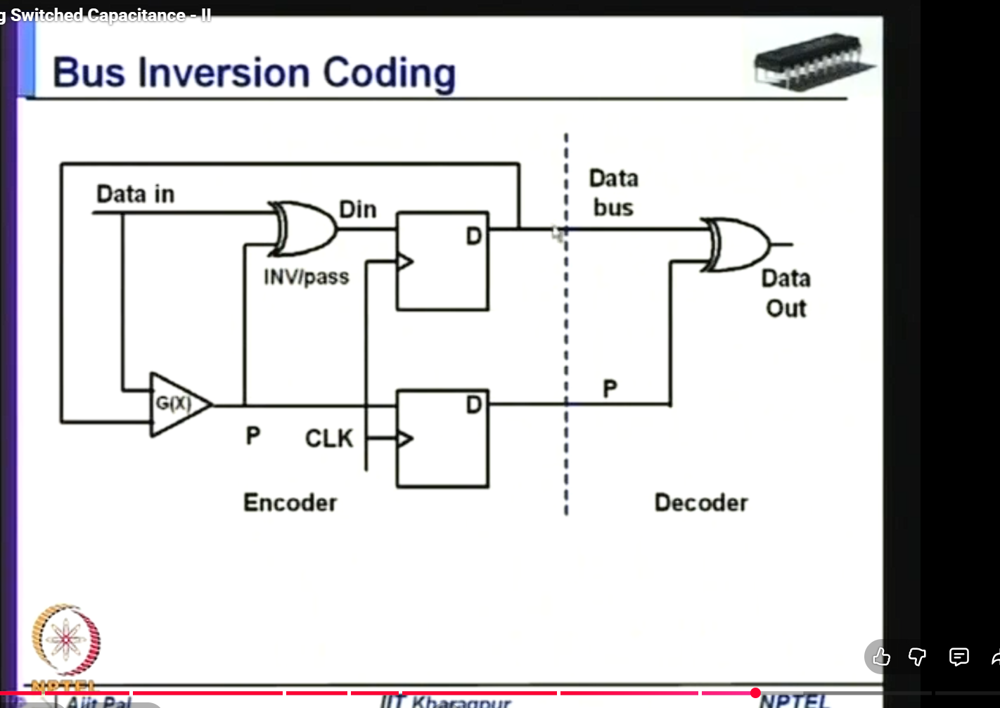

### Definition Of Bus Inversion Coding

Bus inversion coding, also called bus-invert coding, is a redundant low-power bus encoding technique in which the transmitter sends either the original data word or the inverted data word, depending on which choice causes fewer bus transitions.

It uses one extra control bit:

```text
P or INV
```

This bit tells the receiver whether the transmitted data should be passed directly or inverted back.

For an `n`-bit data bus, bus inversion coding uses:

```text
m = n + 1 wires
```

That means:

- `n` wires carry the data or inverted data
- `1` extra wire carries the invert/pass information

### What This Image Shows

The image shows the encoder and decoder circuit for bus inversion coding.

Important parts:

- `Data in`: original data word to be transmitted
- `G(X)`: logic block that decides whether to invert or pass the data
- `INV/pass`: control decision from the encoder
- `Din`: encoded data after possible inversion
- `D` flip-flops: store encoded data and the control bit
- `CLK`: clock for storing the bus value
- `P`: invert/pass bit sent along with the bus data
- `Data bus`: physical bus lines
- `Decoder`: reconstructs original data
- `Data Out`: recovered original data

The dashed vertical line separates the sender side from the receiver side.

### Why XOR Gates Are Used

The XOR gate can either pass or invert a bit depending on the control signal.

```text
Data XOR 0 = Data
Data XOR 1 = NOT Data
```

So at the encoder:

```text
if P = 0, send data normally
if P = 1, send inverted data
```

At the decoder:

```text
received bus value XOR P = original data
```

This works because XORing with the same control bit again reverses the operation.

### How Bus Inversion Coding Works

For every new data word:

1. Compare the new data word with the previous bus value.
2. Count how many bits would change. This is the Hamming distance.
3. If the number of transitions is less than or equal to `n/2`, send the data normally.
4. If the number of transitions is greater than `n/2`, send the inverted data.
5. Send the control bit `P` to tell the receiver what was done.
6. The receiver uses `P` to recover the original data.

In simple form:

```text
if HammingDistance(Data(t), Bus(t-1)) <= n/2:
    Bus(t) = Data(t)
    P = 0

else:
    Bus(t) = NOT Data(t)
    P = 1
```

Some notes may reverse the meaning of `P = 0` and `P = 1`, but the idea is unchanged:

```text
choose data or inverted data to reduce transitions.
```

### Simple Example

Previous bus value:

```text
Bus(t-1) = 00000000
```

New data:

```text
Data(t) = 11111111
```

Without bus inversion:

```text
00000000 -> 11111111
8 data lines switch
```

With bus inversion:

```text
NOT Data(t) = 00000000
```

So the data bus can remain:

```text
00000000
```

Only the invert/pass bit tells the receiver that inversion was used:

```text
P = 1
```

The decoder restores the original value:

```text
00000000 XOR 1 = 11111111
```

### Why It Reduces Power

Bus inversion coding reduces switching activity `alpha`.

Since bus dynamic power is:

```text
P_bus = alpha * C_bus * V_DD^2 * f
```

reducing the number of transitions reduces dynamic power.

This is especially useful for off-chip buses because `C_bus` is large.

IEEE CEDA's page for the original bus-invert paper states that bus-invert coding lowers bus activity and is well suited for buses because buses usually have large capacitance.

### Maximum Transition Property

Without bus inversion, an `n`-bit bus can have up to:

```text
n transitions
```

With bus inversion, the encoder avoids sending a word that changes more than half the data lines.

So data-line transitions are limited to about:

```text
n / 2
```

plus the possible transition on the extra control bit.

This reduces peak switching and peak current.

### Advantages

- reduces bus switching activity
- reduces dynamic power on high-capacitance buses
- reduces peak current
- needs only one extra control line
- decoder is simple
- works well for data buses

### Limitations

- requires one extra bus line
- encoder must compare current data with previous bus value
- needs storage of previous bus state
- adds encoder and decoder delay
- adds encoder and decoder power
- may not help much if data already has low switching activity

### Exam Answer

Bus inversion coding is a redundant low-power bus encoding technique. For an `n`-bit data bus, it uses `n + 1` lines: `n` data lines and one invert/pass control line. The encoder compares the new data with the previous bus value. If sending the original data would cause more than `n/2` transitions, the encoder sends the complement of the data and asserts the control bit. The decoder uses the control bit to recover the original data. This reduces bus switching activity and hence dynamic power, especially for high-capacitance off-chip buses.

## Image 10: Grouped Bus Inversion Coding

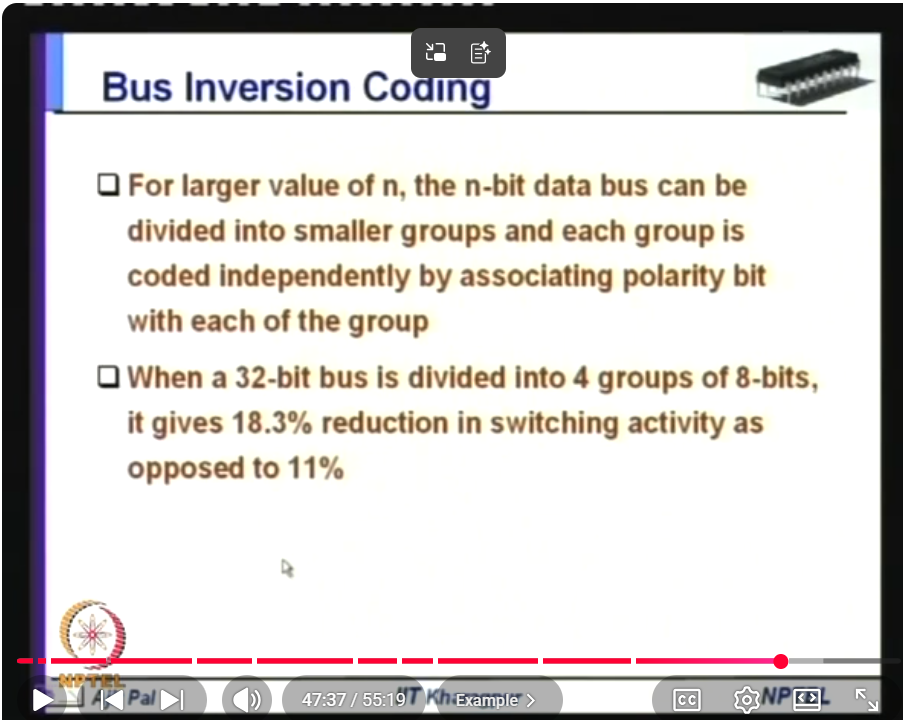

### Definition Of Grouped Bus Inversion Coding

Grouped bus inversion coding is a modified form of bus inversion coding in which a wide data bus is divided into smaller groups, and bus inversion is applied independently to each group.

Each group gets its own polarity bit:

```text
P0, P1, P2, ...
```

The polarity bit tells whether that particular group was transmitted normally or inverted.

So instead of using one invert bit for the entire wide bus, grouped bus inversion uses one invert bit per group.

### What This Image Shows

The image says:

- for larger `n`, the `n`-bit bus can be divided into smaller groups
- each group is coded independently
- each group has its own polarity bit
- when a 32-bit bus is divided into 4 groups of 8 bits, switching activity reduction improves
- the slide gives 18.3 percent reduction instead of 11 percent

The key idea is:

```text
large bus -> smaller groups -> independent inversion decision per group
```

### Why Grouping Is Needed

In normal bus inversion coding, one decision is made for the entire `n`-bit bus.

For a wide bus, this can be inefficient because different parts of the bus may behave differently.

Example:

```text
upper 8 bits may need inversion
lower 8 bits may not need inversion
```

If there is only one polarity bit for the whole 32-bit bus, the encoder must choose one global decision:

```text
invert all 32 bits
or
pass all 32 bits
```

That may not be optimal.

Grouped bus inversion solves this by allowing each group to decide independently.

### Example: 32-Bit Bus Divided Into 4 Groups

A 32-bit bus can be divided as:

```text
Group 0: bits  7:0
Group 1: bits 15:8
Group 2: bits 23:16
Group 3: bits 31:24
```

Each group has 8 bits.

Each group has its own polarity bit:

```text
P0 for Group 0
P1 for Group 1
P2 for Group 2
P3 for Group 3
```

So the total number of wires becomes:

```text
32 data wires + 4 polarity wires = 36 wires
```

### How The Encoder Works

For each 8-bit group:

1. Compare the new group value with the previous bus group value.
2. Count how many bits would toggle.
3. If more than 4 bits would toggle, invert that group.
4. If 4 or fewer bits would toggle, send that group normally.
5. Send the group's polarity bit.

For each group:

```text
if transitions in group > group_size / 2:
    send inverted group
    polarity bit = 1
else:
    send original group
    polarity bit = 0
```

The decoder performs the reverse operation for each group.

### Why It Reduces More Switching

Normal bus inversion uses one control decision for the entire bus.

Grouped bus inversion uses multiple smaller decisions.

Because each group is optimized independently, the encoder can reduce transitions more accurately.

That is why the slide says:

```text
32-bit bus with 4 groups of 8 bits -> 18.3 percent reduction
ordinary bus inversion -> 11 percent reduction
```

The exact percentage depends on data statistics, but the reason for improvement is the same:

```text
local decisions reduce more transitions than one global decision.
```

### Low-Power Meaning

Grouped bus inversion reduces switching activity `alpha` on a wide bus.

Since:

```text
P_bus = alpha * C_bus * V_DD^2 * f
```

lower `alpha` means lower bus dynamic power.

This is especially useful when:

- bus width is large
- bus capacitance is large
- different bit groups have different switching behavior
- off-chip or long interconnect switching power is important

### Tradeoff

Grouped bus inversion gives better switching reduction, but it needs more extra wires.

Normal bus inversion for 32 bits:

```text
32 data wires + 1 polarity wire = 33 wires
```

Grouped bus inversion with 4 groups:

```text
32 data wires + 4 polarity wires = 36 wires
```

So the tradeoff is:

```text
more polarity bits and more encoder/decoder logic
but lower switching activity
```

### Advantages

- better switching reduction for wide buses
- each group is optimized independently
- useful for buses with non-uniform switching behavior
- reduces dynamic power and peak switching

### Limitations

- requires one polarity bit per group
- increases wire count
- increases encoder/decoder logic
- adds delay
- benefit depends on data patterns
- too many small groups can make overhead too large

### Exam Answer

Grouped bus inversion coding divides a wide bus into smaller groups and applies bus inversion independently to each group. Each group has its own polarity bit to indicate whether that group is transmitted normally or inverted. For example, a 32-bit bus can be divided into four 8-bit groups, requiring four polarity bits. This gives better switching reduction than using one polarity bit for the whole bus because each group can choose its own low-transition representation. The limitation is extra polarity wires, encoder/decoder logic, and delay.

## Image 11: T0 Encoding Consecutive Address Example

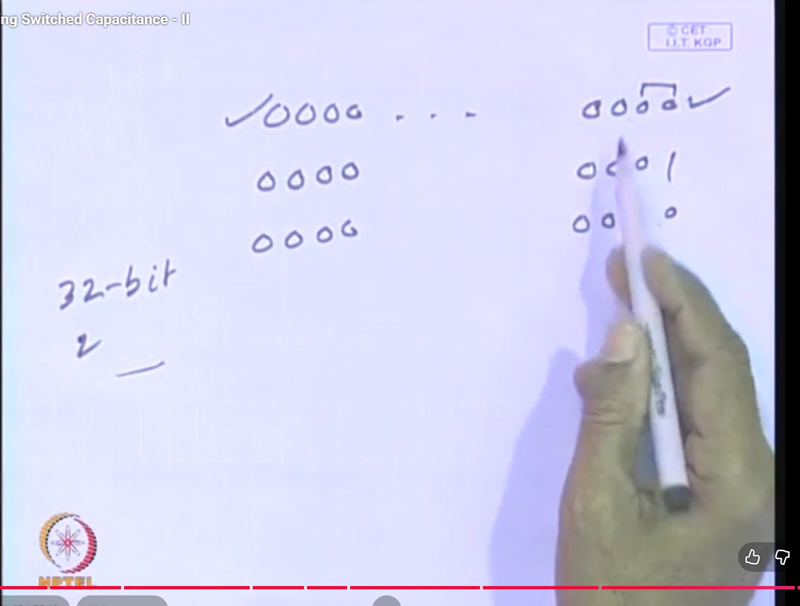

### Definition Of T0 Encoding

T0 encoding, also called T-zero encoding, is a redundant address-bus encoding technique that reduces switching activity for streams of consecutive addresses. If the next address is simply the previous address plus a fixed stride, the transmitter does not put the new address on the bus. Instead, it keeps the bus value unchanged and asserts an extra increment line.

That extra line is usually called:

```text
INC
```

The receiver uses `INC` to internally generate the next address.

In simple words:

```text
For consecutive addresses:
do not toggle the address bus;
toggle/use an increment signal instead.
```

### What "Inform The Other Side To Increase By 1" Means

In T0 encoding, "the other side" means the receiver or decoder side of the bus.

Normally, if the sender wants to send the next address, it would place the full new address on the address bus.

Example:

```text
Previous address = 0000
Next address     = 0001
```

The normal method sends:

```text
0001
```

on the full address bus.

In T0 encoding, if the receiver already knows the previous address, the sender does not need to send the full next address. It only sends a signal meaning:

```text
INC = 1
```

That means:

```text
receiver, take your previous address and add 1
```

So the receiver does this internally:

```text
new address = previous address + 1
```

The important point is that the address bus wires do not change. Only the extra `INC` line tells the receiver to increment its stored address.

If the system uses byte addresses but fetches 32-bit words, the increase may be by 4 bytes instead of 1 byte:

```text
new address = previous address + 4
```

That is why some notes write the increment generally as a stride `S`:

```text
new address = previous address + S
```

For the exam, you can write:

```text
INC = 1 tells the receiver that the next address is consecutive, so the receiver increments the previous address locally instead of receiving a new address on the bus.
```

### What This Image Shows

This image is a handwritten explanation of why address buses can waste power.

It shows a wide address bus, such as a 32-bit bus, and a sequence of address values. Consecutive binary addresses often change in the lower bits. Sometimes several lower bits toggle at the same time because of carry propagation.

Example:

```text
0000 -> 0001
0001 -> 0010
0011 -> 0100
0111 -> 1000
```

The transition:

```text
0111 -> 1000
```

causes many bit changes.

For a wide bus, such as a 32-bit address bus, these transitions can consume noticeable dynamic power because the bus capacitance is large.

### What The 32-Bit Address In The Image Means

The image is referring to a 32-bit address bus.

That means the address bus has:

```text
32 address lines
```

Each line carries one bit of the address.

So one address looks like:

```text
A31 A30 A29 ... A2 A1 A0
```

A 32-bit address is not "2 bits". It means 32 bits are used to represent one address.

With 32 bits, the number of possible address patterns is:

```text
2^32
```

That is probably the "2" idea being written in the image: a 32-bit address bus can represent `2^32` different addresses.

If the machine is byte-addressable:

```text
2^32 byte addresses = 4 GB address space
```

In T0 encoding, the point is not that the address is only 2 bits. The point is:

```text
32-bit bus is wide -> many wires can switch -> high capacitance -> high power
```

T0 avoids repeatedly switching those 32 address wires when addresses are consecutive.

### Why Consecutive Addresses Are Common

Address buses often carry consecutive addresses because processors frequently access:

- sequential instructions
- array elements
- memory blocks
- cache-line data
- loop data

So low-power address-bus encoding tries to exploit this regular pattern.

### Why T0 Encoding Helps

If the address sequence is consecutive, the receiver can predict the next address.

Instead of transmitting:

```text
A
A + S
A + 2S
A + 3S
```

the transmitter can send the first address once and then indicate:

```text
next address = previous address + S
```

using the `INC` line.

So the high-capacitance address bus does not need to switch for every consecutive address.

### Low-Power Meaning

T0 encoding reduces switching activity `alpha` on the address bus.

Since:

```text
P_bus = alpha * C_bus * V_DD^2 * f
```

reducing address-bus transitions reduces dynamic power.

This is especially useful when:

- the bus is wide
- bus capacitance is large
- addresses are mostly sequential
- instruction fetch or memory access streams are common

### Exam Answer

T0 encoding is a redundant address-bus encoding method for low power. It exploits the fact that many address streams are consecutive. When the next address equals the previous address plus a fixed stride, the address bus is kept unchanged and an extra `INC` line is asserted. The receiver then generates the next address internally. This reduces switching activity on the high-capacitance address bus and hence reduces dynamic power.

## Image 12: T0 Encoding Zero-Transition Address Bus

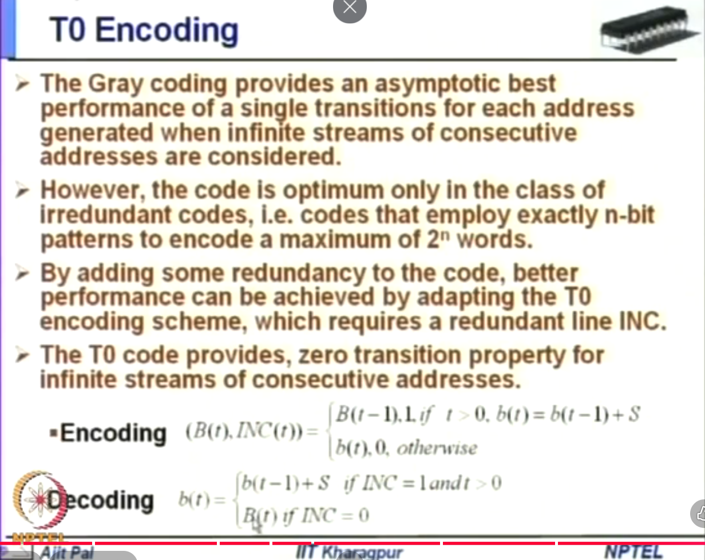

### Definition Of T0 Encoding

T0 encoding is a redundant bus encoding scheme that gives zero transitions on the address bus for long streams of consecutive addresses. It adds a redundant line `INC` to tell the receiver whether the current address should be generated by incrementing the previous address.

The word redundant is important because T0 uses extra information:

```text
original n-bit address bus + INC line
```

So the transmitted representation has more bits than the original address.

### What This Image Shows

The slide compares Gray coding and T0 encoding.

It says:

- Gray coding gives one transition for each consecutive address in the asymptotic case
- Gray coding is optimum only among irredundant codes
- irredundant means exactly `n` bits are used to encode up to `2^n` words
- better performance can be obtained by adding redundancy
- T0 encoding adds a redundant line called `INC`
- T0 gives zero address-bus transitions for infinite streams of consecutive addresses

### Definition Of Gray Coding

Gray coding is an encoding method in which consecutive code words differ by exactly one bit.

Example:

```text
Binary:
00, 01, 10, 11

Gray code:
00, 01, 11, 10
```

Between adjacent Gray-code values, only one bit changes.

That is why Gray coding is good for consecutive addresses, counters, and FIFO pointers.

### Why Gray Coding Is Not Enough Here

Gray coding uses exactly `n` bits for `2^n` possible values.

So it is irredundant:

```text
m = n
```

It can reduce consecutive address transitions to one bit per address, but it cannot reduce them to zero because the bus value must still change to represent the next address.

T0 encoding adds the `INC` line, so it becomes redundant:

```text
m = n + 1
```

That extra line lets the address bus stay unchanged during sequential address streams.

### T0 Encoding Formula

Let:

- `b(t)` = original address at time `t`
- `B(t)` = encoded address placed on the bus at time `t`
- `INC(t)` = increment line at time `t`
- `S` = fixed address stride

The encoding rule is:

```text
If t > 0 and b(t) = b(t-1) + S:
    B(t) = B(t-1)
    INC(t) = 1

Otherwise:
    B(t) = b(t)
    INC(t) = 0
```

The decoding rule is:

```text
If INC(t) = 1 and t > 0:
    b(t) = b(t-1) + S

If INC(t) = 0:
    b(t) = B(t)
```

Here, `t > 0` means the current transfer is not the first transfer. At `t = 0`, there is no previous address `b(t-1)` stored at the receiver, so the encoder must send the full address normally. After the first address has been sent, the receiver has a previous address. Then, when `t > 0`, `INC = 1` can safely mean:

```text
receiver, use your previous decoded address and add S
```

If the lecture says "increase by 1", it is describing the common case where the stride is one address step:

```text
S = 1
new address = previous address + 1
```

For word-addressed or byte-addressed systems, the stride may be written generally as `S`, for example `S = 4` for consecutive 32-bit word fetches in a byte-addressed memory.

### How It Works Step By Step

Suppose the address stream is:

```text
1000, 1004, 1008, 100C, 1010
```

and the stride is:

```text
S = 4
```

First address:

```text
B(0) = 1000
INC(0) = 0
```

Next address is consecutive:

```text
b(1) = b(0) + 4
```

So:

```text
B(1) = B(0)
INC(1) = 1
```

The bus address lines stay the same. The receiver sees `INC = 1` and generates:

```text
b(1) = b(0) + 4
```

This repeats for the consecutive stream.

### Why It Gives Zero Address-Bus Transitions

During a consecutive stream, the address bus value `B(t)` is held constant:

```text
B(t) = B(t-1)
```

So the address bus itself has:

```text
zero transitions
```

Only the redundant `INC` line communicates that the receiver should increment internally.

That is why the slide says T0 provides a zero-transition property for infinite streams of consecutive addresses.

### Low-Power Meaning

T0 encoding reduces switching activity on high-capacitance address lines.

Since:

```text
P_address_bus = alpha * C_bus * V_DD^2 * f
```

keeping the address bus unchanged during sequential access reduces `alpha` almost to zero for those address lines.

### Limitations

- needs an extra `INC` line
- encoder must detect consecutive addresses
- decoder must store previous address
- decoder must increment internally
- benefit is high only when address streams are mostly consecutive
- random address patterns reduce the advantage
- the `INC` line and extra logic also consume some power

### Exam Answer

T0 encoding is a redundant address-bus encoding technique that adds an `INC` line. If the current address is equal to the previous address plus a fixed stride, the encoder keeps the address bus unchanged and asserts `INC`. The decoder then reconstructs the address by incrementing the previous decoded address. For long streams of consecutive addresses, this gives zero transitions on the address bus, reducing switched capacitance and dynamic power. Compared with Gray coding, which gives one transition for consecutive values without extra bits, T0 can do better by using redundancy.

## Short Exam Answer

Switched capacitance is the product of switching activity and capacitance. Dynamic power in CMOS is:

```text
P_dynamic = alpha * C * V_DD^2 * f
```

Therefore, reducing switched capacitance means reducing `alpha*C`.

The dynamic power dissipation image shows that CMOS dynamic power has three components: switching power, short-circuit power, and glitching power. The CMOS inverter derivation image shows why one complete output switching cycle consumes `C_L*V_DD^2` energy and leads to `P_dynamic = alpha*C_L*V_DD^2*f`. The switched-capacitance formula image shows that both output load capacitance and internal node capacitances consume dynamic power. The input-gating image shows operand isolation, where unused units such as an adder or subtractor are disabled to avoid unnecessary switching. The ADC images show a hardware-software tradeoff, where a DAC and comparator with software can replace a dedicated ADC for slow, low-cost applications. The bus-encoding images explain that buses have large capacitance, charging a bus requires `Q = C_bus * V_DD`, and encoding can be non-redundant or redundant depending on whether extra bus lines are used. One-hot coding uses exactly one active line and a data change causes two transitions, but wire count grows as `2^n`. Bus inversion sends either data or inverted data using an extra control bit to reduce transitions. Grouped bus inversion divides a wide bus into smaller groups and gives each group its own polarity bit for better switching reduction. T0 encoding represents consecutive addresses using an `INC` line so the address bus can remain unchanged.

Pipelining and parallelism are performance techniques. Pipelining divides work into stages and overlaps different operations in time. Parallelism uses multiple resources to execute independent operations at the same time. In VLSI, pipelining increases throughput and clock frequency but adds registers and clock power. Parallelism increases throughput using more hardware but increases area, power, routing, and bandwidth demand.

## Sources Used

- NPTEL course page, Low Power VLSI Circuits & Systems, IIT Kharagpur: https://nptel.ac.in/courses/106105034
- NPTEL syllabus PDF listing switched capacitance minimization approaches: https://archive.nptel.ac.in/content/syllabus_pdf/106105034.pdf
- UMBC CMPE 413 lecture on CMOS power dissipation and dynamic power: https://courses.cs.umbc.edu/undergraduate/CMPE315/Spring21/cpatel2/lectures/chap4_lect12_power.pdf
- NIST CSRC glossary, encode: https://csrc.nist.gov/glossary/term/encode
- Federal Agencies Digitization Guidelines Initiative glossary, encoding: https://www.digitizationguidelines.gov/term.php?term=encoding
- TechTarget, encoding and decoding: https://www.techtarget.com/searchnetworking/definition/encoding-and-decoding
- Local PPT outline reference: `PPT/PVL 207 Lec 12 (Minimizing switched Capacitances) [Autosaved].pptx`, slide 2 lists `Bus encoding` and `State encoding` as switched-capacitance minimization techniques.
- Local PPT outline reference: `PPT/PVL 207 Lec 13 (Minimizing Switched capacitances) [Autosaved].pptx`, slide 2 continues the switched-capacitance minimization topic list.
- Analog Devices article on DAC/comparator combinations: https://www.analog.com/en/resources/technical-articles/comparatordac-combinations-solve-dataacquisition-problems.html
- IEEE CEDA, Bus-invert Coding for Low-Power I/O: https://ieee-ceda.org/media/bus-invert-coding-low-power-io
- IBM Research, Narrow bus encoding for low-power DSP systems: https://research.ibm.com/publications/narrow-bus-encoding-for-low-power-dsp-systems
- UCI/GLSVLSI paper, Asymptotic Zero-Transition Activity Encoding for Address Busses: https://websrv.cecs.uci.edu/~papers/compendium94-03/papers/1997/glsvlsi97/pdffiles/glsvlsi97_077.pdf
- Columbia University lecture notes, combinational logic and one-hot encoding: https://www.cs.columbia.edu/~sedwards/classes/2015/3827-summer/combinational.pdf
- Sigasi, one-hot FSM encoding explanation: https://www.sigasi.com/tech/vhdl-onehot-fsm/
- CSE IIT Delhi, Principles of Pipelining: https://www.cse.iitd.ac.in/~srsarangi/archbook/chapters/pipelining.pdf
- IBM, What is parallel computing?: https://www.ibm.com/think/topics/parallel-computing
- ETH Zurich, Numerical Parallel Computing: https://people.inf.ethz.ch/arbenz/PARCO/2.pdf
- YouTube video reference provided by user, playlist index 27: https://www.youtube.com/watch?v=0ykJeTGqv6M&list=PLTEh-62_zAfHmJE-pcjgREKiKyPSgjkxj&index=27
- YouTube video reference provided by user, playlist index 29: https://www.youtube.com/watch?v=t64bIY20X4M&list=PLTEh-62_zAfHmJE-pcjgREKiKyPSgjkxj&index=29
