# SRAM

This file starts the notes for SRAM and memory-cell operation.

## Screenshot Confirmation

The supply-voltage-scaling screenshots already processed are in `supply voltage scaling.md` as Image 1 through Image 19.

The new screenshots are SRAM-related. They are linked below.

## Related PPT And References

- Local PPT found in this workspace: `PPT/Memory Design_PVL331_1Module1 - SRAmL1.pptx`
- Local PPT found in this workspace: `PPT/Memory Design_PVL331_1Module1 -SRAML2.pptx`
- Local PPT found in this workspace: `PPT/Memory Design_PVL331_1Module1 - SRAM3.pptx`

## Index

1. [Definition of SRAM](#definition-of-sram)
2. [Image 1: 6T SRAM cell read operation](#image-1-6t-sram-cell-read-operation)
3. [Image 2: SRAM read operation step summary](#image-2-sram-read-operation-step-summary)
4. [Image 3: Duplicate crop of read-operation diagram](#image-3-duplicate-crop-of-read-operation-diagram)
5. [Image 4: 6T SRAM cell write operation](#image-4-6t-sram-cell-write-operation)
6. [Image 5: Internal organization of memory](#image-5-internal-organization-of-memory)
7. [Image 6: Peripheral circuit](#image-6-peripheral-circuit)
8. [Image 7: I/O interface circuit](#image-7-io-interface-circuit)
9. [Image 8: SRAM peripheral circuit elements](#image-8-sram-peripheral-circuit-elements)
10. [Difference between peripheral circuit and I/O interface](#difference-between-peripheral-circuit-and-io-interface)
11. [Full read operation sequence](#full-read-operation-sequence)
12. [Full write operation sequence](#full-write-operation-sequence)
13. [Image 9: SRAM hold and read stability](#image-9-sram-hold-and-read-stability)
14. [Image 10: SRAM writeability](#image-10-sram-writeability)
15. [Deep topic: read stability vs writeability](#deep-topic-read-stability-vs-writeability)
16. [Short exam answer](#short-exam-answer)
17. [Sources used](#sources-used)

## Definition Of SRAM

`SRAM` means Static Random Access Memory.

It is called `static` because the stored bit is maintained by a latch made from cross-coupled inverters, as long as power is supplied.

So, unlike DRAM:

```text
SRAM does not need periodic refresh for data retention.
```

A common SRAM bit cell is the `6T SRAM cell`, meaning it uses six transistors:

```text
2 PMOS pull-up transistors
2 NMOS pull-down transistors
2 NMOS access transistors
```

The cell stores one bit using two internal storage nodes:

```text
Q
Qbar
```

If:

```text
Q = 1
Qbar = 0
```

the cell stores logic `1`.

If:

```text
Q = 0
Qbar = 1
```

the cell stores logic `0`.

## Image 1: 6T SRAM Cell Read Operation

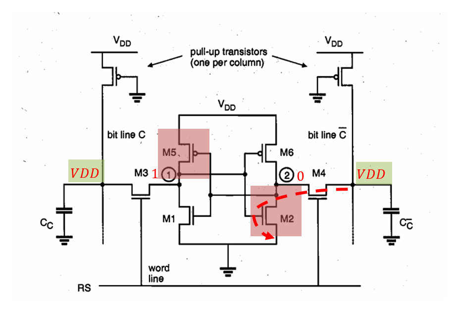

### Definition Of 6T SRAM Cell

A 6T SRAM cell is a one-bit memory cell made from two cross-coupled CMOS inverters and two access transistors.

The two inverters form a latch:

```text
left inverter output  -> Q
right inverter output -> Qbar
```

Because they are cross-coupled:

```text
Q controls Qbar
Qbar controls Q
```

This feedback keeps the stored value stable.

### What This Image Shows

The image shows a 6T SRAM cell connected to two bit lines:

```text
bit line C
bit line Cbar
```

The annotated state is:

```text
Q = 1
Qbar = 0
```

Both bit lines are initially precharged to:

```text
VDD
```

Then the word line is activated, allowing the stored cell value to affect the bit lines.

### Use Of Each Transistor

| Transistor | Type/role | Use |
|---|---|---|
| `M5` | PMOS pull-up | pulls the left internal node high when that side stores `1` |
| `M1` | NMOS pull-down | pulls the left internal node low when that side stores `0` |
| `M6` | PMOS pull-up | pulls the right internal node high when that side stores `1` |
| `M2` | NMOS pull-down | pulls the right internal node low when that side stores `0` |
| `M3` | access transistor | connects left storage node to bit line `C` when word line is high |
| `M4` | access transistor | connects right storage node to bit line `Cbar` when word line is high |

So:

```text
M5, M1 -> left inverter
M6, M2 -> right inverter
M3, M4 -> access/pass transistors
```

### Use Of Each Signal/Node

| Signal/node | Use |
|---|---|
| `VDD` | supply voltage |
| `word line` or `WL` | selects the cell for read/write |
| `RS` | row-select/word-line control in the screenshot |
| `bit line C` | carries the left-side cell information |
| `bit line Cbar` | carries the complementary right-side cell information |
| `Cc` | large bit-line capacitance |
| pull-up transistors above bit lines | precharge bit lines to `VDD` before read |
| `Q` | true storage node |
| `Qbar` | complement storage node |

### Why Bit Lines Are Precharged To VDD

Before reading, both bit lines are charged to:

```text
VDD
```

This creates a known starting condition:

```text
bit line C    = VDD
bit line Cbar = VDD
```

Then during read, one side may discharge slightly.

The sense amplifier detects which bit line dropped.

This is faster than waiting for a full rail-to-rail swing.

### Read Operation For Stored `1`

In this image, the cell stores:

```text
Q = 1
Qbar = 0
```

So the left storage node is high and the right storage node is low.

Before read:

```text
bit line C    = VDD
bit line Cbar = VDD
WL = 0
```

When the word line becomes high:

```text
WL = 1
```

access transistors `M3` and `M4` turn ON.

Left side:

```text
Q = 1
bit line C = VDD
```

Both are already high, so bit line `C` stays near `VDD`.

Right side:

```text
Qbar = 0
bit line Cbar = VDD
```

Now `M4` connects the precharged bit line `Cbar` to the low internal node.

The discharge path is:

```text
bit line Cbar -> M4 -> M2 -> ground
```

So:

```text
bit line Cbar decreases slightly
```

The sense amplifier sees:

```text
bit line C    is higher
bit line Cbar is lower
```

Therefore it decides:

```text
stored data = 1
```

### Why The Bit Line Only Drops Slightly

The bit line has large capacitance `Cc`.

Fully discharging it would be slow and waste energy.

So SRAM read circuits usually detect only a small voltage difference:

```text
Delta V = V(bit line C) - V(bit line Cbar)
```

The sense amplifier converts this small analog difference into a full digital output.

This is why the bit lines go to a sense amplifier instead of directly becoming the final output.

### Read Disturb Point

During read, the low internal node is connected to a precharged high bit line through an access transistor.

For the right side in this example:

```text
bit line Cbar = VDD
Qbar = 0
```

When `M4` turns ON, the low node may rise slightly because it is connected to a high bit line.

But the pull-down transistor `M2` must keep it low enough so the latch does not flip.

This is called read stability.

A safe SRAM cell is designed so:

```text
pull-down transistor is strong enough compared with access transistor
```

This prevents accidental flipping during read.

## Image 2: SRAM Read Operation Step Summary

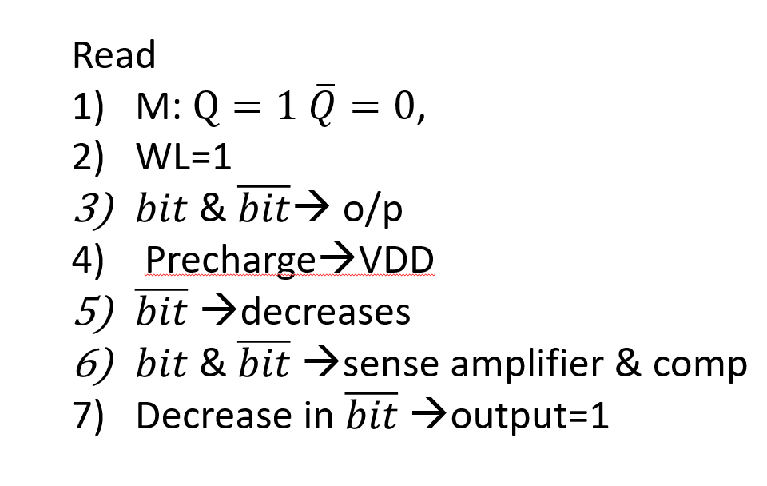

### What This Image Shows

This image lists the read operation in short steps.

The stored memory state is:

```text
Q = 1
Qbar = 0
```

The goal is to read the stored `1` without changing the value stored inside the cell.

### Meaning Of Each Step

| Step | Meaning |
|---|---|
| `M: Q = 1, Qbar = 0` | the memory cell currently stores `1` |
| `WL = 1` | word line is asserted, so access transistors turn ON |
| `bit and bitbar -> o/p` | bit lines carry differential read information toward output circuitry |
| `Precharge -> VDD` | both bit lines are initially charged high |
| `bitbar decreases` | the bit line connected to the stored `0` side discharges |
| `bit and bitbar -> sense amplifier and comparator` | small voltage difference is amplified |
| `decrease in bitbar -> output = 1` | lower complement bit line means true data is `1` |

### Important Correction

The bit lines are not usually the final digital output by themselves.

They are analog/differential signals during read.

The real read output is produced after:

```text
bit line pair -> sense amplifier -> digital output
```

So when the slide says:

```text
bit and bitbar -> output
```

the practical meaning is:

```text
bit and bitbar carry the read information to the sensing/output circuit
```

### Why Decrease In `bitbar` Means Output `1`

The stored value is:

```text
Q = 1
Qbar = 0
```

The bit line connected to `Qbar` discharges because `Qbar` is low.

So:

```text
bitbar decreases
bit remains high
```

The sense amplifier interprets:

```text
bit > bitbar
```

as:

```text
output = 1
```

If the stored value were reversed:

```text
Q = 0
Qbar = 1
```

then the true bit line would decrease, and the output would be `0`.

## Image 3: Duplicate Crop Of Read-Operation Diagram

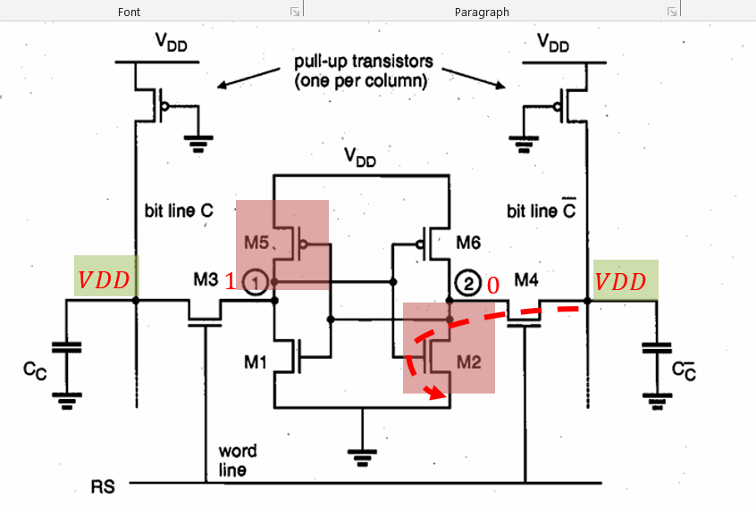

This is another crop of the same SRAM read-operation diagram.

It shows the same concept as Image 1:

```text
Q = 1
Qbar = 0
bit lines precharged to VDD
word line selected
Cbar side discharges through M4 and M2
```

The useful part is the red-marked discharge path on the right side.

That red path shows why the complement bit line drops during read of a stored `1`.

## Image 4: 6T SRAM Cell Write Operation

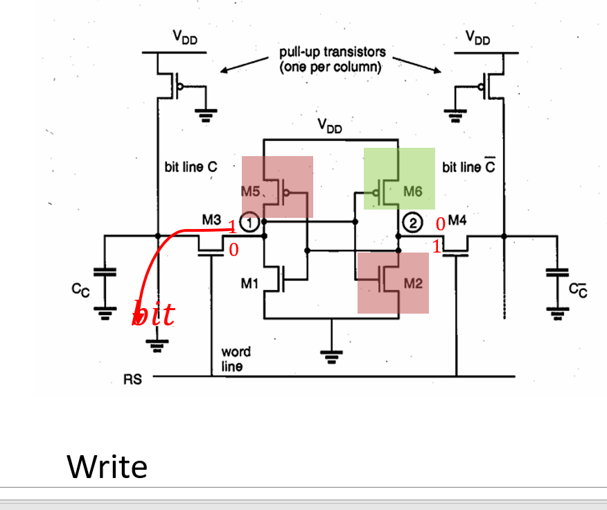

### Definition Of SRAM Write Operation

An SRAM write operation means forcing a new value into the cross-coupled inverter latch through the access transistors and bit lines.

During write, the bit lines are not just sensed.

They are actively driven by write-driver circuits.

For a differential SRAM cell:

```text
write 1 -> BL = 1, BLB = 0
write 0 -> BL = 0, BLB = 1
```

Here `BL` is the true bit line, and `BLB` is the complement bit line.

### What This Image Shows

The image shows a write operation on the 6T SRAM cell.

The annotated condition is:

```text
old cell value: Q = 1, Qbar = 0
bit line C is forced to 0
bit line Cbar is forced to 1
```

So this image is showing the cell being overwritten from:

```text
Q = 1, Qbar = 0
```

to:

```text
Q = 0, Qbar = 1
```

That means the operation is:

```text
writing 0 into the cell
```

### Use Of Each Part During Write

| Part | Use during write |
|---|---|
| `bit line C` or `BL` | driven to the data value being written |
| `bit line Cbar` or `BLB` | driven to the complement of the data |
| write driver | actively forces `BL/BLB` to `0/1` or `1/0` |
| word line `WL` | turns ON access transistors `M3` and `M4` |
| `M3` | passes the true bit-line value into node `Q` |
| `M4` | passes the complement bit-line value into node `Qbar` |
| cross-coupled inverters | latch and reinforce the new value after the cell flips |
| `M5/M1` | left inverter pair |
| `M6/M2` | right inverter pair |

### Step-By-Step Meaning Of The Image

Initial stored value:

```text
Q = 1
Qbar = 0
```

To write `0`, the write driver sets:

```text
BL  = 0
BLB = 1
```

Then the word line is asserted:

```text
WL = 1
```

This turns ON:

```text
M3 and M4
```

Now the bit lines are connected to the internal storage nodes.

The left bit line pulls `Q` downward:

```text
BL = 0 -> M3 -> Q pulled from 1 toward 0
```

The right bit line helps pull `Qbar` upward:

```text
BLB = 1 -> M4 -> Qbar pulled from 0 toward 1
```

Once `Q` falls low enough, the right inverter changes state:

```text
Q low -> M6 turns ON -> Qbar rises to 1
```

Once `Qbar` rises high enough, the left inverter reinforces the new state:

```text
Qbar high -> M1 turns ON and M5 turns OFF -> Q stays 0
```

The cell has now flipped.

Final stored value:

```text
Q = 0
Qbar = 1
```

### Why Write Needs Strong Drivers

During write, the cell may resist being changed.

In this image, the cell initially stores:

```text
Q = 1
```

So the left pull-up PMOS is trying to keep `Q` high.

But to write `0`, the write driver must pull `Q` low through access transistor `M3`.

Therefore the write path must overpower the cell's previous state.

This is called write ability.

A successful write requires:

```text
write driver + access transistor strong enough to flip the latch
```

If the write driver/access path is too weak, the cell may not change value.

### Difference Between Read And Write

| Operation | Bit-line behavior | Goal |
|---|---|---|
| Read | bit lines are precharged, then one discharges slightly | detect stored value without changing it |
| Write | bit lines are actively driven to opposite values | force a new value into the cell |

So:

```text
read  -> cell controls bit lines
write -> bit lines control cell
```

This is the most important difference.

### Short Exam Answer For This Image

During an SRAM write operation, the write driver forces the bit lines to the desired data and its complement. To write `0`, the true bit line is driven to `0` and the complement bit line is driven to `1`. When the word line is asserted, access transistors `M3` and `M4` connect the bit lines to the internal nodes. The true bit line pulls `Q` low and the complement bit line pulls `Qbar` high. Once one internal node crosses the inverter switching threshold, the cross-coupled inverters regenerate the new state and latch `Q = 0, Qbar = 1`. Thus, during write, the bit lines force the SRAM cell to change state.

## Image 5: Internal Organization Of Memory

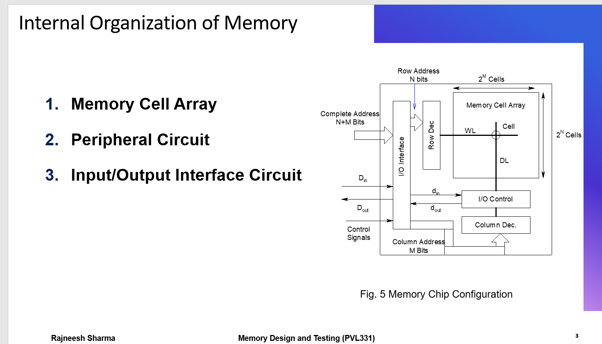

Clearer capture of the same slide:

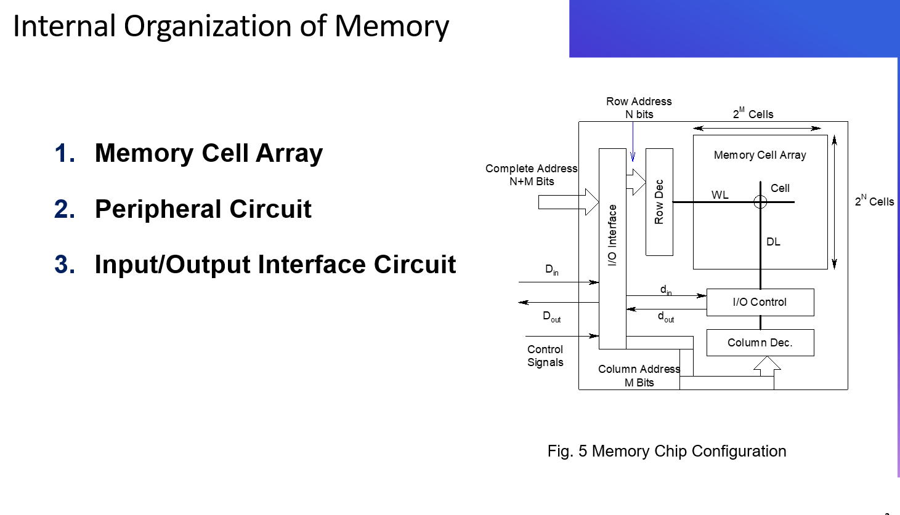

Focused crop of the memory-chip configuration diagram:

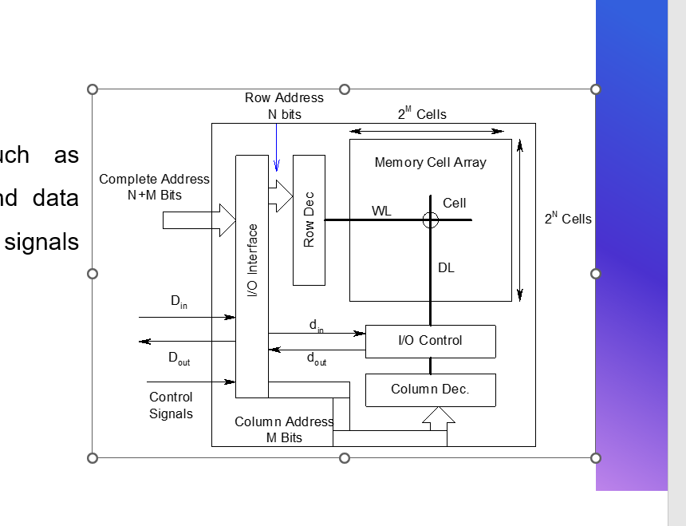

### Definition Of Memory Internal Organization

Memory internal organization means how a memory chip is divided into storage cells, address-selection circuits, input/output circuits, and control circuits.

The image lists three main parts:

```text
1. Memory Cell Array
2. Peripheral Circuit
3. Input/Output Interface Circuit
```

### What This Image Shows

The diagram shows how a complete address selects one cell or one group of cells inside a memory array.

The complete address has:

```text
N + M bits
```

It is divided into:

```text
N row-address bits
M column-address bits
```

The row address selects a word line.

The column address selects the required column/data line.

### Use Of Each Block

| Block/signal | Use |
|---|---|
| memory cell array | stores bits in rows and columns |
| row address `N bits` | selects one row out of `2^N` rows |
| column address `M bits` | selects one column or word group out of `2^M` columns |
| row decoder | converts row address into one active word line |
| column decoder | selects the correct column/data line |
| word line `WL` | activates all cells in the selected row |
| data line `DL` | carries read/write data for selected column |
| I/O control | controls read/write data movement between array and external pins |
| I/O interface | receives address, data, and control from outside the memory |
| `Din` | external write data input |
| `Dout` | external read data output |
| control signals | specify read, write, enable, chip select, etc. |

### Memory Cell Array

The memory cell array is the main storage part.

It contains many SRAM cells arranged in a grid:

```text
rows x columns
```

Rows are selected using word lines.

Columns are selected using bit lines or data lines.

The diagram marks:

```text
2^N rows/cells in vertical direction
2^M cells/columns in horizontal direction
```

So the address is split because selecting memory directly with one huge decoder would be inefficient.

### Row Decoder

The row decoder receives:

```text
N-bit row address
```

and activates one word line.

Example:

```text
N = 10
number of rows = 2^10 = 1024
```

The row decoder turns exactly one row ON during access.

That row's cells connect to their bit lines.

### Column Decoder

The column decoder receives:

```text
M-bit column address
```

and selects the required column or group of columns.

Example:

```text
M = 8
number of column choices = 2^8 = 256
```

The column decoder decides which bit line/data line reaches the I/O circuitry.

### I/O Interface Circuit

The I/O interface is the boundary between the memory chip and the outside system.

It handles:

```text
complete address
input data
output data
control signals
```

It may include buffers, address latches, data drivers, and timing/control logic.

### I/O Control

The I/O control block manages data movement between the selected memory cell and the external data pins.

During read:

```text
cell array -> sense/data line -> I/O control -> Dout
```

During write:

```text
Din -> I/O control -> selected column/data line -> selected cell
```

### How A Read Happens In This Organization

Read sequence:

```text
1. complete address enters I/O interface
2. row address goes to row decoder
3. column address goes to column decoder
4. row decoder activates selected WL
5. selected cells affect bit lines/data lines
6. column decoder selects the requested column
7. I/O control sends sensed data to Dout
```

### How A Write Happens In This Organization

Write sequence:

```text
1. complete address enters I/O interface
2. Din provides data to be written
3. row decoder activates selected word line
4. column decoder selects target column
5. I/O control drives selected data/bit lines
6. selected SRAM cell stores the new value
```

### Short Exam Answer For This Image

The internal organization of memory consists of a memory cell array, peripheral circuits, and input/output interface circuits. The memory array stores bits in rows and columns. The complete address is split into row and column parts. The row decoder uses the `N` row-address bits to select one word line among `2^N` rows. The column decoder uses the `M` column-address bits to select the required column among `2^M` possibilities. The I/O interface receives address, data, and control signals from outside the chip, while I/O control manages read and write transfer between the selected cell and `Din/Dout`.

## Image 6: Peripheral Circuit

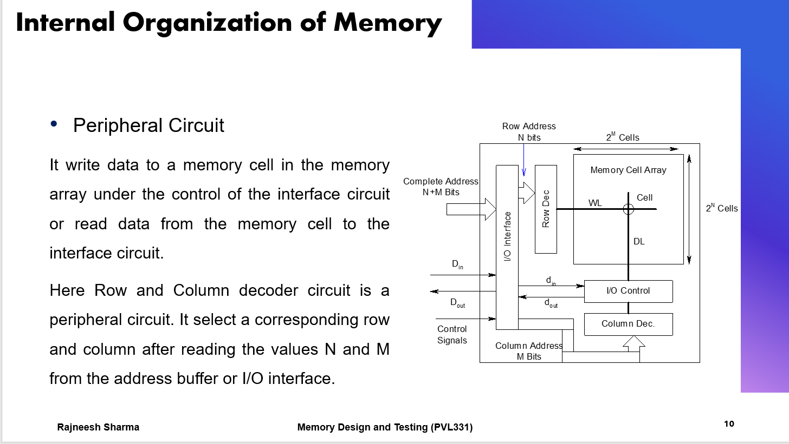

### Definition Of Peripheral Circuit

The peripheral circuit is the internal support circuitry around the memory cell array.

The memory cell array only stores bits.

The peripheral circuit performs the electrical work needed to access those bits.

In simple words:

```text
memory cell array -> storage
peripheral circuit -> selection + read/write machinery
```

### What This Slide Means

The slide says the peripheral circuit writes data to a memory cell or reads data from a memory cell under control of the interface circuit.

Meaning:

The I/O interface receives the outside request.

The peripheral circuit physically performs the memory operation.

So:

```text
I/O interface tells what is requested
peripheral circuit does the actual access
memory array stores or returns the bit
```

### Main Peripheral Blocks

| Peripheral block | Job |
|---|---|
| row decoder | selects one word line or row |
| row driver | drives the selected word line strongly enough |
| column decoder | selects one column or group of columns |
| precharge circuit | charges bit lines before read |
| sense amplifier | detects small bit-line voltage difference during read |
| write driver | forces data into selected cell during write |
| I/O control | controls internal data movement during read/write |

### During Read

Read path:

```text
address comes in
row decoder selects one WL
selected row connects cells to bit lines
column decoder selects required column
sense amplifier reads the data
data goes to I/O interface
```

Example:

If selected SRAM cell stores:

```text
Q = 1
Qbar = 0
```

then the selected bit-line pair develops a small voltage difference.

The sense amplifier converts that small difference into a full logic output.

### During Write

Write path:

```text
input data comes in
write driver prepares bit lines
row decoder selects WL
column decoder selects column
data is forced into selected memory cell
```

So the peripheral circuit is responsible for actual electrical operations on the selected cell.

### Correction To Slide Wording

The slide says the row and column decoder select a corresponding row and column after reading the values `N` and `M`.

A better technical statement is:

```text
The row and column decoders select the corresponding row and column
by decoding the N-bit row address and M-bit column address.
```

`N` and `M` are not data values being read.

They are the number of address bits.

Example:

```text
N = 10
```

means the row address has 10 bits.

So the row decoder can select:

```text
2^10 = 1024 rows
```

Similarly:

```text
M = 8
```

means the column address has 8 bits.

So the column decoder can select:

```text
2^8 = 256 column choices
```

### Short Exam Answer For This Image

The peripheral circuit is the memory-access machinery around the SRAM cell array. It includes row decoder, column decoder, precharge circuits, sense amplifiers, write drivers, and I/O control. During read, it selects the row and column, lets the selected cell affect the bit lines, and uses a sense amplifier to read the data. During write, it selects the row and column and uses write drivers to force the input data into the selected cell. The row decoder uses the `N` row-address bits to select one of `2^N` rows, while the column decoder uses the `M` column-address bits to select one of `2^M` column choices.

## Image 7: I/O Interface Circuit

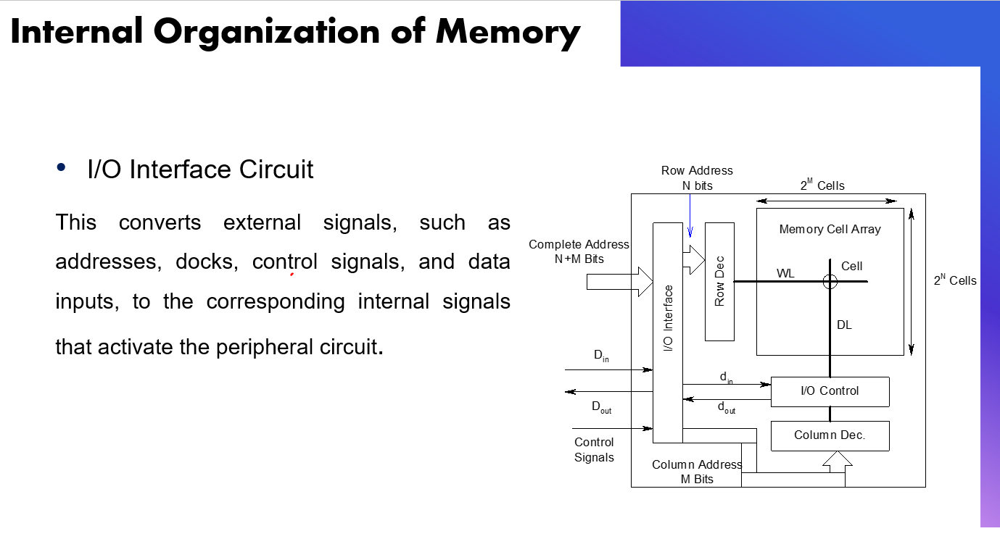

### Definition Of I/O Interface Circuit

The I/O interface circuit is the boundary between the external system and the internal memory circuitry.

It communicates with the outside world, such as:

```text
CPU
memory controller
system bus
test controller
```

Then it converts external signals into internal memory-control signals.

### Important Typo In The Slide

The slide says:

```text
docks
```

This should be:

```text
clocks
```

So the corrected idea is:

```text
The I/O interface converts external addresses, clocks, control signals,
and data inputs into corresponding internal signals.
```

### External Signals Handled By I/O Interface

External signals may include:

```text
address pins
Din
Dout
clock
chip select
read enable
write enable
output enable
control signals
```

These are the signals seen by the CPU or memory controller.

### Internal Signals Generated By I/O Interface

The memory array does not directly understand high-level external requests.

It needs internal control signals such as:

```text
row address bits
column address bits
read enable
write enable
precharge enable
sense amplifier enable
write driver enable
data input path enable
data output path enable
```

The I/O interface converts the external command into these internal signals.

### Why I/O Interface Is Needed

The outside system may only say:

```text
read address A
```

or:

```text
write data D to address A
```

But inside the memory chip, many coordinated events must happen:

```text
decode row
decode column
precharge bit lines
enable sense amplifier
drive write data
control output buffer
```

The I/O interface and control circuitry coordinate these actions.

### Short Exam Answer For This Image

The I/O interface circuit is the communication boundary of the memory chip. It receives external address, data, clock, and control signals from the CPU or memory controller and converts them into internal signals used by the memory. These internal signals activate peripheral blocks such as row decoder, column decoder, precharge circuit, sense amplifier, and write driver. Thus the I/O interface does not itself store data; it translates and buffers external requests so the peripheral circuit can access the memory cell array.

## Image 8: SRAM Peripheral Circuit Elements

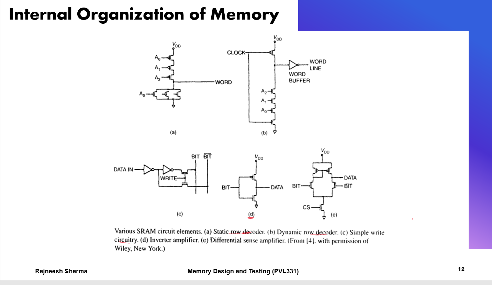

Clearer capture of the same slide:

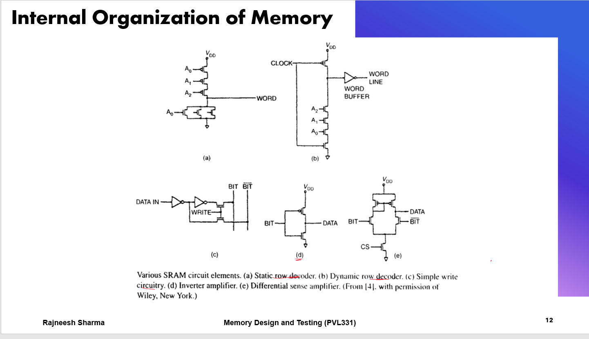

### Definition Of SRAM Peripheral Circuit Elements

SRAM peripheral circuit elements are the circuits that surround the SRAM cell array and make array access possible.

The cell array stores data, but it cannot independently:

```text
decode address
select a row
drive bit lines for write
sense small read voltage
send full digital data to output
```

Peripheral circuits perform these jobs.

### What This Image Shows

The image lists several SRAM peripheral circuit elements:

```text
(a) static row decoder
(b) dynamic row decoder
(c) simple write circuit
(d) inverter amplifier
(e) differential sense amplifier
```

These are not memory cells.

They are support circuits used to access the memory cells.

### Use Of Each Circuit

| Circuit | Use |
|---|---|
| static row decoder | selects a word line using address inputs and static CMOS logic |
| dynamic row decoder | selects a word line using precharge/evaluate clocked logic |
| simple write circuit | drives `BIT` and `BITbar` during write |
| inverter amplifier | converts a bit-line voltage into a stronger logic-level signal |
| differential sense amplifier | compares `BIT` and `BITbar` and amplifies small voltage difference |

### Why This Particular Slide Has These Circuits

The memory cell array alone is only a passive grid of storage cells.

To use that grid, the chip must solve five practical problems:

```text
1. choose exactly one row
2. drive a long word line
3. force data into the cell during write
4. detect weak bit-line movement during read
5. convert internal analog-ish signals into full digital data
```

The five circuits in the slide correspond to those five needs:

```text
static/dynamic row decoder -> choose row
word-line buffer           -> drive long word line
write circuit              -> force bit lines during write
inverter amplifier         -> simple single-ended sensing
differential sense amp     -> fast robust differential sensing
```

So the slide is not showing random circuits.

It is showing the minimum support machinery needed around SRAM cells.

### Static Row Decoder

The static row decoder uses address inputs such as:

```text
A0, A1, A2
```

to generate a word-line select signal.

The job is:

```text
one address code -> one selected row
```

Static means the output is maintained by static CMOS pull-up/pull-down networks as long as the inputs are stable.

Advantage:

```text
simple and stable
```

Cost:

```text
larger area and capacitance for large decoders
```

### Why The Static Row Decoder Circuit Works

A row decoder is basically an address-matching circuit.

For an `N`-bit row address, it must activate exactly one of:

```text
2^N word lines
```

Example:

```text
A2 A1 A0 = 101
```

should activate only the row whose address is `101`.

The circuit uses transistors controlled by address bits so that the word output becomes active only for the required address combination.

Conceptually:

```text
if address matches this row:
    WORD selected
else:
    WORD not selected
```

This is why address-controlled transistors appear in series/parallel networks.

The transistor network implements the logical condition for one row.

Only the matching row gets the correct pull-up/pull-down path.

Every other row stays inactive.

### Why Static Decoders Are Used

Static decoders are useful because their output remains valid as long as the address input remains valid.

They do not depend on charge stored on a dynamic node.

So they are:

```text
reliable
easy to reason about
less sensitive to leakage
good for simpler/slower designs
```

The disadvantage is that a large static decoder can have:

```text
more transistor area
larger input capacitance
more delay for large fan-in
```

### Dynamic Row Decoder

The dynamic row decoder uses a clocked precharge/evaluate style.

The slide shows a clock signal and a word-line buffer.

Basic operation:

```text
precharge phase -> prepare internal node
evaluate phase  -> address inputs decide whether word line is selected
```

Use:

```text
faster operation and compact decoder implementation
```

But it needs careful timing because dynamic nodes can leak or be disturbed.

### Why The Dynamic Row Decoder Circuit Works

The dynamic decoder uses two phases.

Precharge phase:

```text
clock prepares the dynamic node
```

The top clocked PMOS charges the internal decoder node.

Evaluate phase:

```text
address-controlled NMOS stack either discharges the node or leaves it charged
```

If the address matches the selected row condition, the NMOS stack creates a path to ground.

Then the internal node discharges.

The word-line buffer inverts/strengthens that signal and drives the word line.

If the address does not match, the discharge path is not formed.

The dynamic node stays in its precharged state, so the row is not selected.

In compact form:

```text
precharge -> set up node
evaluate  -> matching address changes node
buffer    -> produce strong word-line signal
```

### Why Dynamic Decoders Are Used

Dynamic decoders can be faster and smaller for large memories.

Reason:

They can reduce the amount of static pull-up logic and use clocked precharge/evaluate behavior.

This can reduce:

```text
large PMOS stack delay
decoder area
input capacitance
```

But the cost is:

```text
needs clock timing
dynamic node can leak
wrong timing can cause incorrect selection
more sensitive to noise
```

So dynamic decoders are used when speed/area matter, but they need careful design.

### Word-Line Buffer

The word-line buffer strengthens the decoder output before driving the word line.

This is needed because a word line can be long and capacitive.

If a decoder directly drove a long word line, it could be slow.

So:

```text
decoder selects row
word-line buffer drives row strongly
```

### Why The Word-Line Buffer Is Needed

The word line runs across many SRAM cells in one row.

That means it has large capacitance:

```text
many access transistor gates connected to same WL
long metal wire capacitance
```

The decoder output alone may be too weak to charge/discharge this long word line quickly.

The word-line buffer acts like a driver.

It gives:

```text
stronger current
sharper WL edge
faster row activation
less delay variation
```

So the decoder decides which row, but the buffer physically drives that selected row.

### Simple Write Circuit

The simple write circuit receives:

```text
DATA IN
WRITE enable
```

and drives:

```text
BIT
BITbar
```

During write:

```text
write 1 -> BIT = 1, BITbar = 0
write 0 -> BIT = 0, BITbar = 1
```

Its job is to overpower the previous cell state through the access transistors.

So it must be strong enough for write ability.

### Why The Simple Write Circuit Works

The write circuit takes one data input and creates complementary bit-line values.

The inverters generate:

```text
DATA
DATAbar
```

The `WRITE` signal enables the drivers only during a write operation.

When `WRITE` is active, the circuit drives:

```text
BIT and BITbar
```

with opposite values.

This is necessary because a 6T SRAM cell is differential:

```text
one internal node must be forced low
the other internal node must be forced high
```

Example for writing `0`:

```text
BIT = 0
BITbar = 1
```

When the word line turns ON, these bit-line values overpower the old latch state and flip the cell.

### Why The Write Circuit Is Gated By `WRITE`

The write driver must not drive bit lines during read.

During read, the cell needs to create a small voltage difference on the bit lines.

If the write driver were still active:

```text
it could fight the cell
destroy the stored value
corrupt read sensing
waste power
```

So the write circuit is enabled only when:

```text
WRITE = active
```

and otherwise it is disconnected or inactive.

### Inverter Amplifier

An inverter amplifier is a simple single-ended sensing circuit.

It takes one bit-line signal:

```text
BIT
```

and produces:

```text
DATA
```

Use:

```text
amplifies one bit-line voltage into a digital level
```

Limitation:

It is less robust than a differential sense amplifier because it depends on one signal crossing the inverter switching threshold.

### Why The Inverter Amplifier Works

An inverter has high gain around its switching threshold.

If the bit-line voltage moves enough, the inverter converts that analog voltage movement into a full digital level.

For example:

```text
BIT high enough -> inverter output low
BIT low enough  -> inverter output high
```

So it acts as a simple amplifier and logic restorer.

Why use it:

```text
small circuit
simple
low area
```

Why it is limited:

```text
uses only one bit line
needs larger voltage swing
more sensitive to threshold/noise variation
slower than differential sensing for small Delta V
```

So inverter sensing is simpler, but differential sensing is usually better for high-speed SRAM.

### Differential Sense Amplifier

The differential sense amplifier compares:

```text
BIT
BITbar
```

and outputs:

```text
DATA
```

It detects which bit line is slightly higher.

During read, SRAM bit-line voltage difference may be small:

```text
BIT - BITbar = small Delta V
```

The differential sense amplifier quickly converts this small difference into a full logic output.

Advantage:

```text
fast
noise tolerant
does not require full bit-line discharge
saves read energy
```

### Why Sense Amplifiers Are Needed

Bit lines have large capacitance because many cells connect to them.

Fully charging or discharging them is slow and power-hungry.

So memory reads usually create only a small voltage difference.

The sense amplifier detects this small difference and restores it into a full digital value.

This improves:

```text
read speed
read energy
output signal quality
```

### Why The Differential Sense Amplifier Circuit Works

During a read, SRAM usually produces:

```text
BIT  = slightly high
BITbar = slightly low
```

or the reverse.

The difference may be very small.

The differential sense amplifier uses positive feedback.

Positive feedback means:

```text
a small difference is reinforced until it becomes a full 0/1 output
```

If `BIT` is slightly higher than `BITbar`, the sense amplifier drives the output toward one logic state.

If `BITbar` is slightly higher than `BIT`, it drives the opposite state.

The `CS` signal in the drawing is the sense-amplifier enable/control signal.

When `CS` is inactive:

```text
sense amplifier is off or isolated
```

When `CS` becomes active:

```text
sense amplifier compares BIT and BITbar
small Delta V becomes full DATA
```

### Why Differential Sensing Is Preferred

Differential sensing is preferred because it compares two signals instead of measuring one signal against a fixed threshold.

This helps reject common noise.

If both bit lines have some shared noise:

```text
BIT and BITbar both move together
```

the difference between them may still be clear.

So differential sensing is:

```text
faster
more noise tolerant
better for small bit-line swing
lower energy because full discharge is not needed
```

This is why large SRAMs usually use differential bit lines and sense amplifiers.

### Why This Particular Set Of Circuits Is Used Together

An SRAM access needs a chain:

```text
address -> row select -> word line drive -> bit-line action -> sensing/writing -> data output/input
```

The slide's circuits map directly to that chain:

| Access need | Circuit that solves it |
|---|---|
| choose row | static/dynamic row decoder |
| drive selected WL | word-line buffer |
| write new value | simple write circuit |
| read simple single-ended signal | inverter amplifier |
| read small differential signal | differential sense amplifier |

So the answer to "why this particular circuit?" is:

```text
because a memory array needs address decoding, strong word-line driving,
controlled bit-line writing, and sensitive read amplification.
```

The 6T cell itself cannot do these jobs efficiently.

Peripheral circuits provide them.

### Short Exam Answer For This Image

The SRAM peripheral circuit elements shown are support circuits used to access the memory array. Static and dynamic row decoders select the required word line from the row address. The word-line buffer strengthens the row-select signal. The write circuit drives `BIT` and `BITbar` with complementary values during a write operation. The inverter amplifier is a simple single-ended read amplifier, while the differential sense amplifier compares `BIT` and `BITbar` and amplifies a small read voltage difference into a full digital output. These peripheral circuits make SRAM read and write operations fast and reliable.

## Difference Between Peripheral Circuit And I/O Interface

The two slides are explaining two different supporting parts around the memory cell array.

```text
Outside world / CPU
        |
        v
I/O Interface Circuit
        |
        v
Peripheral Circuit
        |
        v
Memory Cell Array
```

The memory cell array stores the bits.

The I/O interface talks to the outside world.

The peripheral circuit selects cells and performs read/write inside the memory chip.

| Block | Simple meaning | Main job |
|---|---|---|
| I/O interface circuit | communicator/translator | converts external signals into internal signals |
| peripheral circuit | memory-access machinery | selects cells and performs read/write |
| memory cell array | storage | stores actual `0`s and `1`s |

Think of it like this:

```text
CPU / Controller
      |
      v
I/O Interface: What does the outside world want?
      |
      v
Peripheral Circuit: Which cell should I access, and how?
      |
      v
Memory Array: Here is the stored bit, or store this new bit.
```

### Full Read Example Across The Blocks

Suppose the CPU wants to read one bit.

Step 1:

```text
external address arrives
read command active
write command inactive
```

Step 2:

The I/O interface processes the external signals and separates the address:

```text
complete address = row address + column address
N + M bits = N row bits + M column bits
```

Step 3:

The peripheral circuit selects the location:

```text
N row bits -> row decoder -> selected WL
M column bits -> column decoder -> selected column/data line
```

Step 4:

The sense amplifier reads the selected bit-line pair and produces a full logic value.

Step 5:

The I/O interface sends the result outside:

```text
internal d_out -> I/O interface -> external Dout
```

### Full Write Example Across The Blocks

Suppose the CPU wants to write data.

Step 1:

```text
external address arrives
Din carries data to write
write enable active
```

Step 2:

The I/O interface converts them into:

```text
internal row address
internal column address
write enable
internal data input
```

Step 3:

The peripheral circuit performs the write:

```text
row decoder selects WL
column decoder selects target column
write driver drives data into selected bit-line pair
```

Step 4:

The selected memory cell stores the new value.

### Simple Analogy

Imagine a library.

| Memory block | Library analogy |
|---|---|
| memory cell array | bookshelves |
| row decoder | selects shelf row |
| column decoder | selects book position |
| peripheral circuit | librarian who retrieves or places the book |
| I/O interface | reception desk communicating with the customer |

The customer does not directly touch the shelves.

The customer talks to the reception desk.

The reception desk tells the librarian what to do.

The librarian accesses the correct shelf and book.

Similarly:

```text
CPU talks to I/O interface
I/O interface controls peripheral circuit
peripheral circuit accesses memory array
```

## Full Read Operation Sequence

### Step 1: Hold State Before Read

Before read, the word line is low:

```text
WL = 0
```

The access transistors are OFF.

So the cell is isolated from the bit lines.

The cross-coupled inverters hold:

```text
Q = 1
Qbar = 0
```

### Step 2: Precharge Bit Lines

Both bit lines are charged to `VDD`:

```text
BL  = VDD
BLB = VDD
```

This is done by precharge transistors shared by the column.

### Step 3: Assert Word Line

The selected row turns ON:

```text
WL = 1
```

This turns ON the two access transistors:

```text
M3 and M4 ON
```

Now the storage nodes are connected to the bit lines.

### Step 4: Differential Bit-Line Development

For stored `1`:

```text
Q = 1
Qbar = 0
```

So:

```text
BL stays high
BLB starts to fall
```

The difference is:

```text
Delta V = BL - BLB
```

The sense amplifier waits until `Delta V` is large enough to detect reliably.

### Step 5: Sense Amplification

The sense amplifier compares:

```text
BL
BLB
```

If:

```text
BL > BLB
```

it outputs:

```text
1
```

If:

```text
BL < BLB
```

it outputs:

```text
0
```

### Step 6: End Read And Precharge Again

After reading:

```text
WL goes low
cell disconnects from bit lines
bit lines are precharged again
```

The memory cell keeps its original stored value.

That is why SRAM read is intended to be non-destructive.

## Full Write Operation Sequence

### Step 1: Decide The Data To Write

For differential SRAM:

```text
write 1 -> BL = 1, BLB = 0
write 0 -> BL = 0, BLB = 1
```

The screenshot shows the second case:

```text
write 0
```

### Step 2: Drive The Bit Lines

The write driver actively forces the bit lines.

For writing `0`:

```text
BL  = 0
BLB = 1
```

This is different from read, where bit lines are precharged and then sensed.

### Step 3: Assert Word Line

The selected row activates:

```text
WL = 1
```

This turns ON access transistors:

```text
M3 and M4
```

### Step 4: Force Internal Nodes

The bit lines force the storage nodes:

```text
BL = 0  -> Q pulled low
BLB = 1 -> Qbar pulled high
```

### Step 5: Regeneration By Cross-Coupled Inverters

Once the internal nodes move enough, the cross-coupled inverters regenerate the state:

```text
Q low reinforces Qbar high
Qbar high reinforces Q low
```

The cell flips to:

```text
Q = 0
Qbar = 1
```

### Step 6: Deassert Word Line

After the write completes:

```text
WL = 0
```

The access transistors turn OFF.

The bit lines disconnect from the cell.

The cross-coupled inverters hold the newly written value.

## Image 9: SRAM Hold And Read Stability

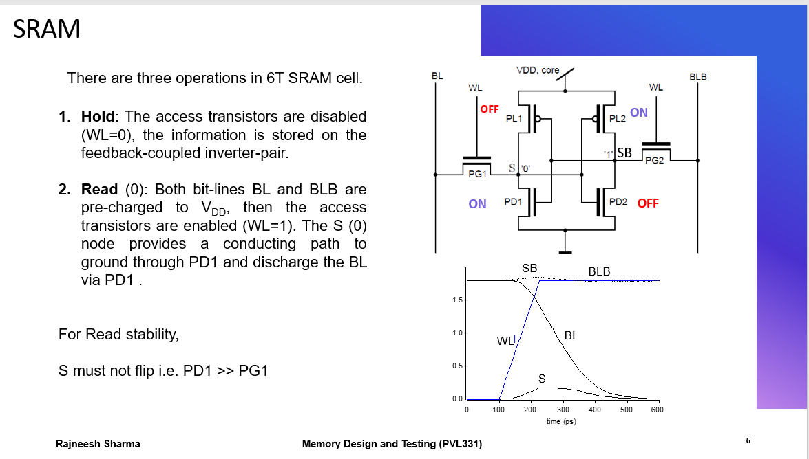

### Definition Of Hold Operation

Hold operation means the SRAM cell keeps its stored value when it is not being accessed.

In hold:

```text
WL = 0
```

So the access transistors are OFF.

The cell is isolated from the bit lines.

The stored value is maintained by the cross-coupled inverter pair.

### Definition Of Read Stability

Read stability means the SRAM cell should not accidentally flip while it is being read.

During read:

```text
WL = 1
BL and BLB are precharged to VDD
```

The selected cell is connected to high bit lines.

The dangerous part is that the internal node storing `0` may be pulled upward slightly by the precharged bit line.

Read stability means:

```text
the internal 0 must stay low enough that the latch does not flip
```

### What This Slide Shows

The slide says there are three operations in a 6T SRAM cell:

```text
1. hold
2. read
3. write
```

This image focuses on hold and read.

The shown read case is:

```text
stored data = 0 at node S
S = 0
SB = 1
```

Both bit lines are precharged:

```text
BL = VDD
BLB = VDD
```

Then:

```text
WL = 1
```

The node `S = 0` creates a discharge path for `BL`.

### Use Of Each Transistor Name

| Name | Meaning | Use |
|---|---|---|
| `PG1` | pass-gate/access transistor on left side | connects `BL` to node `S` when `WL = 1` |
| `PG2` | pass-gate/access transistor on right side | connects `BLB` to node `SB` when `WL = 1` |
| `PD1` | pull-down NMOS on left inverter | keeps node `S` low when `S = 0` |
| `PD2` | pull-down NMOS on right inverter | keeps node `SB` low when that side stores `0` |
| `PL1` | pull-up PMOS on left inverter | pulls node `S` high when that side stores `1` |
| `PL2` | pull-up PMOS on right inverter | pulls node `SB` high when that side stores `1` |

### Why BL Discharges During Read Of `0`

The slide says:

```text
S = 0 provides conducting path to ground through PD1
and discharges BL via PD1.
```

More fully, when `WL = 1`, `PG1` turns ON.

The discharge path is:

```text
BL -> PG1 -> S node -> PD1 -> ground
```

So:

```text
BL decreases
BLB stays high
```

The sense amplifier sees:

```text
BL < BLB
```

and reads:

```text
data = 0
```

### Why `S` Must Not Flip During Read

Before read:

```text
S = 0
SB = 1
```

But during read, `BL` starts at `VDD`.

When `PG1` turns ON, the high bit line tries to raise node `S`.

So there is a fight:

```text
PG1 tries to pull S upward from BL
PD1 tries to keep S low to ground
```

If `S` rises too much, it can cross the inverter trip point.

Then the cross-coupled latch may flip, corrupting the stored value.

That is a read disturb failure.

### Why `PD1 >> PG1`

The slide says:

```text
For read stability, S must not flip, i.e. PD1 >> PG1
```

Meaning:

```text
pull-down transistor PD1 must be stronger than access transistor PG1
```

Why?

Because during read, the access transistor connects the internal `0` node to a high precharged bit line.

If `PG1` is too strong, it pulls the internal `0` upward too much.

If `PD1` is stronger, it holds the internal node near ground.

So:

```text
strong PD1 -> stable read
weak PD1 or too-strong PG1 -> possible read flip
```

This is why SRAM cell sizing matters.

### Meaning Of The Waveform

The waveform shows:

```text
WL rises
BL falls
BLB stays high
S rises only slightly and then remains low
SB stays high
```

Interpretation:

`BL` falls because it discharges through `PG1` and `PD1`.

`S` rises slightly because it is connected to the high precharged bit line through `PG1`.

But `S` does not rise enough to flip the latch because `PD1` is strong.

That is successful read stability.

## Image 10: SRAM Writeability

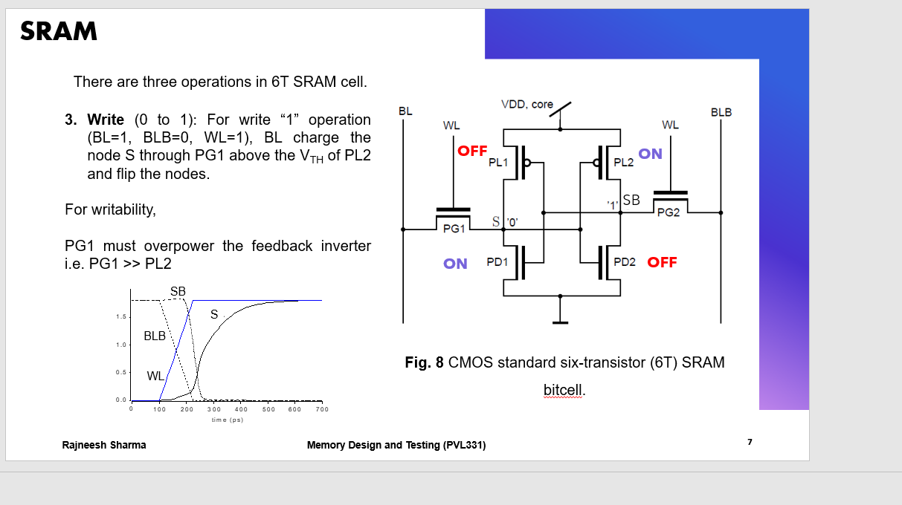

### Definition Of Writeability

Writeability means the ability of the SRAM cell to change state when new data is written.

During write, the bit lines are actively driven.

For writing `1` into the shown case:

```text
BL = 1
BLB = 0
WL = 1
```

The access transistor must be strong enough to force the internal node to the new value.

### What This Slide Shows

The slide says:

```text
Write (0 to 1)
For write "1" operation, BL = 1, BLB = 0, WL = 1.
BL charges node S through PG1 above VTH of PL2 and flips the nodes.
```

The original stored state is:

```text
S = 0
SB = 1
```

The desired new state after writing `1` is:

```text
S = 1
SB = 0
```

### Why BL Charges Node S

Because:

```text
BL = 1
WL = 1
```

the access transistor `PG1` turns ON and connects high `BL` to node `S`.

So the write path is:

```text
BL -> PG1 -> S
```

This charges `S` upward from `0`.

As `S` rises, it changes the input of the opposite inverter.

Eventually the cross-coupled pair regenerates and flips:

```text
S rises -> SB falls -> S is pulled further high
```

### Why `PG1 >> PL2`

The slide says:

```text
For writability, PG1 must overpower the feedback inverter, i.e. PG1 >> PL2
```

The exact intuitive meaning is:

During write, the access transistor must overpower the old stored state.

In this case, the old state is:

```text
S = 0
SB = 1
```

To write `1`, `PG1` tries to pull `S` high from `BL`.

But the cell's feedback inverter is trying to preserve the old value.

So the write path must be strong enough to disturb the latch intentionally.

If `PG1` is too weak:

```text
S cannot rise enough
cell does not flip
write fails
```

If `PG1` is strong enough:

```text
S crosses inverter threshold
positive feedback flips both nodes
write succeeds
```

The phrase `PG1 >> PL2` is expressing that the access/write path must overpower the feedback pull-up action that maintains the old state.

More generally:

```text
write path must be stronger than the cell's resistance to flipping
```

### Meaning Of The Write Waveform

The waveform shows:

```text
WL rises
BL is high
BLB is low
S rises from 0 to 1
SB falls from 1 to 0
```

There is a regenerative flip:

At first, `S` rises slowly through `PG1`.

Once `S` becomes high enough, the opposite inverter switches.

Then `SB` falls, and the cross-coupled feedback rapidly completes the state transition.

So the slow analog movement becomes a fast digital flip.

## Deep Topic: Read Stability Vs Writeability

Read stability and writeability create a sizing conflict in a 6T SRAM cell.

For read stability:

```text
PD must be stronger than PG
```

because the internal `0` node must not be pulled up too much by a precharged bit line.

For writeability:

```text
PG must be strong enough to overpower the cell feedback
```

because the new bit-line value must force the latch to change state.

So:

```text
read wants weaker access transistor
write wants stronger access transistor
```

This is the central SRAM design tradeoff.

### Why SRAM Design Is A Tradeoff

If access transistor `PG` is made too weak:

```text
read stability improves
write becomes difficult
read current may reduce
```

If access transistor `PG` is made too strong:

```text
write becomes easier
read stability worsens
cell may flip during read
```

If pull-down `PD` is made strong:

```text
read stability improves
but writing a 1 into a 0 node becomes harder
```

If pull-up `PL` is made weak:

```text
write becomes easier
but hold stability/noise margin may reduce
```

Therefore designers choose transistor ratios carefully.

### Common Sizing Intuition

For a conventional 6T SRAM:

```text
PD > PG > PL
```

Interpretation:

`PD > PG` helps read stability.

`PG > PL` helps writeability.

This is not an exact universal equation, but it is the common design intuition for explaining why the cell is sized the way it is.

### Exam Memory

Use this memory rule:

```text
Read:
cell must resist change.
Therefore pull-down must beat access transistor.

Write:
cell must be forced to change.
Therefore access/write path must beat feedback inverter.
```

Compact form:

```text
read stability -> PD >> PG
writeability   -> PG >> PL
```

### Short Exam Answer For This Topic

During read, both bit lines are precharged and the word line is enabled. If node `S` stores `0`, the precharged bit line tries to raise `S` through the access transistor `PG1`, while pull-down transistor `PD1` tries to keep `S` low. For read stability, `S` must not rise enough to flip the latch, so `PD1` must be stronger than `PG1`. During write, the bit lines are actively driven. To write `1`, `BL = 1`, `BLB = 0`, and `WL = 1`; `PG1` charges node `S` high enough to flip the cross-coupled inverters. For writeability, the access/write path must overpower the feedback inverter, so `PG1` must be strong enough compared with the pull-up feedback device. This creates the SRAM sizing tradeoff: read stability prefers weaker access transistors, while writeability prefers stronger access transistors.

## Short Exam Answer

A 6T SRAM cell stores one bit using two cross-coupled inverters and two access transistors. During read, both bit lines are precharged to `VDD`; then the selected word line turns ON the access transistors, and the bit line connected to the stored `0` side discharges slightly. A sense amplifier compares the two bit lines and produces the digital output. During write, the write driver actively forces `BL/BLB` to complementary values; asserting the word line connects those values to the internal nodes and flips the latch if necessary. In a complete memory chip, the memory cell array stores the bits, the row decoder selects the word line, the column decoder selects the required column, and the I/O interface/control circuits move data between the selected cell and `Din/Dout`.

## Sources Used

- Local slide deck: `PPT/Memory Design_PVL331_1Module1 - SRAmL1.pptx`
- Local slide deck: `PPT/Memory Design_PVL331_1Module1 -SRAML2.pptx`
- Local slide deck: `PPT/Memory Design_PVL331_1Module1 - SRAM3.pptx`
- University of Hamburg CMOS 6T SRAM cell demo: https://tams.informatik.uni-hamburg.de/applets/hades/webdemos/05-switched/40-cmos/sramcell.html
- Michigan State University ECE 410 memory basics notes, SRAM architecture/peripheral circuits: https://www.egr.msu.edu/classes/ece410/mason/files/Ch13.pdf
- Semiconductor memory design chapter PDF provided in your notes: https://www.researchgate.net/profile/Naushad-Alam-2/post/Which-signal-Pulse-or-DC-is-often-used-for-read-and-write-operation-in-a-SRAM-memory-cell/attachment/5f228497ce377e00016ab653/AS%3A918914456379393%401596097687238/download/Chapter_08.pdf
- ScienceDirect article overview noting 6T SRAM uses cross-coupled inverters plus access devices and read-path support circuitry: https://www.sciencedirect.com/science/article/pii/S2214785321068371
- Maryland thesis PDF, SRAM read description with bit-line differential and precharge: https://api.drum.lib.umd.edu/server/api/core/bitstreams/bb4bc4cf-e9a3-43dc-a0fb-301deb9945da/content
