# Supply Voltage Scaling

This file starts the notes for supply-voltage-based low-power design.

## Related PPT And Video References

- Local PPT found in this workspace: `PPT/PVL 207 Lec 7 (Voltage Scaling for low power).pptx`. This covers supply voltage scaling approaches, challenges, architectural support, parallelism, pipelining, MVS, and DVFS introduction.
- Local PPT found in this workspace: `PPT/PVL 207 Lec 8 (Multilevel Voltage scaling).pptx`. This covers multi-level voltage scaling, multiple Vdd circuits, voltage islands, level converters, converter placement, floorplanning, clock distribution, and timing-analysis issues.
- Local PPT found in this workspace: `PPT/PVL 207 Lec 9 (DFS and DVFS).pptx`. This covers static voltage scaling, multi-level voltage scaling, DFS, DVFS, workload prediction, variable voltage/frequency generators, latency overhead, and adaptive voltage scaling.
- Video-list screenshot in this file shows NPTEL `Mod-01 Lec-22 Supply Voltage Scaling - I` and `Mod-01 Lec-23 Supply Voltage Scaling - II`.

## Index

1. [Image 1: Supply voltage scaling video sequence](#image-1-supply-voltage-scaling-video-sequence)
2. [Definition of supply voltage scaling](#definition-of-supply-voltage-scaling)
3. [Why reducing VDD saves power](#why-reducing-vdd-saves-power)
4. [Image 2: Device feature size scaling](#image-2-device-feature-size-scaling)
5. [Image 3: Constant field scaling](#image-3-constant-field-scaling)
6. [Image 4: Constant field scaling equation derivation](#image-4-constant-field-scaling-equation-derivation)
7. [Image 5: Constant voltage scaling](#image-5-constant-voltage-scaling)
8. [Image 6: Parallelism for voltage scaling](#image-6-parallelism-for-voltage-scaling)
9. [Image 7: Parallelism power calculation](#image-7-parallelism-power-calculation)
10. [Image 8: Pipelining speedup formula](#image-8-pipelining-speedup-formula)
11. [Image 9: Pipelining for low power](#image-9-pipelining-for-low-power)
12. [Image 10: Multi-core for low power](#image-10-multi-core-for-low-power)
13. [Image 11: Voltage scaling approaches](#image-11-voltage-scaling-approaches)
14. [Static voltage scaling](#static-voltage-scaling)
15. [Image 12: Static voltage scaling path-delay graph](#image-12-static-voltage-scaling-path-delay-graph)
16. [Multi-level voltage scaling](#multi-level-voltage-scaling)
17. [Image 13: DFS vs DVFS workload graph](#image-13-dfs-vs-dvfs-workload-graph)
18. [Image 14: DVFS system model](#image-14-dvfs-system-model)
19. [Image 15: Variable voltage generator](#image-15-variable-voltage-generator)
20. [Image 16: Variable frequency generator](#image-16-variable-frequency-generator)
21. [Image 17: Workload prediction](#image-17-workload-prediction)
22. [Image 18: Discrete processing rate](#image-18-discrete-processing-rate)
23. [Image 19: Latency overhead](#image-19-latency-overhead)
24. [Dynamic voltage and frequency scaling](#dynamic-voltage-and-frequency-scaling)
25. [SVS vs MVS vs DVFS](#svs-vs-mvs-vs-dvfs)
26. [Main challenges](#main-challenges)
27. [Relation to previous low-power techniques](#relation-to-previous-low-power-techniques)
28. [Short exam answer](#short-exam-answer)
29. [Sources used](#sources-used)

## Image 1: Supply Voltage Scaling Video Sequence


### What This Image Shows

This image shows the NPTEL video sequence:

```text
Mod-01 Lec-22 Supply Voltage Scaling - I
Mod-01 Lec-23 Supply Voltage Scaling - II
```

So this topic is not a single small point. It is a full section of low-power design.

From the local PPTs, the topic is spread like this:

```text
Lec 7 -> basic voltage scaling, approaches, challenges, architectural support
Lec 8 -> multi-level voltage scaling and multiple Vdd design issues
Lec 9 -> DFS, DVFS, workload prediction, adaptive voltage scaling
```

So in this file, the first important task is to understand the main voltage-scaling approaches:

```text
SVS
MVS
DVFS
```

## Definition Of Supply Voltage Scaling

Supply voltage scaling is a low-power design technique in which the supply voltage `VDD` of a circuit, block, or processor is reduced or adjusted so that the circuit consumes less power while still meeting its performance requirement.

In simple words:

```text
use only as much voltage as needed for the required speed
```

The core reason is that CMOS dynamic power depends quadratically on supply voltage:

```text
P_dynamic = alpha * C_L * VDD^2 * f
```

where:

| Symbol | Meaning |
|---|---|
| `alpha` | switching activity factor |
| `C_L` | switched/load capacitance |
| `VDD` | supply voltage |
| `f` | clock frequency |

Since `VDD` is squared, reducing voltage is one of the strongest ways to reduce dynamic power.

## Why Reducing VDD Saves Power

If all other terms remain fixed:

```text
P_dynamic proportional to VDD^2
```

So if voltage is reduced from `1.0 V` to `0.8 V`:

```text
new power / old power = (0.8 / 1.0)^2
                      = 0.64
```

That means dynamic power becomes about:

```text
64% of original
```

or:

```text
36% reduction
```

If voltage is reduced by half:

```text
VDD -> VDD/2
```

then:

```text
P_dynamic -> 1/4 of original
```

This is why the lecture slide says that a factor-of-two reduction in supply voltage can give a factor-of-four reduction in energy/power related to switching.

### But There Is A Cost

Lowering `VDD` also reduces transistor drive strength.

That increases delay:

```text
lower VDD -> slower transistor switching -> larger delay -> lower maximum frequency
```

A common delay intuition is:

```text
t_delay increases as VDD approaches Vth
```

where `Vth` is threshold voltage.

So voltage scaling always has a tradeoff:

```text
lower VDD -> lower power
lower VDD -> slower circuit
```

That is why voltage scaling is often combined with architectural techniques such as parallelism and pipelining, or runtime techniques such as DVFS.

## Image 2: Device Feature Size Scaling

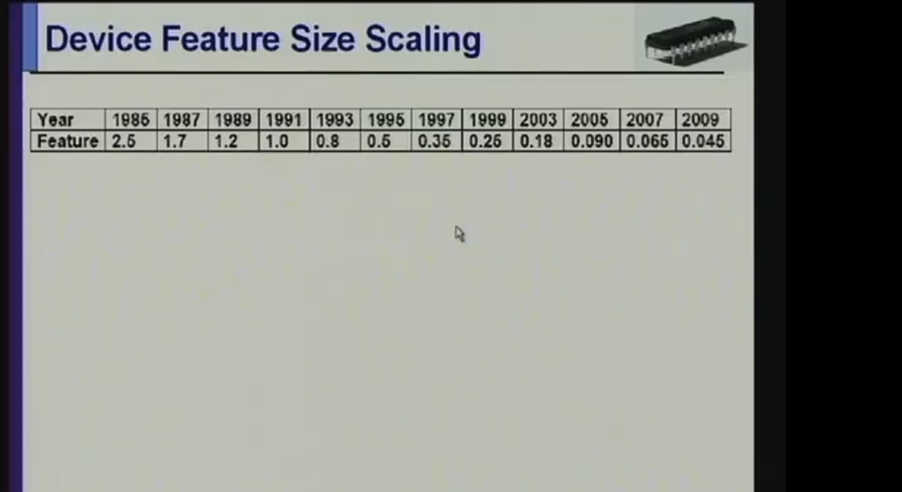

### Definition Of Device Feature Size Scaling

Device feature size scaling means reducing the minimum physical dimensions of MOS transistors from one technology generation to the next.

In simple words:

```text
make transistors smaller
```

The feature size usually refers to the minimum gate length or minimum lithographic dimension of the technology node.

### What This Image Shows

The image shows historical CMOS feature-size reduction:

| Year | Feature size |
|---:|---:|
| 1985 | 2.6 um |
| 1987 | 1.7 um |
| 1989 | 1.2 um |
| 1991 | 1.0 um |
| 1993 | 0.8 um |
| 1995 | 0.5 um |
| 1997 | 0.35 um |
| 1999 | 0.25 um |
| 2003 | 0.18 um |
| 2005 | 0.090 um |
| 2007 | 0.065 um |
| 2009 | 0.045 um |

Important conversion:

```text
0.045 um = 45 nm
0.065 um = 65 nm
0.090 um = 90 nm
```

So the slide is saying that over time, CMOS technology moved from micrometer-scale devices to nanometer-scale devices.

### Why Feature Size Scaling Is Related To Voltage Scaling

When device dimensions shrink, capacitances usually reduce.

Smaller device dimensions can reduce:

```text
gate capacitance
diffusion capacitance
wire/load capacitance in some local structures
switching energy per node
```

Dynamic energy depends on:

```text
E_switch proportional to C_L * VDD^2
```

So technology scaling historically helped power in two ways:

```text
smaller C_L
lower VDD
```

That is why feature-size scaling and voltage scaling are discussed together in low-power design.

### Why Smaller Feature Size Alone Is Not Enough

Earlier CMOS scaling was often explained using constant-field scaling:

```text
scale dimensions down
scale voltage down
keep electric field controlled
```

But in modern technologies, voltage cannot always be reduced as aggressively as feature size because of:

```text
threshold voltage limits
noise margin
leakage current
process variation
reliability
delay constraints
```

So the important point is:

```text
feature size can keep shrinking,
but VDD scaling becomes harder.
```

This is one reason low-power design needs many techniques together:

```text
voltage scaling
clock gating
operand isolation
parallelism
pipelining
multi-VDD design
DVFS
```

### Short Exam Answer For This Image

Device feature size scaling means reducing transistor dimensions across technology generations. The slide shows CMOS feature size decreasing from micrometer values such as `2.6 um` to nanometer-class values such as `0.045 um`, or `45 nm`. Smaller devices usually reduce capacitance and can support lower supply voltage, which helps reduce dynamic energy because `E_switch` depends on `C_L*VDD^2`. However, voltage cannot be reduced indefinitely because delay, threshold voltage, noise margin, leakage, and reliability become limiting factors.

## Image 3: Constant Field Scaling

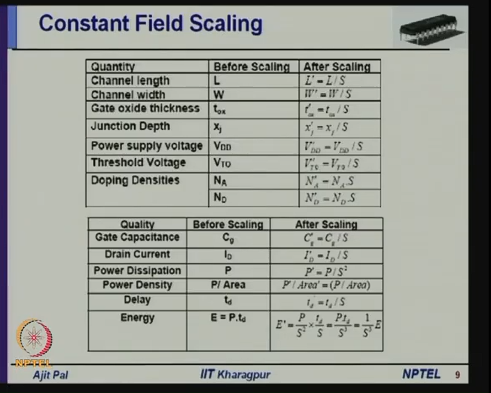

### Definition Of Constant Field Scaling

Constant field scaling is a classical MOS technology scaling rule in which device dimensions and voltages are scaled down by the same factor so that the electric field inside the device remains approximately constant.

If the scaling factor is:

```text
S > 1
```

then constant field scaling uses:

```text
lengths   -> divide by S
voltages  -> divide by S
doping    -> multiply by S
```

The phrase "constant field" comes from:

```text
electric field E approximately equals voltage / distance
```

If both voltage and distance are divided by `S`:

```text
E' = (V/S) / (L/S)
   = V/L
```

So the electric field remains almost the same.

### What This Image Shows

The image gives the scaling rules for device quantities and circuit performance quantities.

Main device dimensions:

| Quantity | Before Scaling | After Scaling |
|---|---:|---:|
| Channel length | `L` | `L' = L/S` |
| Channel width | `W` | `W' = W/S` |
| Gate oxide thickness | `t_ox` | `t_ox' = t_ox/S` |
| Junction depth | `x_j` | `x_j' = x_j/S` |
| Power supply voltage | `VDD` | `VDD' = VDD/S` |
| Threshold voltage | `VT0` | `VT0' = VT0/S` |
| Doping densities | `NA`, `ND` | `NA' = NA*S`, `ND' = ND*S` |

Main circuit effects:

| Quantity | After Scaling |
|---|---:|
| Gate capacitance | `Cg' = Cg/S` |
| Drain current | `ID' = ID/S` |
| Power dissipation | `P' = P/S^2` |
| Power density | approximately unchanged |
| Delay | `td' = td/S` |
| Energy | `E' = E/S^3` |

### Why Doping Density Increases

When dimensions shrink, the device must still control the channel properly.

So doping concentration is increased:

```text
NA' = NA * S
ND' = ND * S
```

This helps maintain electrostatic behavior as the physical dimensions become smaller.

### Why Gate Capacitance Becomes Cg/S

Gate capacitance is roughly:

```text
Cg = W * L * Cox
```

where:

```text
Cox = oxide capacitance per unit area
```

Under constant field scaling:

```text
W' = W/S
L' = L/S
t_ox' = t_ox/S
```

Since:

```text
Cox = epsilon_ox / t_ox
```

then:

```text
Cox' = S * Cox
```

Now substitute:

```text
Cg' = W' * L' * Cox'
    = (W/S) * (L/S) * (S*Cox)
    = (W*L*Cox) / S
    = Cg/S
```

So even though `Cox` per unit area increases, the physical gate area reduces by `S^2`, giving total gate capacitance reduction by `S`.

### Why Power Becomes P/S^2

Power can be written approximately as:

```text
P = ID * VDD
```

From the scaling table:

```text
ID' = ID/S
VDD' = VDD/S
```

Therefore:

```text
P' = ID' * VDD'
   = (ID/S) * (VDD/S)
   = P/S^2
```

So constant field scaling reduces power per gate by `S^2`.

### Why Delay Becomes td/S

A simple delay intuition is:

```text
delay roughly proportional to capacitance * voltage / current
```

So:

```text
td = C * V / I
```

After scaling:

```text
C' = C/S
V' = V/S
I' = I/S
```

Then:

```text
td' = (C/S) * (V/S) / (I/S)
    = (C*V/I) / S
    = td/S
```

So the circuit becomes faster by approximately `S`.

### Why Energy Becomes E/S^3

Energy per operation is:

```text
E = P * td
```

After scaling:

```text
P'  = P/S^2
td' = td/S
```

Therefore:

```text
E' = P' * td'
   = (P/S^2) * (td/S)
   = E/S^3
```

This is a very important result:

```text
constant field scaling reduces energy per switching operation by S^3
```

### Why Power Density Stays Approximately Same

Area scales as:

```text
Area' = Area/S^2
```

Power scales as:

```text
P' = P/S^2
```

So power per area becomes:

```text
P'/Area' = (P/S^2)/(Area/S^2)
         = P/Area
```

So even though each gate consumes less power, more gates can fit in the same chip area. That is why power density does not automatically improve.

### Short Exam Answer For This Image

Constant field scaling scales device dimensions and voltages by the same factor `S`, so the electric field remains roughly constant. Channel length, width, oxide thickness, junction depth, supply voltage, and threshold voltage reduce by `S`, while doping density increases by `S`. Under this scaling, gate capacitance becomes `Cg/S`, drain current becomes `ID/S`, power becomes `P/S^2`, delay becomes `td/S`, and energy becomes `E/S^3`. Power density remains approximately unchanged because both power and area scale by `1/S^2`.

## Image 4: Constant Field Scaling Equation Derivation

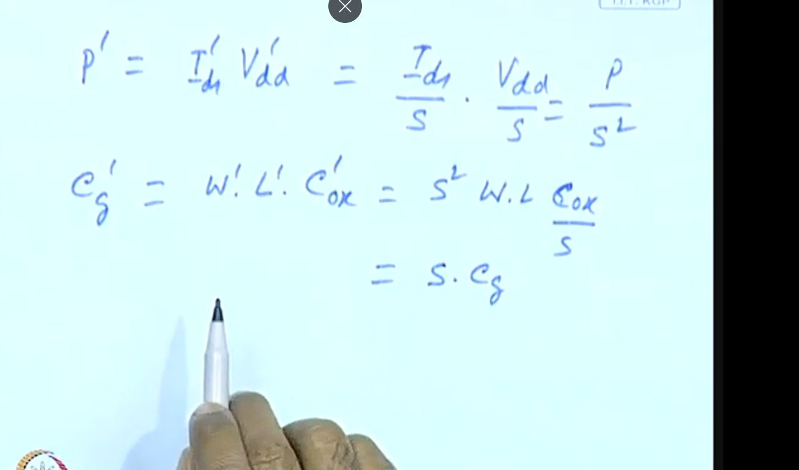

### What This Image Shows

This handwritten image derives two important constant-field-scaling results:

```text
P'  = P/S^2
Cg' = Cg/S
```

The idea is to show where the slide-table values come from.

### Derivation Of P' = P/S^2

Power is written as:

```text
P = ID * VDD
```

After scaling:

```text
ID'  = ID/S
VDD' = VDD/S
```

So:

```text
P' = ID' * VDD'
   = (ID/S) * (VDD/S)
   = P/S^2
```

Meaning:

```text
current reduces by S
voltage reduces by S
power reduces by S^2
```

Example with `S = 2`:

```text
P' = P/4
```

### Derivation Of Cg' = Cg/S

Gate capacitance is:

```text
Cg = W * L * Cox
```

After scaling:

```text
W' = W/S
L' = L/S
Cox' = S*Cox
```

So:

```text
Cg' = W' * L' * Cox'
    = (W/S) * (L/S) * (S*Cox)
    = W*L*Cox/S
    = Cg/S
```

This is the important correction to remember:

```text
oxide capacitance per unit area increases by S
but total gate area decreases by S^2
therefore total gate capacitance decreases by S
```

### Why Cox Increases But Cg Decreases

This point can look contradictory.

`Cox` is capacitance per unit area:

```text
Cox = epsilon_ox/t_ox
```

When oxide thickness becomes smaller:

```text
t_ox' = t_ox/S
```

then:

```text
Cox' = S*Cox
```

So per-unit-area oxide capacitance increases.

But the actual transistor gate area is:

```text
W * L
```

and after scaling:

```text
W'L' = (W/S)(L/S) = WL/S^2
```

So total capacitance is:

```text
smaller area effect    -> divide by S^2
higher Cox effect      -> multiply by S
net effect             -> divide by S
```

Therefore:

```text
Cg' = Cg/S
```

### Short Exam Answer For This Image

The handwritten derivation shows why constant field scaling gives `P' = P/S^2` and `Cg' = Cg/S`. Since `ID' = ID/S` and `VDD' = VDD/S`, scaled power is `(ID/S)(VDD/S) = P/S^2`. For capacitance, `Cg = WLCox`; after scaling, `W' = W/S`, `L' = L/S`, and `Cox' = S*Cox`, so `Cg' = (W/S)(L/S)(S*Cox) = Cg/S`.

## Image 5: Constant Voltage Scaling

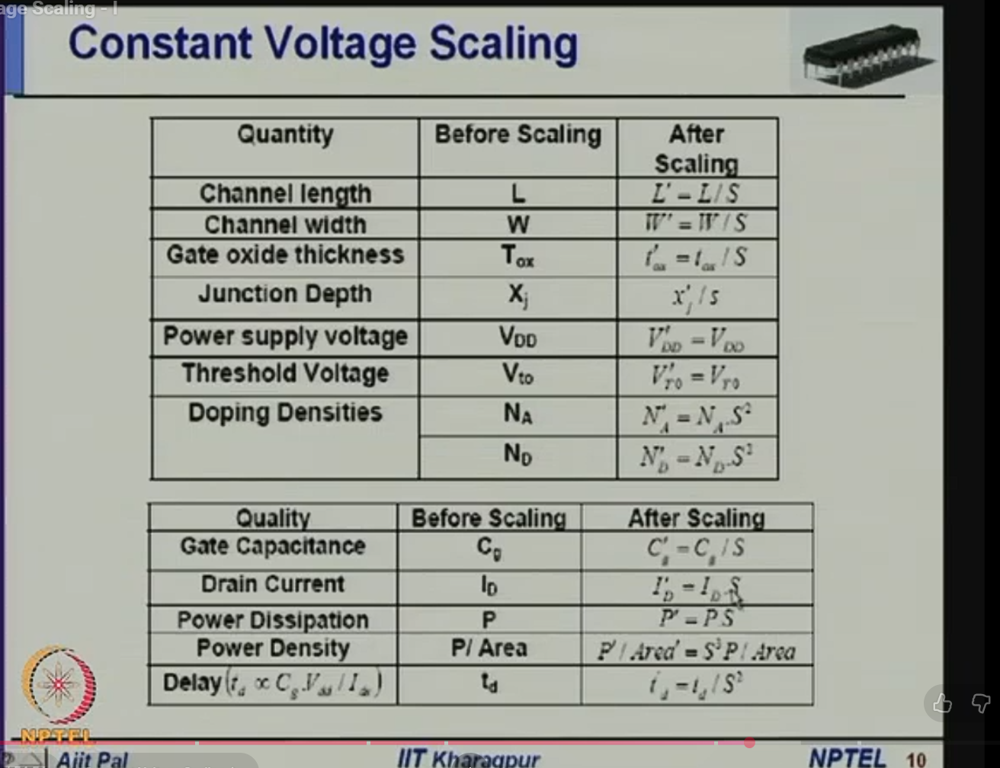

### Definition Of Constant Voltage Scaling

Constant voltage scaling is a MOS scaling approach where device dimensions are reduced, but the supply voltage is kept constant.

In simple words:

```text
make the transistor smaller
but do not reduce VDD
```

This is different from constant field scaling.

Constant field scaling:

```text
dimensions -> divide by S
VDD        -> divide by S
electric field stays approximately constant
```

Constant voltage scaling:

```text
dimensions -> divide by S
VDD        -> unchanged
electric field increases
```

### What This Image Shows

The image gives scaling rules for constant voltage scaling.

Main device quantities:

| Quantity | Before Scaling | After Scaling |
|---|---:|---:|
| Channel length | `L` | `L' = L/S` |
| Channel width | `W` | `W' = W/S` |
| Gate oxide thickness | `t_ox` | `t_ox' = t_ox/S` |
| Junction depth | `x_j` | `x_j' = x_j/S` |
| Power supply voltage | `VDD` | `VDD' = VDD` |
| Threshold voltage | `VT0` | `VT0' = VT0` |
| Doping densities | `NA`, `ND` | `NA' = NA*S^2`, `ND' = ND*S^2` |

Main circuit effects:

| Quantity | After Scaling |
|---|---:|
| Gate capacitance | `Cg' = Cg/S` |
| Drain current | `ID' = ID*S` |
| Power dissipation | `P' = P*S` |
| Power density | `S^3 * P/Area` |
| Delay | `td' = td/S^2` |

### Why Electric Field Increases

Electric field is approximately:

```text
electric field = voltage / distance
```

In constant voltage scaling:

```text
voltage stays same
distance reduces by S
```

So:

```text
E' = V / (L/S)
   = S * (V/L)
```

The electric field increases by `S`.

That is why constant voltage scaling is more stressful for reliability than constant field scaling.

### Why Drain Current Increases

In this scaling method, the device becomes shorter and thinner, but voltage is not reduced.

The stronger electric field can increase drive current. The slide summarizes this as:

```text
ID' = ID * S
```

This makes the gate faster, but it also increases power.

### Why Power Increases

Power can be approximated as:

```text
P = ID * VDD
```

Under constant voltage scaling:

```text
ID'  = ID * S
VDD' = VDD
```

So:

```text
P' = ID' * VDD'
   = (ID*S) * VDD
   = P*S
```

So power per device increases by `S`.

This is the opposite of constant field scaling, where:

```text
P' = P/S^2
```

### Why Delay Improves Strongly

The slide gives:

```text
td' = td/S^2
```

A simple delay form is:

```text
td proportional to Cg*VDD/ID
```

Under constant voltage scaling:

```text
Cg'  = Cg/S
VDD' = VDD
ID'  = ID*S
```

So:

```text
td' = (Cg/S)*VDD/(ID*S)
    = td/S^2
```

Therefore, constant voltage scaling gives a large speed improvement.

### Why Power Density Becomes A Serious Problem

Area scales down as:

```text
Area' = Area/S^2
```

Power scales as:

```text
P' = P*S
```

Therefore power density becomes:

```text
P'/Area' = (P*S)/(Area/S^2)
         = S^3 * P/Area
```

So power density increases by:

```text
S^3
```

This is dangerous because it means more heat per unit area.

### Constant Field Vs Constant Voltage Scaling

| Point | Constant Field Scaling | Constant Voltage Scaling |
|---|---|---|
| `VDD` | reduced by `S` | unchanged |
| Electric field | approximately constant | increases by `S` |
| Gate capacitance | `Cg/S` | `Cg/S` |
| Drain current | `ID/S` | `ID*S` |
| Power | `P/S^2` | `P*S` |
| Delay | `td/S` | `td/S^2` |
| Power density | approximately unchanged | increases by `S^3` |
| Main advantage | lower power and controlled field | much faster speed |
| Main problem | slower than constant-voltage case | high field, high power density, reliability risk |

### Short Exam Answer For This Image

Constant voltage scaling reduces transistor dimensions by a factor `S` while keeping supply voltage and threshold voltage unchanged. Because voltage is not scaled down, the electric field increases by `S`. The gate capacitance still reduces to `Cg/S`, but drain current increases to `ID*S`, so power increases to `P*S`. Delay improves strongly to `td/S^2`, but power density increases by `S^3`, creating serious heat and reliability problems. Therefore, constant voltage scaling improves speed but is poor for low-power and reliability compared with constant field scaling.

## Image 6: Parallelism For Voltage Scaling

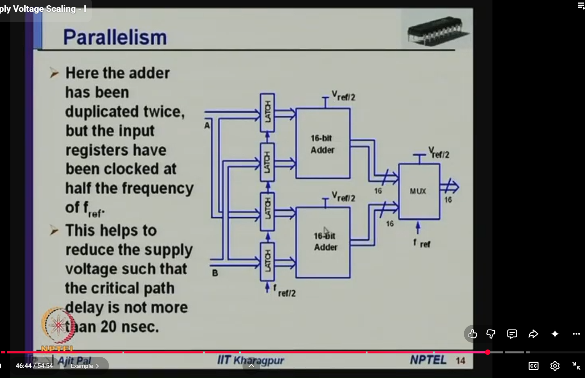

### Definition Of Parallelism

Parallelism is an architectural technique in which multiple hardware units operate at the same time so that more work is completed per cycle or per unit time.

In simple words:

```text
duplicate hardware
split the work
run slower or at lower voltage
still maintain required throughput
```

In low-power voltage scaling, parallelism is useful because extra hardware can reduce the speed requirement of each unit. If each unit can run slower, the supply voltage can be reduced while keeping the overall throughput the same.

### Definition Of Reference Design

The reference design is the original design before applying parallelism or voltage scaling.

In this slide, the reference idea is:

```text
one 16-bit adder
running at f_ref
powered by V_ref
```

Its power can be written as:

```text
P_ref = C_ref * V_ref^2 * f_ref
```

Here `C_ref` means the effective switched capacitance of the original adder design.

### Definition Of Parallel Design

The parallel design is the modified design where the adder hardware is duplicated.

The image says:

```text
the adder has been duplicated twice
```

So there are two 16-bit adders working in parallel.

Each adder processes part of the input stream, so each one only needs to operate at:

```text
f_ref/2
```

The slide also shows:

```text
V_ref/2
```

for the duplicated adders, meaning the supply voltage can be reduced because each adder has more time to finish its operation.

### What This Image Shows

The image shows:

```text
inputs A and B
latches clocked at f_ref/2
two 16-bit adders
MUX at the output
output selected at f_ref
```

The two adders work on alternating data items.

Example:

```text
cycle group 1 -> upper adder works
cycle group 2 -> lower adder works
output mux interleaves results
```

So the total output rate can still match the original reference rate, but each adder runs slower.

### Why Parallelism Helps Reduce Voltage

The key timing idea is:

```text
slower clock -> more time per operation
more time per operation -> lower VDD can still meet timing
```

If the original adder had to finish within:

```text
T_ref
```

then after two-way parallelism, each adder has roughly:

```text
2*T_ref
```

to finish its computation.

Because it has more time, the voltage can be reduced.

This reduces dynamic power strongly because:

```text
P_dynamic = C * VDD^2 * f
```

Lower voltage gives a square-law power reduction.

### Why Hardware Duplication Does Not Automatically Increase Power Too Much

At first, duplicating the adder seems bad:

```text
two adders -> more capacitance
```

But each adder is:

```text
clocked at half frequency
operated at lower voltage
```

So the voltage and frequency reductions can dominate the extra hardware cost.

In the slide's example, duplicated hardware increases effective capacitance, but the voltage is halved and the frequency is halved, so power reduces overall.

### Why The MUX Is Needed

The output MUX combines the results from the two parallel adders into one output stream.

The adders produce results alternately:

```text
adder 1 result
adder 2 result
adder 1 result
adder 2 result
```

The MUX selects the correct result each output cycle.

So the external system can still see a regular output rate of:

```text
f_ref
```

even though each individual adder runs at:

```text
f_ref/2
```

### Short Exam Answer For This Image

Parallelism helps voltage scaling by duplicating hardware so that each hardware unit can operate at a lower clock frequency. In the slide, the 16-bit adder is duplicated, and each adder is clocked at `f_ref/2`. Since each adder has more time to complete its operation, the supply voltage can be reduced to about `V_ref/2` while maintaining the required throughput using an output MUX. Although hardware capacitance increases, the reduction in voltage and frequency can reduce total dynamic power.

## Image 7: Parallelism Power Calculation

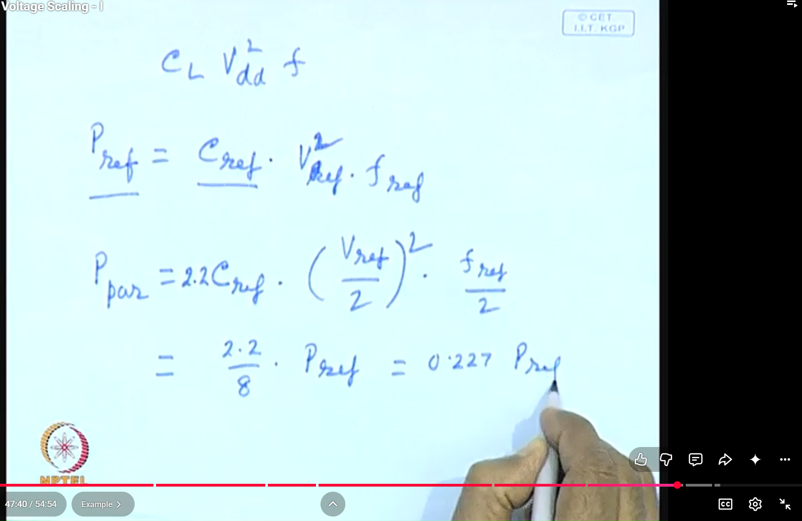

### Definition Of Parallelism Power Calculation

Parallelism power calculation means comparing the power of the original reference design with the power of the parallelized, voltage-scaled design.

The goal is to answer:

```text
Does duplicating hardware and lowering voltage actually save power?
```

### Reference Power

The image writes reference dynamic power as:

```text
P_ref = C_ref * V_ref^2 * f_ref
```

This means:

| Symbol | Meaning |
|---|---|
| `P_ref` | power of the original reference design |
| `C_ref` | effective switched capacitance of the original adder |
| `V_ref` | original supply voltage |
| `f_ref` | original operating frequency |

This is the same dynamic-power equation:

```text
P_dynamic = C * VDD^2 * f
```

The switching activity factor is being absorbed into `C_ref` for simplicity.

### Parallel Design Power

The image writes:

```text
P_par = 2.2*C_ref * (V_ref/2)^2 * (f_ref/2)
```

Meaning:

```text
2.2*C_ref
```

is the effective capacitance of the parallel design.

Why `2.2` instead of exactly `2`?

Because two adders are duplicated, but extra overhead is also added:

```text
extra latches
extra mux
extra routing
extra control/load
```

So the capacitance is estimated as:

```text
2 adders + overhead = about 2.2*C_ref
```

### Step-By-Step Calculation

Start:

```text
P_par = 2.2*C_ref * (V_ref/2)^2 * (f_ref/2)
```

Square the voltage term:

```text
(V_ref/2)^2 = V_ref^2/4
```

So:

```text
P_par = 2.2*C_ref * (V_ref^2/4) * (f_ref/2)
```

Combine the denominator:

```text
4 * 2 = 8
```

So:

```text
P_par = (2.2/8) * C_ref * V_ref^2 * f_ref
```

But:

```text
P_ref = C_ref * V_ref^2 * f_ref
```

Therefore:

```text
P_par = (2.2/8) * P_ref
```

Calculate:

```text
2.2/8 = 0.275
```

So the mathematically correct value is:

```text
P_par = 0.275 * P_ref
```

The handwritten slide appears to write approximately:

```text
0.227 * P_ref
```

but using the visible `2.2/8` expression gives:

```text
0.275 * P_ref
```

So for exam work, write the expression first. If the lecture expects the slide value, mention it as the lecture approximation, but the arithmetic of `2.2/8` is `0.275`.

### Meaning Of The Result

If:

```text
P_par = 0.275 * P_ref
```

then the parallel voltage-scaled design consumes:

```text
27.5% of the original reference power
```

Power saving is:

```text
1 - 0.275 = 0.725
```

or:

```text
72.5% reduction
```

This large reduction happens because voltage is halved:

```text
(1/2)^2 = 1/4
```

and frequency is also halved:

```text
1/2
```

Together:

```text
1/4 * 1/2 = 1/8
```

Even after multiplying by `2.2` capacitance overhead:

```text
2.2/8 < 1
```

So total power is lower.

### Important Exam Warning

Parallelism is not automatically low power.

It saves power only if:

```text
power saved from lower VDD and lower f
>
power added by duplicated hardware and overhead
```

If voltage cannot be reduced much, parallelism may increase area and power.

### Short Exam Answer For This Image

The parallelism power calculation compares the original adder power `P_ref = C_ref*V_ref^2*f_ref` with a duplicated-adder design. The parallel design has about `2.2*C_ref` capacitance because of two adders plus overhead, but each adder operates at `V_ref/2` and `f_ref/2`. Therefore `P_par = 2.2*C_ref*(V_ref/2)^2*(f_ref/2) = (2.2/8)P_ref = 0.275P_ref`. Thus, despite hardware duplication, voltage and frequency reduction can greatly reduce total dynamic power.

## Image 8: Pipelining Speedup Formula

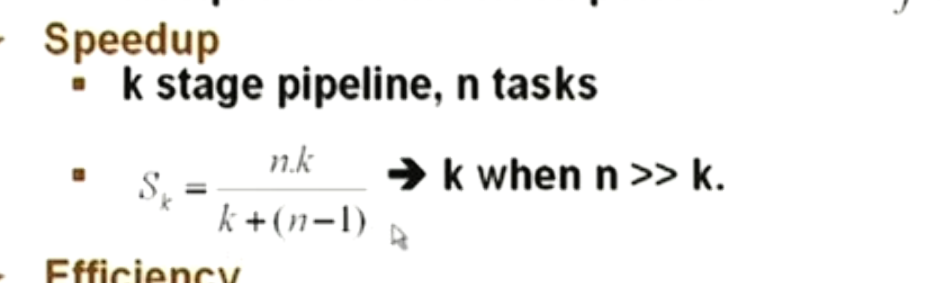

### Definition Of Pipelining

Pipelining is an implementation technique where a computation is divided into sequential stages, and different tasks occupy different stages at the same time.

Simple meaning:

```text
split one long operation into smaller stages
insert registers/latches between stages
overlap different inputs in different stages
```

In voltage scaling, pipelining is useful because each stage has a smaller critical path. A smaller critical path can meet timing at a lower supply voltage.

### What This Image Shows

The image shows the ideal speedup of a `k`-stage pipeline executing `n` tasks:

```text
S_k = n*k / (k + (n - 1))
```

For large `n`:

```text
S_k -> k
```

meaning the maximum ideal speedup approaches the number of pipeline stages.

### Where The Formula Comes From

Without pipelining:

```text
each task takes k stage-times
n tasks take n*k cycles
```

With pipelining:

```text
first task completes after k cycles
remaining n-1 tasks complete one per cycle
total cycles = k + (n - 1)
```

So speedup is:

```text
S_k = non-pipelined time / pipelined time
    = n*k / (k + (n - 1))
```

### Why S_k Approaches k When n Is Much Larger Than k

If:

```text
n >> k
```

then:

```text
k + (n - 1) approximately n
```

So:

```text
S_k approximately n*k/n
S_k approximately k
```

This means a 5-stage pipeline can ideally approach 5 times throughput improvement for a large number of tasks.

### How This Helps Low Power

Pipelining can be used in two ways:

```text
1. keep VDD same -> increase speed/throughput
2. keep throughput same -> reduce VDD and save power
```

For low power, the second use is important.

If pipelining reduces the critical path delay, the designer may reduce supply voltage until the original throughput requirement is just met.

So:

```text
pipelining creates timing slack
timing slack allows lower VDD
lower VDD reduces dynamic power quadratically
```

### Short Exam Answer For This Image

Pipelining divides a computation into `k` stages and overlaps different tasks in those stages. For `n` tasks, ideal speedup is `S_k = n*k/(k+n-1)`, which approaches `k` when `n >> k`. In low-power design, pipelining reduces the critical path delay per stage, allowing the same throughput to be achieved at a lower supply voltage. Since dynamic power depends on `VDD^2`, this can reduce power significantly.

## Image 9: Pipelining For Low Power

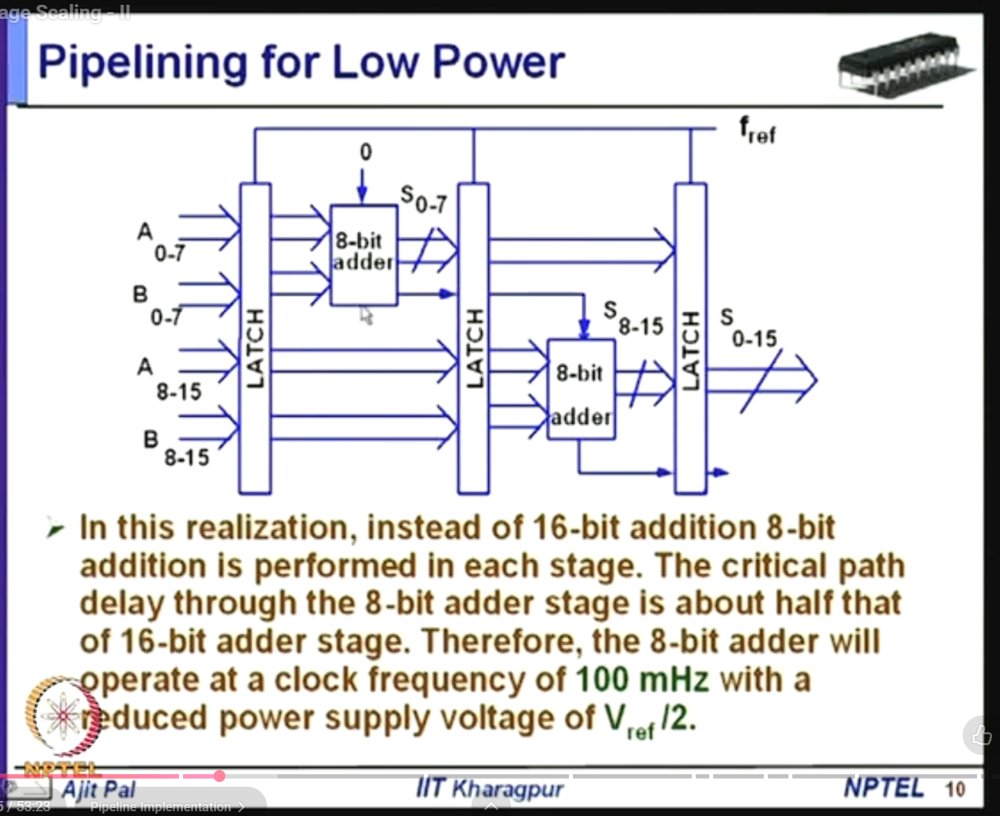

### Definition Of Pipelining For Low Power

Pipelining for low power means splitting a long combinational operation into shorter pipeline stages so that each stage can run at a lower supply voltage while maintaining the required throughput.

In this image:

```text
one 16-bit addition
is split into
two 8-bit addition stages
```

The goal is not only to make the adder faster. The low-power goal is to use the reduced critical path to lower `VDD`.

### What This Image Shows

The image shows a 16-bit adder implemented as two 8-bit pipeline stages:

```text
stage 1 -> lower 8-bit addition, S0-7
stage 2 -> upper 8-bit addition, S8-15
```

Latches are inserted between the stages.

The slide says:

```text
instead of 16-bit addition, 8-bit addition is performed in each stage
critical path through an 8-bit adder is about half that of a 16-bit adder
therefore the 8-bit adder can operate at 100 MHz with reduced VDD of V_ref/2
```

### Why Splitting 16-Bit Into 8-Bit Stages Reduces Critical Path

A 16-bit ripple-carry-style addition has a carry path that can propagate across 16 bits.

If it is split into two stages:

```text
stage 1 carry path -> about 8 bits
stage 2 carry path -> about 8 bits
```

So the longest combinational delay per stage is roughly reduced.

This allows the circuit to meet the same clock target at a lower supply voltage.

### Why Lower VDD Becomes Possible

Lower `VDD` makes gates slower.

But pipelining makes each stage shorter.

So these two effects can balance:

```text
shorter stage delay from pipelining
slower transistor delay from lower VDD
```

If the original 16-bit adder met the timing at:

```text
V_ref
```

then the pipelined 8-bit stages may meet the same throughput target at:

```text
V_ref/2
```

as shown in the slide.

### Important Difference From Parallelism

Parallelism duplicates hardware units.

Pipelining divides one operation path into stages.

| Point | Parallelism | Pipelining |
|---|---|---|
| Main method | duplicate hardware | split logic into stages |
| Example | two 16-bit adders | two 8-bit adder stages |
| Throughput | multiple units work simultaneously | overlapped stage execution |
| Cost | extra functional units | extra latches/registers |
| Low-power reason | each unit can run slower/lower VDD | each stage has shorter critical path/lower VDD |

### Short Exam Answer For This Image

Pipelining for low power splits a long combinational path into shorter stages. In the image, a 16-bit addition is divided into two 8-bit adder stages separated by latches. Since the critical path of an 8-bit adder is about half that of a 16-bit adder, the circuit can maintain the required throughput with a reduced supply voltage, shown as `V_ref/2`. This reduces dynamic power because power is proportional to `VDD^2`.

## Image 10: Multi-Core For Low Power

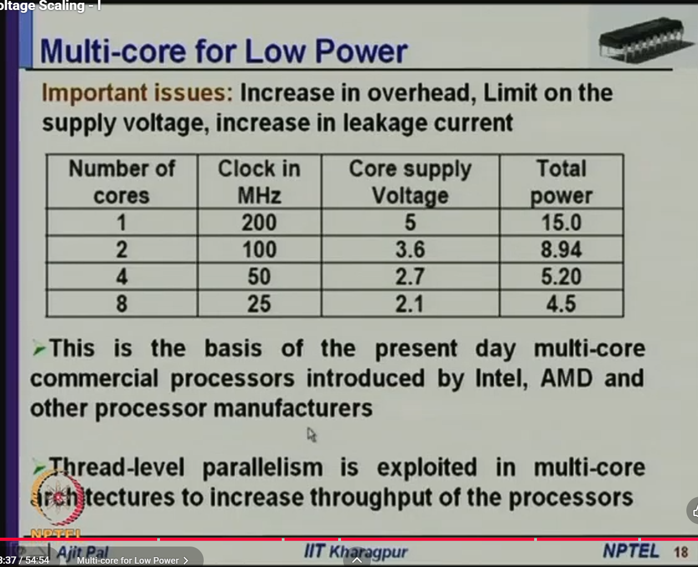

### Definition Of Multi-Core For Low Power

Multi-core for low power is an architectural technique where multiple processor cores are used in parallel so that each core can run at a lower clock frequency and lower supply voltage while maintaining overall throughput.

In simple words:

```text
use more cores
run each core slower
reduce each core's VDD
save power while keeping throughput
```

This is the processor-level version of the parallel-adder example.

### Definition Of Thread-Level Parallelism

Thread-level parallelism means executing multiple independent software threads or tasks at the same time on different cores.

Example:

```text
Core 1 -> thread A
Core 2 -> thread B
Core 3 -> thread C
Core 4 -> thread D
```

The slide says thread-level parallelism is exploited in multi-core architectures to increase processor throughput.

### What This Image Shows

The table compares different numbers of cores:

| Number of cores | Clock | Core supply voltage | Total power |
|---:|---:|---:|---:|
| 1 | 200 MHz | 5 V | 15.0 |
| 2 | 100 MHz | 3.6 V | 8.94 |
| 4 | 50 MHz | 2.7 V | 5.20 |
| 8 | 25 MHz | 2.1 V | 4.5 |

The pattern is:

```text
more cores -> lower clock per core -> lower supply voltage -> lower total power
```

The throughput can remain similar because the work is distributed across more cores.

### Why More Cores Can Reduce Power

Dynamic power is:

```text
P_dynamic = C * VDD^2 * f
```

For each core, if we reduce:

```text
frequency f
voltage VDD
```

then power per core drops.

Even though there are more cores, the total can still reduce because voltage has a square effect:

```text
VDD^2
```

Example from the table:

```text
1 core  -> 15.0 total power
4 cores -> 5.20 total power
8 cores -> 4.5 total power
```

So the table shows that multi-core parallelism can reduce power for the same or similar throughput target.

### Why The Improvement Becomes Smaller At 8 Cores

Power reduces strongly from:

```text
1 core -> 2 cores -> 4 cores
```

But from:

```text
4 cores -> 8 cores
```

the improvement is smaller:

```text
5.20 -> 4.5
```

This is because multi-core scaling has overheads.

The slide lists important issues:

```text
increase in overhead
limit on supply voltage
increase in leakage current
```

These limit the benefit of adding more cores.

### Issue 1: Increase In Overhead

More cores require extra support hardware:

```text
interconnect
cache coherence
shared memory system
clock distribution
power management logic
synchronization support
```

This extra hardware consumes area and power.

So adding cores is not free.

### Issue 2: Limit On Supply Voltage

Voltage cannot be reduced indefinitely.

If `VDD` becomes too low:

```text
delay becomes too large
noise margin becomes poor
variation sensitivity increases
circuits may fail timing
```

So after some point, adding more cores cannot keep reducing voltage much further.

### Issue 3: Increase In Leakage Current

More cores mean more transistors.

Even if cores run at lower voltage, the total leakage can increase because there are more devices.

Leakage power is roughly:

```text
P_leakage = VDD * I_leakage
```

So:

```text
more transistors -> more leakage paths
```

This limits the low-power benefit of heavy parallelism.

### Why This Is The Basis Of Modern Multi-Core Processors

The slide says this is the basis of present-day multi-core commercial processors.

Reason:

```text
single-core frequency scaling hits power/thermal limits
multi-core uses parallelism to improve throughput more efficiently
```

Instead of making one core very fast and hot, modern processors use multiple cores at more manageable voltage/frequency points.

### Short Exam Answer For This Image

Multi-core low-power design uses thread-level parallelism to distribute work across several cores. Since each core handles only part of the total workload, each core can operate at a lower frequency and lower supply voltage. Because dynamic power is proportional to `VDD^2*f`, reducing voltage and frequency can reduce total power even though more cores are used. The slide shows total power dropping from `15.0` for one core to `4.5` for eight cores. However, the benefit is limited by overhead, minimum supply-voltage limits, and increased leakage current.

## Image 11: Voltage Scaling Approaches

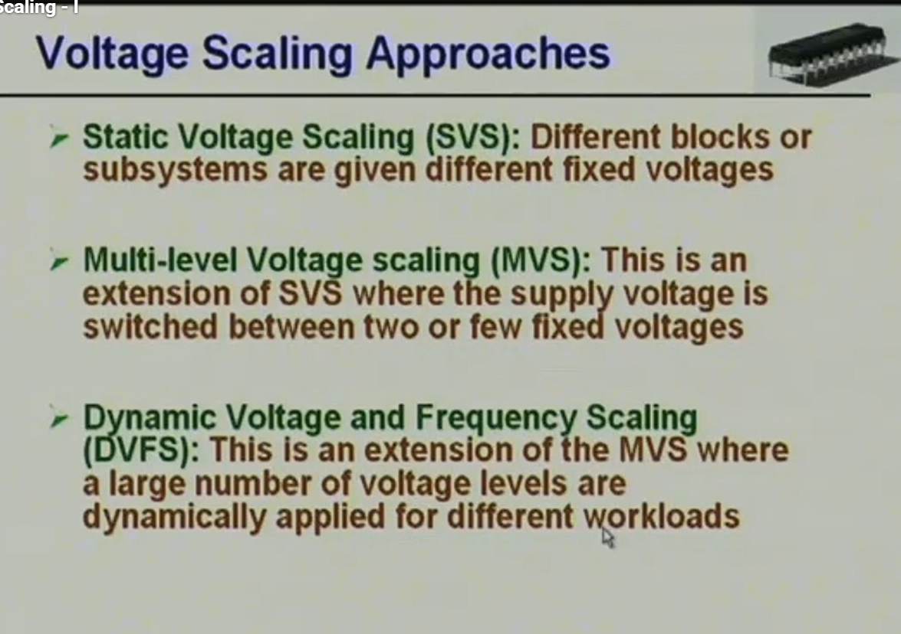

### Definition Of Voltage Scaling Approaches

Voltage scaling approaches are different ways of assigning or changing the supply voltage of a design so that power is reduced while timing constraints are still satisfied.

The image lists three main approaches:

```text
1. Static Voltage Scaling (SVS)
2. Multi-level Voltage Scaling (MVS)
3. Dynamic Voltage and Frequency Scaling (DVFS)
```

All three use the same power fact:

```text
lower VDD -> lower dynamic power
```

But they differ in when and how the voltage is chosen.

## Static Voltage Scaling

Static Voltage Scaling, or `SVS`, means different blocks or subsystems are given different fixed supply voltages.

The key word is:

```text
fixed
```

Example:

```text
critical block      -> high VDD
non-critical block  -> low VDD
memory block        -> another fixed VDD
I/O block           -> required interface VDD
```

The voltage assignment is usually decided during design time or configuration time, not continuously changed every few cycles.

### Why SVS Works

Not every part of a chip needs the same speed.

If a block is not on the critical timing path, it can run slower. Since it can tolerate slower delay, it can be assigned a lower voltage.

So:

```text
critical path     -> keep high voltage
non-critical path -> reduce voltage
```

This saves power without breaking timing.

### SVS Example

Suppose a chip has two blocks:

```text
Block A: timing-critical CPU core
Block B: slow peripheral controller
```

If both use `1.0 V`, Block B may be wasting power.

With SVS:

```text
Block A -> 1.0 V
Block B -> 0.75 V
```

Block B switches with lower dynamic power because of the `VDD^2` term.

### Limitation Of SVS

SVS is simple, but it is not very flexible.

If workload changes at runtime:

```text
SVS does not automatically adapt
```

Also, because blocks communicate across voltage domains, level shifters may be needed.

## Image 12: Static Voltage Scaling Path-Delay Graph

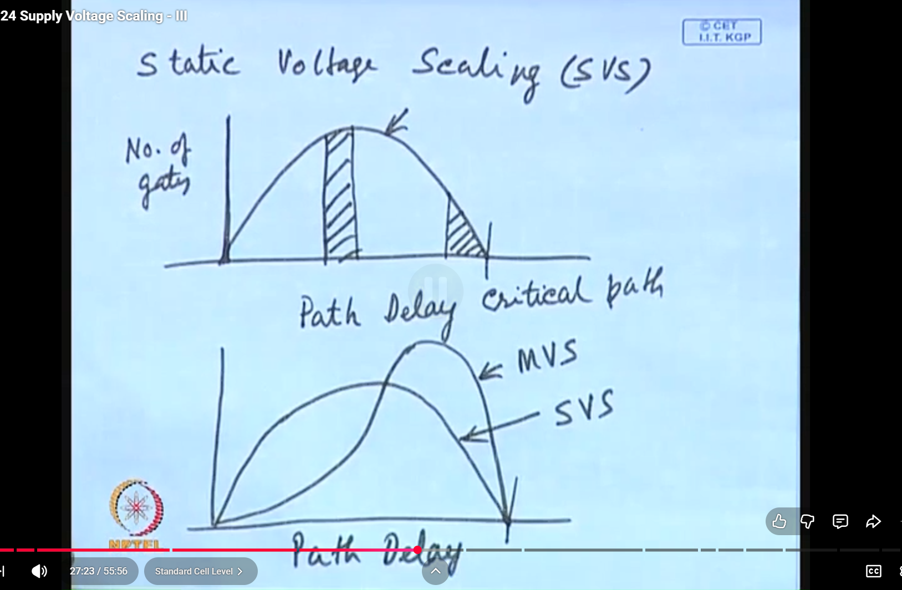

### Definition Of Path Delay

Path delay is the time taken by a signal to travel through a timing path.

In a synchronous digital circuit, a common timing path is:

```text
source register -> combinational logic -> destination register
```

The path delay includes the delay of gates and wires in that path.

### Definition Of Critical Path

The critical path is the path with the largest delay in the circuit.

It decides the minimum safe clock period:

```text
clock period must be >= critical path delay
```

If the clock period is smaller than the critical path delay, the destination register may capture wrong or unstable data.

### Definition Of Slack In This Graph

For any path:

```text
slack = allowed time - actual path delay
```

So, if the timing deadline is `10 ns` and a path delay is `6 ns`:

```text
slack = 10 ns - 6 ns = 4 ns
```

That path has `4 ns` of extra time.

Voltage scaling uses this idea:

```text
positive slack -> path can be slowed down by reducing VDD
zero/low slack -> path must stay fast, so keep higher VDD
```

### What The Top Graph Means

The top graph is a delay-distribution graph.

Read the axes like this:

```text
x-axis -> path delay
y-axis -> number of paths/gate chains having that delay
```

The handwriting says `No. of gates`, but the useful interpretation is the count of timing paths or gate chains that fall around each delay value.

The curve means:

```text
many paths have medium delay
few paths are very short
few paths are very long
```

The rightmost marked position is the critical path region.

That right edge is important because it sets the maximum delay that the chip can tolerate for the selected clock period.

So:

```text
left side paths  -> short delay -> large slack
middle paths     -> moderate delay -> some slack
rightmost paths  -> critical/near-critical -> little or no slack
```

### Meaning Of The Shaded Regions

The shaded region near the middle represents a group of paths that are not critical.

Those paths complete earlier than the clock deadline.

So they have timing slack.

The shaded region near the right side represents paths close to the critical path.

Those paths have much less slack.

So:

```text
middle shaded region -> good candidate for lower VDD
right shaded region  -> bad candidate for lower VDD unless timing margin is still enough
```

This is the key low-power opportunity.

If a path already finishes early, it is wasting speed.

That wasted speed can be traded for lower voltage and lower power.

### Why SVS Is Limited

In basic static voltage scaling, one block or large region receives one fixed supply voltage.

If the whole block uses one `VDD`, then lowering `VDD` slows every path together:

```text
short paths slow down
medium paths slow down
critical paths slow down
```

The critical path limits how far the voltage can be reduced.

Once the critical path reaches the clock deadline, voltage cannot be lowered further.

Otherwise:

```text
critical path delay > allowed clock period
```

and the circuit fails timing.

This is why SVS leaves some power-saving opportunity unused.

Many non-critical paths may still have slack, but they cannot be slowed independently if the whole block shares the same voltage.

### What The Bottom Graph Means

The bottom graph compares the path-delay distribution under `SVS` and `MVS`.

In the graph:

```text
SVS curve -> more paths remain away from the critical-path boundary
MVS curve -> more paths are pushed closer to the critical-path boundary
```

This does not mean MVS is making the circuit worse.

It means MVS is using the available slack more efficiently.

MVS can do this because it uses more than one voltage level:

```text
critical paths     -> high VDD -> stay fast
non-critical paths -> low VDD  -> become slower but save power
```

So the non-critical paths move rightward on the delay axis.

They become slower, but they still remain before the critical deadline.

That is acceptable because they had positive slack.

### Why MVS Can Save More Power Than SVS

Dynamic power is:

```text
P_dynamic = alpha * C_L * VDD^2 * f
```

Because `VDD` is squared, even a moderate voltage reduction gives a strong power reduction.

MVS saves more power than basic SVS because it can reduce voltage selectively:

```text
keep high VDD only where timing really needs it
use low VDD where slack exists
```

SVS is coarse-grained.

MVS is finer-grained.

That is the reason the graph shows MVS pushing more paths toward the critical boundary.

It is intentionally spending slack to save power.

### Numerical Example

Assume the clock allows:

```text
maximum path delay = 10 ns
```

Path A:

```text
actual delay at high VDD = 9.8 ns
slack = 10 ns - 9.8 ns = 0.2 ns
```

Path A is near-critical.

It should stay at high `VDD`.

Path B:

```text
actual delay at high VDD = 5 ns
slack = 10 ns - 5 ns = 5 ns
```

Path B has large slack.

If lowering `VDD` increases its delay to `8 ns`, timing is still safe:

```text
new slack = 10 ns - 8 ns = 2 ns
```

So Path B can be assigned low `VDD`.

That is exactly the idea shown by the graph.

### Important Exam Interpretation

The graph is not just saying:

```text
lower VDD saves power
```

It is saying something deeper:

```text
delay slack is a power-saving resource
```

If a path has unused timing margin, the designer can convert that margin into power reduction by reducing `VDD`.

The critical path has almost no margin, so it cannot be slowed much.

Non-critical paths have margin, so they are the main targets for voltage reduction.

### Short Exam Answer For This Image

The graph shows a distribution of path delays in a circuit. The rightmost delay corresponds to the critical path, which determines the minimum clock period. Paths to the left of the critical path finish earlier and therefore have positive slack. In basic static voltage scaling, a whole block uses one fixed supply voltage, so the critical path limits how much the supply can be reduced. Multi-level voltage scaling uses this slack more efficiently by keeping near-critical paths at high `VDD` and assigning low `VDD` to non-critical paths. The low-`VDD` paths become slower, so their delay moves closer to the critical-path boundary, but timing remains correct as long as they do not cross the deadline. This saves power because dynamic power is proportional to `VDD^2`.

## Multi-Level Voltage Scaling

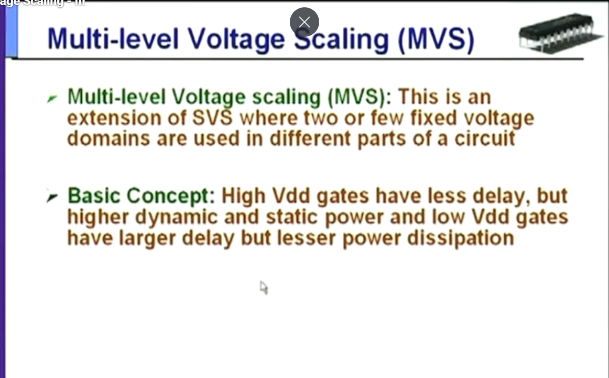

### Definition Of Multi-Level Voltage Scaling

Multi-level Voltage Scaling, or `MVS`, is an extension of SVS where the design uses two or a few fixed voltage levels.

More precisely, MVS uses two or a few fixed voltage domains in different parts of a circuit.

The image says:

```text
MVS is an extension of SVS where two or few fixed voltage domains
are used in different parts of a circuit
```

So MVS is more flexible than basic SVS, but it still uses only a small set of voltage choices.

Example:

```text
VDD_high = 1.0 V
VDD_mid  = 0.8 V
VDD_low  = 0.6 V
```

Different blocks, paths, or operating modes can use these levels.

### Basic Concept In The Image

The slide gives the main delay-power tradeoff:

```text
high VDD gates -> less delay, more dynamic/static power
low VDD gates  -> more delay, less power dissipation
```

So the design rule is:

```text
critical/timing-sensitive logic -> high VDD
non-critical/slack-rich logic   -> low VDD
```

This works because not every gate or block needs to be equally fast.

### Why High VDD Has Less Delay

Higher `VDD` gives transistors more drive current.

More drive current charges and discharges capacitances faster.

So:

```text
high VDD -> larger drive current -> smaller delay
```

But higher voltage also increases power:

```text
P_dynamic = alpha * C * VDD^2 * f
```

So high `VDD` is fast but power hungry.

### Why Low VDD Has Less Power But More Delay

Lower `VDD` reduces dynamic power strongly because voltage is squared:

```text
lower VDD -> much lower VDD^2 term
```

But lower `VDD` reduces transistor drive current.

So:

```text
low VDD -> smaller drive current -> larger delay
```

Therefore low `VDD` is suitable only where the circuit has timing slack.

### Definition Of Timing Slack

Timing slack is the extra time available on a path after satisfying the required timing constraint.

In simple form:

```text
slack = required arrival time - actual arrival time
```

If:

```text
slack > 0
```

the path is faster than required, so it has extra time.

If:

```text
slack = 0
```

the path is exactly meeting timing.

If:

```text
slack < 0
```

the path is too slow and violates timing.

Example:

```text
required time = 10 ns
actual path delay = 7 ns
slack = 10 ns - 7 ns = 3 ns
```

This path has `3 ns` of timing slack.

In MVS, that `3 ns` can be used by lowering `VDD`. Lowering `VDD` makes the path slower, but as long as the final delay stays within `10 ns`, timing is still correct.

So the low-power idea is:

```text
use high VDD only on paths with little or no slack
use low VDD on paths with positive slack
```

### Why MVS Uses Fixed Voltage Domains

MVS usually does not continuously vary voltage like DVFS.

Instead it uses a small set of predefined voltages:

```text
VDDH = high voltage domain
VDDL = low voltage domain
```

or:

```text
VDDH, VDDM, VDDL
```

The chip is divided into voltage domains or voltage islands. Each domain receives one of these fixed supply values.

### Short Exam Answer For This Image

Multi-level voltage scaling is an extension of static voltage scaling in which two or a few fixed voltage domains are used in different parts of a circuit. High-`VDD` gates are assigned to critical paths because they have lower delay, but they consume higher dynamic and static power. Low-`VDD` gates are assigned to non-critical paths because they have larger delay but lower power dissipation. The goal is to meet timing using high voltage only where necessary and save power elsewhere using low voltage.

### Two Ways To Understand MVS

In practice, MVS can appear in two related forms.

Spatial MVS:

```text
different regions of chip use different fixed voltage levels
```

Temporal MVS:

```text
same block switches between a few voltage levels over time
```

The local lecture decks discuss both the general idea of multiple fixed levels and multiple Vdd circuits.

### Multiple Vdd Circuits

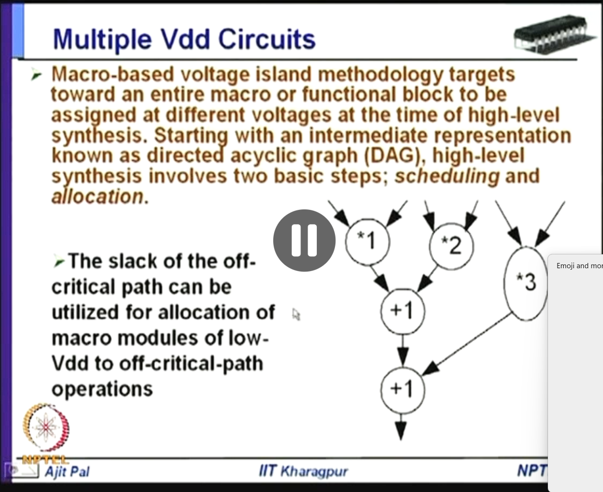

### Definition Of Multiple Vdd Circuits

Multiple Vdd circuits are circuits where different blocks, macros, or voltage islands operate at different supply voltages on the same chip.

In simple words:

```text
one chip
multiple supply voltages
different blocks assigned to different VDD levels
```

This is a physical/design implementation of multi-level voltage scaling.

In a multiple-Vdd design:

```text
critical gates/blocks -> high VDD
non-critical gates/blocks -> low VDD
```

This saves power because non-critical logic does not need to run at full voltage.

### What This Image Shows

The slide says macro-based voltage island methodology assigns an entire macro or functional block to a voltage level during high-level synthesis.

It also says high-level synthesis starts from an intermediate representation called a:

```text
directed acyclic graph, or DAG
```

and uses two basic steps:

```text
scheduling
allocation
```

The figure on the right is a DAG of operations.

Example operation nodes:

```text
*1, *2, *3 -> multiplications
+1       -> additions
```

The arrows show data dependency.

### Definition Of DAG

A directed acyclic graph, or DAG, is a graph with directed edges and no cycles.

In high-level synthesis, a DAG shows operation dependencies.

Example:

```text
operation B depends on operation A
```

is drawn as:

```text
A -> B
```

No cycles means the computation has a valid order from inputs to outputs.

### Definition Of Scheduling

Scheduling decides when each operation will execute.

Example:

```text
cycle 1 -> multiplication *1 and *2
cycle 2 -> addition +1
cycle 3 -> final addition +1
```

Scheduling must respect dependencies. If an addition needs the output of a multiplication, the addition cannot be scheduled before that multiplication completes.

### Definition Of Allocation

Allocation decides which hardware resource or macro will perform each scheduled operation.

Example:

```text
operation *1 -> multiplier macro M1
operation *2 -> multiplier macro M2
operation +1 -> adder macro A1
```

In multiple-Vdd design, allocation also decides whether a macro should be:

```text
high VDD
low VDD
```

### What "Off-Critical Path" Means

The critical path is the longest timing path that determines the minimum clock period.

An off-critical path is a path that is not the longest path.

Off-critical paths usually have timing slack.

So:

```text
critical path     -> little/no slack -> needs high VDD
off-critical path -> positive slack  -> can use low VDD
```

### What The Slide Means By "Slack Can Be Utilized"

The slide says:

```text
The slack of the off-critical path can be utilized for allocation
of macro modules of low-Vdd to off-critical-path operations.
```

Meaning:

If an operation is not on the critical path, it has extra time available.

So the designer can assign that operation to a low-`VDD` macro.

Low-`VDD` macro:

```text
slower
lower power
```

This is acceptable because the off-critical path has slack.

### Example

Suppose a multiplication on the critical path must finish in:

```text
5 ns
```

A low-`VDD` multiplier would take:

```text
8 ns
```

Then low `VDD` cannot be used there.

But suppose another multiplication on an off-critical path has:

```text
required time = 12 ns
low-VDD delay = 8 ns
```

Then:

```text
slack after low-VDD assignment = 12 ns - 8 ns = 4 ns
```

So low `VDD` is safe and saves power.

### Short Exam Answer For This Image

Multiple Vdd circuits use different supply voltages for different macros or functional blocks. In high-level synthesis, the computation can be represented as a DAG, and scheduling decides when operations occur while allocation decides which hardware macro performs each operation. Operations on off-critical paths have positive slack, meaning they have extra available time. This slack can be used to assign low-`VDD` macro modules to those operations. Low-`VDD` modules are slower but consume less power, so they are suitable for paths that are not timing-critical.

But whenever a signal crosses from one voltage domain to another, the interface must be handled carefully.

### Why Level Converters Are Needed

If a low-voltage domain drives a high-voltage domain:

```text
low-domain logic high may not be high enough for high-domain input
```

This can cause:

```text
incorrect logic level
short-circuit current
reliability/timing issues
```

So low-to-high crossings usually need level shifters.

High-to-low crossings can also need care because the larger swing can increase switching energy or stress low-voltage devices.

## Image 13: DFS Vs DVFS Workload Graph

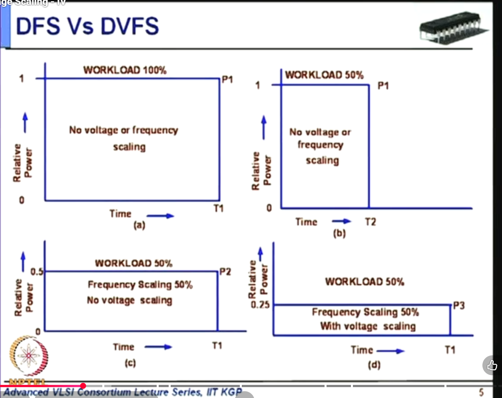

### Definition Of DFS

Dynamic Frequency Scaling, or `DFS`, means changing the clock frequency according to the workload while keeping the supply voltage unchanged.

In simple words:

```text
high workload -> high frequency
low workload  -> low frequency
```

But in pure DFS:

```text
VDD is not reduced
```

So DFS reduces the `f` term in the dynamic-power equation, but it does not reduce the `VDD^2` term.

### Definition Of DVFS

Dynamic Voltage and Frequency Scaling, or `DVFS`, means changing both the clock frequency and the supply voltage according to workload.

In simple words:

```text
high workload -> high f + high VDD
low workload  -> low f  + low VDD
```

DVFS is more powerful than DFS because dynamic power is:

```text
P_dynamic = alpha * C_L * VDD^2 * f
```

DFS reduces:

```text
f
```

DVFS reduces:

```text
f and VDD^2
```

That squared voltage term is the reason DVFS gives a much larger power reduction than DFS alone.

### What The Axes Mean

Each small graph has:

```text
x-axis -> time
y-axis -> relative power
```

Relative power means power normalized with respect to the full-speed, full-voltage case.

So:

```text
relative power = 1
```

means the reference full-power case.

The area under a power-time graph represents energy:

```text
energy = power * time
```

So for these rectangular graphs:

```text
energy is proportional to rectangle area
```

That is why the graph is important. It is not only comparing power height; it is also showing how long the circuit consumes that power.

### Graph (a): 100% Workload, No Scaling

Graph `(a)` shows:

```text
workload = 100%
relative power = 1
execution time = T1
```

This is the reference case.

The system uses full voltage and full frequency for the whole interval.

So:

```text
P1 = 1
time = T1
energy = P1 * T1 = 1 * T1
```

This is the baseline against which the other cases are compared.

### Graph (b): 50% Workload, No Voltage Or Frequency Scaling

Graph `(b)` shows:

```text
workload = 50%
relative power while active = 1
active time = T2
```

Since the workload is only half, the processor can finish the work earlier.

So:

```text
T2 < T1
```

If it runs at full speed, it finishes around half the deadline and then becomes idle.

The important interpretation is:

```text
the processor races to finish early
then waits idle for the remaining time
```

If the idle period is truly power-gated or clock-gated, the active energy is roughly:

```text
energy = 1 * T2
```

For a perfect 50% workload:

```text
T2 = T1 / 2
energy = 1 * T1/2 = 0.5 T1
```

But notice the instantaneous power during active execution is still high:

```text
relative active power = 1
```

So this method reduces energy only because the circuit is active for less time, not because each active cycle is cheaper.

### Graph (c): 50% Workload With DFS Only

Graph `(c)` shows:

```text
workload = 50%
frequency scaling = 50%
no voltage scaling
relative power = 0.5
execution time = T1
```

Here the circuit does not finish early.

Instead, it uses the available deadline and runs slower.

Because the frequency is halved:

```text
f_new = 0.5 f_ref
```

and because voltage is unchanged:

```text
VDD_new = VDD_ref
```

dynamic power becomes:

```text
P_new / P_ref = (VDD_new / VDD_ref)^2 * (f_new / f_ref)
```

Substitute the DFS-only values:

```text
P_new / P_ref = 1^2 * 0.5 = 0.5
```

So the graph shows:

```text
relative power = 0.5
```

This reduces peak/instantaneous power.

But for a fixed amount of digital work, DFS alone does not strongly reduce switching energy per operation, because each transition still uses approximately:

```text
C_L * VDD^2
```

The voltage did not change.

So DFS is useful for lowering power and thermal stress, but DVFS is needed for stronger energy saving.

### Graph (d): 50% Workload With DVFS

Graph `(d)` shows:

```text
workload = 50%
frequency scaling = 50%
with voltage scaling
relative power = 0.25
execution time = T1
```

The circuit again stretches the work over the full available time `T1`.

But now, because the frequency is lower, the supply voltage can also be reduced.

This is possible because lower frequency allows larger gate delay.

So:

```text
lower f -> more time per cycle -> lower VDD can still meet timing
```

The dynamic-power ratio is:

```text
P_new / P_ref = (VDD_new / VDD_ref)^2 * (f_new / f_ref)
```

The graph shows:

```text
P_new / P_ref = 0.25
```

Since:

```text
f_new / f_ref = 0.5
```

the remaining factor must come from voltage:

```text
(VDD_new / VDD_ref)^2 = 0.5
```

Therefore:

```text
VDD_new / VDD_ref = sqrt(0.5) ~= 0.707
```

So this slide is not necessarily saying the voltage itself became exactly `50%`.

It is showing an example where frequency reduction plus voltage reduction together make relative power become `0.25`.

### Why DVFS Is Better Than DFS

Compare graph `(c)` and graph `(d)`.

DFS-only:

```text
power = 0.5
time = T1
energy = 0.5 T1
```

DVFS:

```text
power = 0.25
time = T1
energy = 0.25 T1
```

So in the slide example:

```text
DVFS energy is half of DFS-only energy
```

The reason is the squared voltage term:

```text
DFS  -> saves through f only
DVFS -> saves through f and VDD^2
```

### Why Not Always Use Lowest Voltage?

Lowering `VDD` increases delay.

If voltage is reduced too much:

```text
gate delay becomes too large
setup timing fails
maximum frequency cannot be met
```

Therefore DVFS must choose a safe pair:

```text
(VDD, frequency)
```

The chosen voltage must be high enough for the selected frequency.

That is why DVFS operating points are usually stored as a table:

```text
high VDD -> high frequency
medium VDD -> medium frequency
low VDD -> low frequency
```

### Race-To-Idle Vs Pace-To-Idle

Graph `(b)` is like:

```text
race-to-idle
```

The circuit runs fast, finishes early, and then idles.

Graph `(d)` is like:

```text
pace-to-idle
```

The circuit slows down to finish just before the deadline, using lower voltage and frequency.

For CMOS dynamic power, pace-to-idle with voltage scaling can be better when the deadline is known and leakage/transition overheads are not dominant.

But if voltage transition overhead is high, or if the idle state is extremely efficient, race-to-idle can sometimes be competitive.

So the best policy depends on:

```text
deadline
workload prediction accuracy
voltage regulator transition time
leakage power
idle power
performance requirement
```

### Short Exam Answer For This Image

The DFS vs DVFS graph compares power for a full workload and a half workload. With no scaling, a 100% workload consumes relative power `1` for time `T1`. With 50% workload and no scaling, the system runs at full power but finishes early at `T2`, then idles. With DFS only, the frequency is reduced by 50%, so dynamic power becomes about `0.5` because `P_dynamic` is proportional to frequency. However, the voltage is unchanged, so energy per transition is not reduced. With DVFS, both frequency and voltage are reduced. Since dynamic power is proportional to `VDD^2*f`, the extra voltage reduction lowers relative power further to about `0.25` in the slide example. Thus DVFS saves more power and energy than DFS alone, provided the lower voltage still satisfies timing at the selected lower frequency.

## Image 14: DVFS System Model

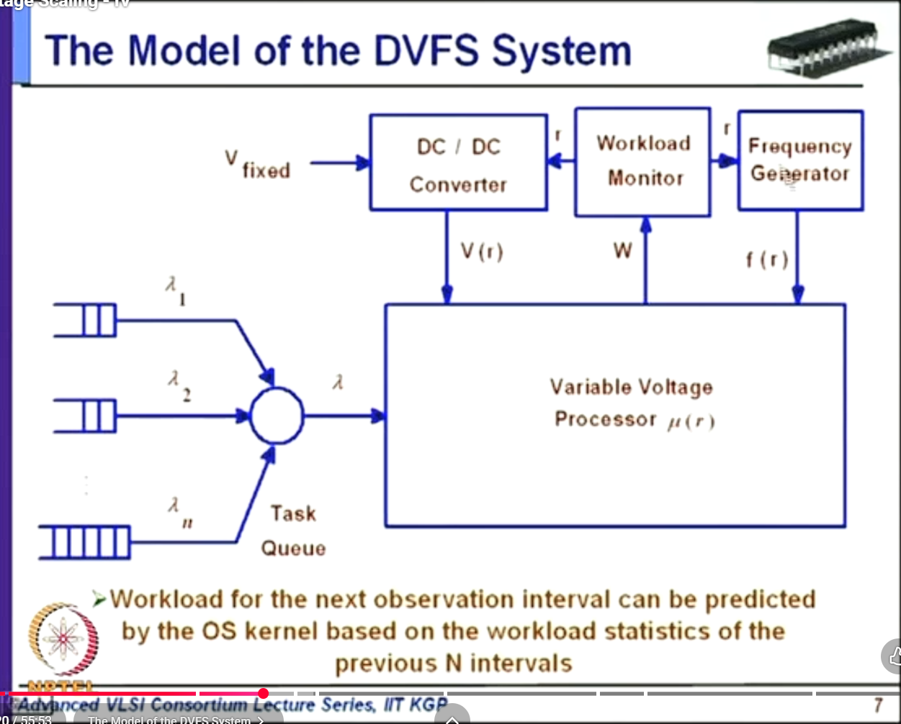

Clearer capture of the same slide:

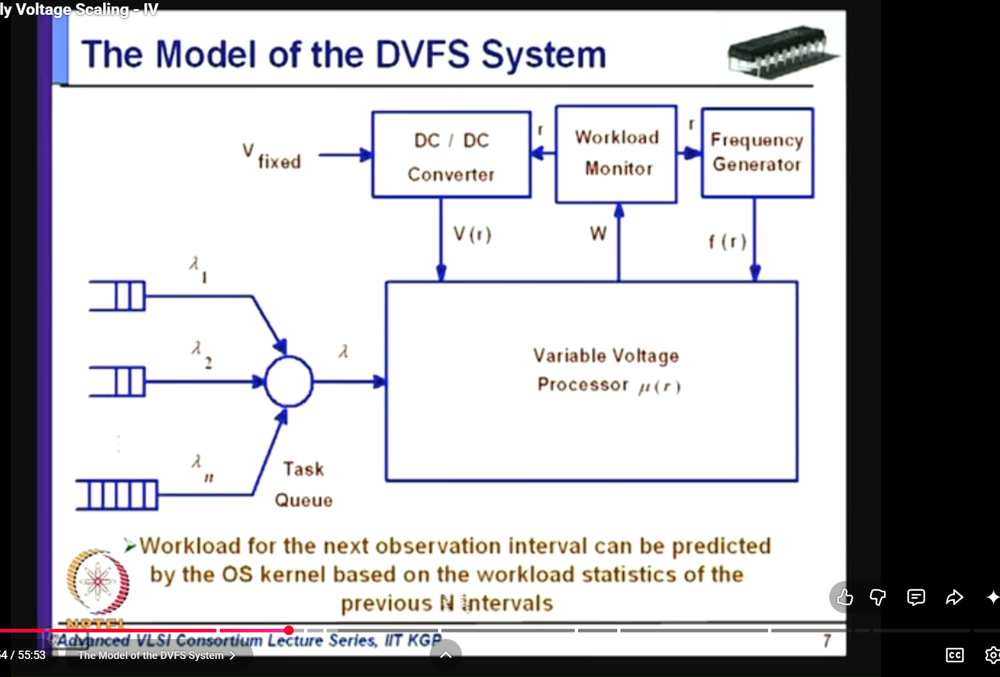

### Definition Of A DVFS System Model

A DVFS system model describes how a processor automatically changes its voltage and frequency based on workload.

The system has three main jobs:

```text
1. observe workload
2. choose a voltage/frequency operating point
3. run the processor at that operating point
```

The goal is:

```text
meet performance demand with minimum possible power
```

### What This Image Shows

The image shows a feedback-control view of DVFS.

The main blocks are:

```text
task queue
variable-voltage processor
workload monitor
DC/DC converter
frequency generator
```

The incoming tasks enter a queue.

The processor executes the queued tasks.

The workload monitor observes how much work is waiting or how busy the processor is.

Then it controls both:

```text
DC/DC converter -> changes supply voltage
frequency generator -> changes clock frequency
```

So the processor receives:

```text
V(r) -> selected supply voltage
f(r) -> selected clock frequency
```

### Meaning Of The Symbols

| Symbol | Meaning |
|---|---|
| `lambda_1, lambda_2, ..., lambda_n` | input task streams or task arrival rates |
| `lambda` | combined arrival rate into the task queue |
| `Task Queue` | buffer that stores pending work before execution |
| `mu(r)` | service rate/performance of the processor at setting `r` |
| `W` | measured workload or workload information |
| `r` | control setting chosen by the workload monitor |
| `V_fixed` | fixed input supply given to the voltage converter |
| `V(r)` | output voltage selected for control setting `r` |
| `f(r)` | clock frequency selected for control setting `r` |

Here `lambda` and `mu` are queueing-style symbols.

In simple words:

```text
lambda -> how fast work arrives
mu     -> how fast the processor serves work
```

For stable operation, the processor must serve work fast enough:

```text
mu(r) >= lambda
```

If:

```text
lambda > mu(r)
```

tasks arrive faster than they are processed, so the queue grows and response time becomes worse.

### Meaning Of `r`

The symbol `r` is the selected DVFS operating point or control level.

Example:

```text
r = 0 -> low-power mode
r = 1 -> medium mode
r = 2 -> high-performance mode
```

For each `r`, the system chooses a matching voltage and frequency:

```text
r low  -> low V(r), low f(r)
r high -> high V(r), high f(r)
```

This is why both the DC/DC converter and frequency generator receive the same control variable `r`.

They must move together.

If frequency is increased without enough voltage, timing can fail.

If voltage is increased without needing higher frequency, power is wasted.

### Task Queue Meaning

The task queue stores waiting jobs.

It is useful because workload is not perfectly constant.

Tasks may arrive in bursts:

```text
low arrival for some time
sudden high arrival
then low arrival again
```

The queue gives the workload monitor a visible signal:

```text
empty/small queue -> low workload
large queue       -> high workload
```

So the queue length is a practical clue for choosing the DVFS state.

### Workload Monitor Meaning

The workload monitor estimates how much processing is needed.

It can observe:

```text
queue length
CPU utilization
missed deadlines
previous task arrival rate
instruction count
performance counters
```

In the slide, the bottom sentence says:

```text
Workload for the next observation interval can be predicted by the OS kernel
based on the workload statistics of the previous N intervals.
```

Meaning:

The system does not know the future exactly.

So it estimates the next interval from recent history.

Example:

```text
last N intervals were busy -> predict next interval may be busy
last N intervals were light -> predict next interval may be light
```

### Observation Interval

An observation interval is the time window over which the system measures workload and decides whether to change voltage/frequency.

Example:

```text
every 1 ms, 5 ms, or 10 ms
```

the controller checks workload and chooses a new operating point.

If the interval is too short:

```text
controller changes V/f too often
transition overhead increases
```

If the interval is too long:

```text
controller reacts slowly
power may be wasted or performance may suffer
```

So the observation interval must balance responsiveness and overhead.

### DC/DC Converter Meaning

The DC/DC converter takes a fixed input supply:

```text
V_fixed
```

and produces the selected processor supply:

```text
V(r)
```

If workload is low, the controller chooses a lower `r`, so the converter outputs lower `V(r)`.

If workload is high, the controller chooses a higher `r`, so the converter outputs higher `V(r)`.

The converter is necessary because the processor cannot directly create many safe supply voltages from a fixed battery or board supply.

### Frequency Generator Meaning

The frequency generator produces the selected clock:

```text
f(r)
```

This block may be implemented using:

```text
PLL
clock divider
digitally controlled oscillator
frequency synthesizer
```

The clock frequency must match the selected voltage.

The rule is:

```text
lower VDD -> slower transistors -> lower safe f
higher VDD -> faster transistors -> higher safe f
```

### Variable Voltage Processor Meaning

The processor is marked:

```text
Variable Voltage Processor mu(r)
```

This means its processing rate depends on the selected DVFS setting.

At high `r`:

```text
high V(r)
high f(r)
large mu(r)
high power
```

At low `r`:

```text
low V(r)
low f(r)
small mu(r)
low power
```

So `mu(r)` is the rate at which the processor can complete tasks under operating point `r`.

### Control Flow In The Diagram

The feedback loop works like this:

```text
1. tasks arrive with total rate lambda
2. tasks wait in the task queue
3. processor executes tasks at rate mu(r)
4. workload monitor observes workload W
5. workload monitor selects control level r
6. r controls DC/DC converter and frequency generator
7. processor receives V(r) and f(r)
8. processor speed and power change
```

This is a closed loop because the processor's behavior affects workload, and workload affects the next processor setting.

### How This Latest DVFS Screenshot Works In Depth

This screenshot is showing a control system.

It is not just a block diagram of hardware.

It is saying:

```text
measure workload -> decide required performance -> set voltage and frequency -> observe again
```

The system keeps repeating this loop.

That is why DVFS is called dynamic.

The voltage and frequency are not fixed once forever. They are adjusted as the workload changes.

### Step 1: Tasks Arrive

On the left side, several input task streams arrive:

```text
lambda_1
lambda_2
...
lambda_n
```

Each `lambda_i` means one source of work.

Example:

```text
lambda_1 -> video decoding tasks
lambda_2 -> user interface tasks
lambda_3 -> network packet processing tasks
lambda_n -> background OS tasks
```

These task streams combine into one total workload arrival rate:

```text
lambda = lambda_1 + lambda_2 + ... + lambda_n
```

So `lambda` means:

```text
how fast new work is entering the processor system
```

### Step 2: The Task Queue Stores Waiting Work

The task queue is a buffer.

If tasks arrive faster than the processor can finish them, the queue grows.

If the processor is faster than the arrival rate, the queue shrinks.

So queue behavior tells the controller whether the current processor speed is enough.

Important cases:

```text
queue empty or small -> current speed may be more than needed
queue growing       -> current speed is too low
queue stable        -> current speed roughly matches workload
```

This is why the task queue is connected to the DVFS idea.

The queue is a practical way to see whether the processor is underloaded or overloaded.

### Step 3: The Processor Serves Work At Rate `mu(r)`

Inside the big rectangle, the processor is marked:

```text
Variable Voltage Processor mu(r)
```

`mu(r)` means the processor's service rate at DVFS setting `r`.

In simple words:

```text
mu(r) = how fast the processor can finish tasks when it uses setting r
```

If `r` is high:

```text
V(r) is high
f(r) is high
mu(r) is high
power is high
```

If `r` is low:

```text
V(r) is low
f(r) is low
mu(r) is low
power is low
```

So the controller wants to choose the smallest `r` that still gives enough service rate.

The ideal condition is:

```text
mu(r) just greater than lambda
```

Not much smaller, because then the queue grows.

Not much larger, because then power is wasted.

### Step 4: The Processor Sends Workload Information `W`

The vertical arrow from the processor to the workload monitor is labeled:

```text
W
```

`W` means measured workload information.

It may include:

```text
task queue length
processor utilization
number of cycles spent busy
number of cycles spent stalled
deadline misses
instruction count
memory/cache miss rate
```

The workload monitor uses `W` to answer:

```text
Is the processor too slow, too fast, or just right?
```

### Step 5: The Workload Monitor Predicts The Next Interval

The slide says the next workload can be predicted by the OS kernel using statistics from the previous `N` intervals.

This means DVFS is usually not based only on the current instant.

It uses history:

```text
previous interval 1
previous interval 2
...
previous interval N
```

Then the OS or hardware controller predicts:

```text
next interval workload
```

Example:

```text
if the last several intervals were busy -> choose higher r
if the last several intervals were light -> choose lower r
```

This is needed because changing voltage and frequency takes time.

The controller must act before performance becomes bad.

This is the same general idea used by interval-based DVFS schedulers: predict future load from past behavior, then scale voltage and clock frequency for the next interval.

### Step 6: The Workload Monitor Chooses `r`

The arrows from the workload monitor to the DC/DC converter and frequency generator are labeled:

```text
r
```

`r` is the selected performance level.

Think of `r` as an index into a voltage-frequency table.

Example table:

| `r` | Mode | `V(r)` | `f(r)` | `mu(r)` |
|---:|---|---:|---:|---:|
| 0 | low power | `0.70 V` | `300 MHz` | low |
| 1 | balanced | `0.85 V` | `600 MHz` | medium |
| 2 | performance | `1.00 V` | `1 GHz` | high |

The actual numbers depend on the chip.

The idea is:

```text
r selects both voltage and frequency together
```

### Step 7: The DC/DC Converter Produces `V(r)`

The DC/DC converter receives:

```text
V_fixed
```

and produces:

```text
V(r)
```

So it converts a fixed supply into the supply voltage needed by the processor for the selected DVFS level.

For example:

```text
V_fixed = 1.2 V
r = 0 -> V(r) = 0.70 V
r = 1 -> V(r) = 0.85 V
r = 2 -> V(r) = 1.00 V
```

The processor cannot simply choose any arbitrary voltage instantly.

The DC/DC converter has:

```text
settling delay
conversion efficiency loss
voltage ramp rate limit
output ripple
control overhead
```

So voltage changes must be controlled carefully.

### Step 8: The Frequency Generator Produces `f(r)`

The frequency generator produces the clock frequency:

```text
f(r)
```

For the same `r` table:

```text
r = 0 -> f(r) = 300 MHz
r = 1 -> f(r) = 600 MHz
r = 2 -> f(r) = 1 GHz
```

This block may use a PLL, divider, oscillator, or clock-generation circuit.

The important point is that frequency and voltage must be coordinated.

Frequency cannot be chosen independently of voltage.

### Why Voltage And Frequency Must Move Together

Lower voltage reduces power, but it also increases gate delay.

So:

```text
lower VDD -> gates become slower
```

If the clock frequency is still high, the clock period may become too short for the slower gates.

Then setup timing fails.

So the safe rule is:

```text
high frequency needs high enough voltage
low frequency allows lower voltage
```

That is why the same control value `r` goes to both:

```text
DC/DC converter
frequency generator
```

They must select a compatible pair:

```text
(V(r), f(r))
```

### Safe Transition Order

This is very important.

When increasing performance:

```text
raise VDD first
then raise frequency
```

Reason:

If frequency is raised first while voltage is still low, the circuit may not meet timing.

When decreasing performance:

```text
lower frequency first
then lower VDD
```

Reason:

If voltage is lowered first while frequency is still high, the circuit may again fail timing.

So:

```text
up-scaling:   VDD up -> frequency up
down-scaling: frequency down -> VDD down
```

This safety sequencing is not drawn explicitly in the slide, but it is implied whenever voltage and frequency are changed together.

### How The Controller Decides Whether To Increase Or Decrease `r`

A simple DVFS decision policy can be understood like this:

```text
if queue is growing quickly:
    increase r
elif queue is small and deadlines are safe:
    decrease r
else:
    keep r unchanged
```

More detailed version:

```text
if predicted workload is high:
    choose higher V(r), higher f(r)
elif predicted workload is low:
    choose lower V(r), lower f(r)
else:
    keep current V(r), f(r)
```

The controller is trying to avoid two bad cases:

```text
too high r -> power waste
too low r  -> queue growth, delay, missed deadlines
```

### Why This Saves Power

Dynamic power is:

```text
P_dynamic = alpha * C_L * VDD^2 * f
```

DVFS reduces:

```text
VDD
f
```

So if workload is low, the system can lower frequency and voltage.

Because `VDD` is squared, voltage reduction gives a strong power saving.

Example:

```text
VDD reduced to 0.8 of original
frequency reduced to 0.5 of original
```

Then:

```text
P_new / P_old = (0.8)^2 * 0.5
              = 0.64 * 0.5
              = 0.32
```

So power becomes about:

```text
32% of original
```

This is why DVFS is stronger than only frequency scaling.

### Why The System Does Not Always Choose The Lowest `r`

The lowest `r` gives lowest power, but it also gives lowest service rate:

```text
low r -> low mu(r)
```

If `mu(r)` becomes less than the arrival rate:

```text
mu(r) < lambda
```

then the task queue grows.

That means:

```text
more waiting time
higher latency
possible deadline misses
bad performance
```

So DVFS is not simply:

```text
always use lowest voltage
```

It is:

```text
use the lowest voltage-frequency pair that still meets workload demand
```

### Full Working Example

Assume the processor has three DVFS levels:

| Setting | Voltage | Frequency | Use |
|---|---:|---:|---|
| `r = 0` | `0.70 V` | `300 MHz` | light workload |
| `r = 1` | `0.85 V` | `600 MHz` | medium workload |
| `r = 2` | `1.00 V` | `1 GHz` | heavy workload |

At first, task arrivals are low:

```text
lambda is small
queue is almost empty
```

The workload monitor selects:

```text
r = 0
```

The converter outputs:

```text
V(0) = 0.70 V
```

The frequency generator outputs:

```text
f(0) = 300 MHz
```

Power is low.

Now many tasks arrive:

```text
lambda increases
queue length increases
```

The workload monitor detects this through `W` and predicts that the next interval will be busy.

It selects:

```text
r = 2
```

For a safe performance increase:

```text
VDD is raised first
frequency is raised after voltage is stable
```

Now:

```text
V(2) = 1.00 V
f(2) = 1 GHz
mu(2) is high
```

The queue begins to drain.

When workload falls again, the monitor lowers `r`.

For a safe power decrease:

```text
frequency is lowered first
VDD is lowered after frequency is safe
```

This cycle repeats throughout operation.

### What You Should Infer From The Screenshot

The screenshot is saying:

```text
DVFS is a feedback loop, not a one-time setting.
```

The task queue and workload monitor decide how much performance is needed.

The DC/DC converter supplies the matching voltage.

The frequency generator supplies the matching clock.

The variable-voltage processor then runs at the selected power-performance point.

The monitor observes again and updates the decision for the next interval.

### What Can Go Wrong In DVFS

DVFS is powerful, but it is not free.

Main problems:

```text
wrong workload prediction
voltage transition delay
frequency/PLL lock delay
DC/DC converter energy loss
too many voltage changes
timing failure if V and f are mismatched
large queueing delay if frequency is too low
```

So a good DVFS controller must be:

```text
fast enough to react
stable enough not to oscillate
conservative enough to avoid timing failure
accurate enough to avoid power waste
```

### Example

Suppose the task queue becomes large.

That means:

```text
lambda is high or mu(r) is too low
```

The workload monitor increases `r`.

Then:

```text
V(r) increases
f(r) increases
mu(r) increases
```

The processor now finishes tasks faster.

Power also increases, but performance demand is satisfied.

Now suppose the queue becomes almost empty.

The workload monitor decreases `r`.

Then:

```text
V(r) decreases
f(r) decreases
mu(r) decreases
```

The processor runs slower, but that is acceptable because workload is low.

Power reduces because both voltage and frequency reduce.

### Why Prediction Is Needed

Voltage and frequency cannot change instantly.

There is overhead due to:

```text
DC/DC converter settling time
PLL or clock-generator locking time
software decision time
safe transition sequencing
```

Therefore the controller must predict workload ahead of time.

If it waits until the queue is already too large, performance may already be hurt.

If it predicts too high:

```text
voltage/frequency are raised unnecessarily -> wasted power
```

If it predicts too low:

```text
processor too slow -> queue builds up -> deadlines may be missed
```

So DVFS quality depends heavily on workload prediction.

### Short Exam Answer For This Image

The DVFS system model shows a feedback loop in which incoming task streams enter a task queue and are processed by a variable-voltage processor. The workload monitor observes workload `W`, predicts the next observation interval from previous workload statistics, and selects a control setting `r`. This setting controls both the DC/DC converter and the frequency generator. The DC/DC converter produces the supply voltage `V(r)`, while the frequency generator produces the clock frequency `f(r)`. The processor service rate is `mu(r)`, meaning its performance depends on the selected voltage-frequency pair. If workload is high, `r` is increased so voltage, frequency, and service rate increase. If workload is low, `r` is reduced so voltage and frequency decrease, saving power.

## Image 15: Variable Voltage Generator

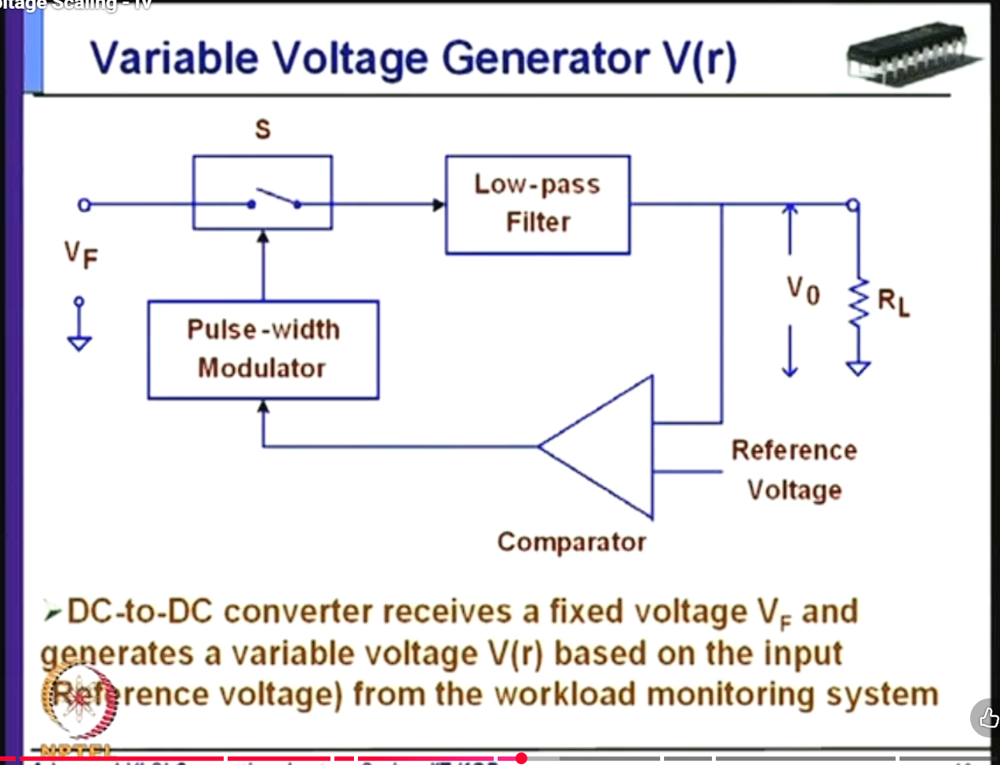

### Definition Of Variable Voltage Generator

A variable voltage generator is a circuit that produces an adjustable output voltage from a fixed input voltage.

In the DVFS context:

```text
fixed supply VF -> variable processor supply V(r)
```

The output voltage changes according to the performance setting selected by the workload monitor.

The slide says the DC-to-DC converter receives a fixed voltage `VF` and generates a variable voltage `V(r)` based on the input reference voltage from the workload monitoring system.

### Why This Block Is Needed In DVFS

DVFS needs the processor supply voltage to change.

But the battery, adapter, or board supply is usually fixed or only slowly varying.

So the processor needs a converter:

```text
fixed input voltage -> controlled lower/higher output voltage
```

Without this block, the workload monitor could decide a low-power voltage level, but the processor would have no hardware mechanism to actually receive that voltage.

### What This Image Shows

This image shows a feedback-controlled DC/DC converter.

Main parts:

```text
VF
switch S
pulse-width modulator
low-pass filter
output voltage V0
load resistor RL
comparator
reference voltage
feedback path
```

The basic working idea is:

```text
PWM controls how long the switch is ON
switch creates a pulsed waveform
low-pass filter smooths the pulses into DC
comparator checks output against reference
feedback adjusts PWM to correct the output
```

### Use Of Each Element

| Element | Use |
|---|---|
| `VF` | fixed input supply voltage available to the converter |
| ground symbol | reference node for voltages |
| switch `S` | rapidly connects/disconnects `VF` to create a switched waveform |
| pulse-width modulator | controls switch ON-time and OFF-time |
| low-pass filter | smooths the switched pulses into a nearly DC output voltage |
| `V0` | actual output voltage delivered to the load/processor |
| `RL` | load resistance representing the processor or circuit consuming power |
| feedback line | sends actual output voltage back for checking |
| comparator | compares actual output voltage with desired reference voltage |
| reference voltage | target voltage requested by workload monitor/DVFS controller |

### Fixed Input Voltage `VF`

`VF` is the fixed supply voltage feeding the converter.

Example:

```text
VF = 1.2 V or 3.3 V or battery voltage
```

The converter does not create energy by itself.

It reshapes the available input supply into the voltage required by the processor.

In a DVFS system:

```text
VF is fixed
V0 or V(r) is variable
```

### Switch `S`

The switch `S` is the power switch of the converter.

It is usually implemented using a transistor such as a MOSFET.

Its job is to turn the input supply on and off rapidly.

When `S` is ON:

```text
VF is connected toward the filter
```

When `S` is OFF:

```text
VF is disconnected
```

This creates a pulsed waveform.

The converter then controls the average value of this pulsed waveform.

### Pulse-Width Modulator

The pulse-width modulator, or `PWM`, controls the switch.

It decides:

```text
how long S stays ON
how long S stays OFF
```

The fraction of time for which the switch is ON is called duty cycle.

```text
duty cycle D = ON time / total switching period
```

For an ideal simple buck-like converter:

```text
V0 approximately = D * VF
```

So:

```text
larger duty cycle -> higher output voltage
smaller duty cycle -> lower output voltage
```

Example:

```text
VF = 1.2 V
D = 0.75
V0 ~= 0.9 V
```

This is how the converter generates different voltage levels for DVFS.

### Low-Pass Filter

The switch output is not a clean DC voltage.

It is a pulse train.

The low-pass filter removes high-frequency switching ripple and keeps the average value.

So:

```text
PWM pulses -> low-pass filter -> smooth DC output
```

In real converters, this filter is usually made using inductors and capacitors.

Its use is:

```text
reduce voltage ripple
store/release energy smoothly
protect processor from pulsed supply
```

The processor cannot be powered directly by a harsh pulsed waveform.

It needs a stable supply voltage.

### Output Voltage `V0`

`V0` is the actual output voltage after filtering.

This is the voltage applied to the load `RL`.

In the DVFS system model, this output corresponds to:

```text
V(r)
```

So:

```text
V0 = actual generated voltage
V(r) = desired/generated voltage for setting r
```

If the workload monitor asks for a low-power mode, `V0` is reduced.

If it asks for a high-performance mode, `V0` is increased.

### Load `RL`

`RL` represents the load connected to the converter.

In the lecture diagram, it is drawn as a resistor for simplicity.

In a real DVFS system, the load is:

```text
processor core
logic block
voltage island
functional unit
```

The load consumes current.

If the load current changes, the output voltage may try to droop or rise.

That is why feedback is needed.

### Comparator

The comparator compares:

```text
actual output voltage V0
desired reference voltage
```

If output voltage is too low:

```text
V0 < reference
```

the comparator tells the PWM to increase duty cycle.

Then the switch stays ON longer, and output voltage rises.

If output voltage is too high:

```text
V0 > reference
```

the comparator tells the PWM to reduce duty cycle.

Then the switch stays ON for less time, and output voltage falls.

So the comparator is the error detector of the feedback loop.

### Reference Voltage

The reference voltage is the target output voltage.

It comes from the workload monitoring system or DVFS controller.

Example:

```text
low workload  -> reference = 0.70 V
medium load   -> reference = 0.85 V
high workload -> reference = 1.00 V
```

The converter tries to make:

```text
V0 = reference voltage
```

So the reference voltage tells the converter what output voltage should be generated.

### Feedback Path

The feedback path carries the actual output voltage back to the comparator.

Without feedback, the converter would not know whether the output voltage is correct.

The load current may change because processor activity changes.

Example:

```text
processor suddenly becomes busy -> load current increases -> V0 may droop
```

Feedback detects this droop and corrects it.

So feedback provides regulation.

### How The Whole Circuit Works Step By Step

Step 1:

```text
workload monitor chooses desired voltage
```

Example:

```text
reference voltage = 0.8 V
```

Step 2:

```text
comparator compares V0 with 0.8 V
```

Step 3:

If:

```text
V0 is below 0.8 V
```

then PWM increases duty cycle.

Step 4:

```text
switch S stays ON longer
```

Step 5:

```text
average voltage entering low-pass filter increases
```

Step 6:

```text
low-pass filter smooths it
```

Step 7:

```text
V0 rises toward 0.8 V
```

Step 8:

When:

```text
V0 ~= reference voltage
```

the converter settles.

The processor now receives the DVFS-selected voltage.

### Why The Output Is Variable

The output is variable because the reference voltage is variable.

The workload monitor changes the reference depending on required performance.

So:

```text
reference changes -> comparator detects mismatch -> PWM changes duty cycle -> V0 changes
```

This is how the DVFS system physically changes the processor supply voltage.

### Relation To The Previous DVFS System Model

In the previous DVFS-system-model image, the DC/DC converter block produced:

```text
V(r)
```

This image opens that DC/DC converter block and shows how it can be implemented.

So:

```text
previous image -> system-level DVFS feedback loop
this image     -> voltage-generator circuit inside that loop
```

The workload monitor chooses `r`.

The chosen `r` becomes or generates a reference voltage.

The converter then adjusts its duty cycle until:

```text
V0 = V(r)
```

### Why A Low-Pass Filter Is Used Instead Of Direct PWM Output

PWM output rapidly switches between high and low values.

A processor supply cannot be a raw switching waveform because that would create:

```text
large supply noise
logic delay variation
possible timing failures
reliability problems
```

The low-pass filter converts the PWM waveform into a smooth DC level.

So the processor sees:

```text
stable voltage
```

not:

```text
rapid ON/OFF pulses
```

### Short Exam Answer For This Image

The variable voltage generator is a feedback-controlled DC/DC converter used in DVFS to generate the required processor supply voltage `V(r)` from a fixed input voltage `VF`. The pulse-width modulator controls the switch `S`, changing its duty cycle. The switched waveform is smoothed by the low-pass filter to produce the output voltage `V0`, which supplies the load `RL`. The comparator compares `V0` with the reference voltage from the workload monitor. If `V0` is lower than the reference, the PWM increases duty cycle; if `V0` is higher, it decreases duty cycle. Thus the feedback loop regulates the output voltage so the processor receives the voltage required by the selected DVFS operating point.

## Image 16: Variable Frequency Generator

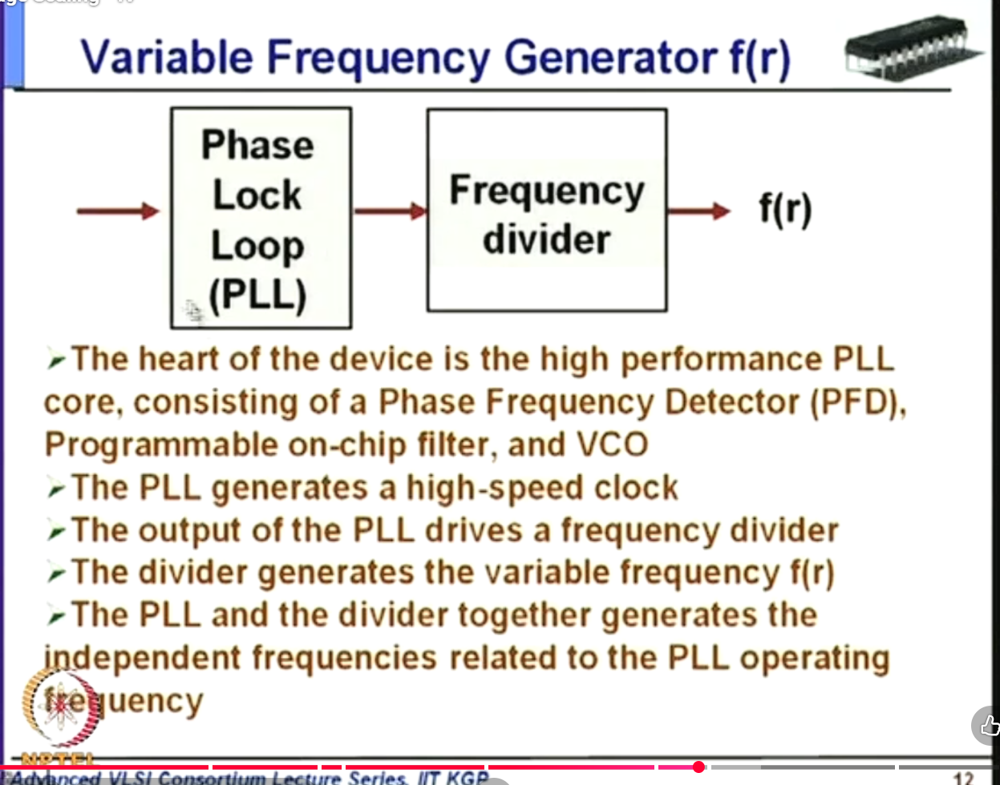

### Definition Of Variable Frequency Generator

A variable frequency generator is a clock-generation circuit that produces a selectable output clock frequency.

In a DVFS system, it generates:

```text
f(r)
```

where `r` is the operating point selected by the workload monitor.

So:

```text
low r  -> lower frequency
high r -> higher frequency
```

### What This Image Shows

The image shows a simple frequency-generation chain:

```text
PLL -> frequency divider -> f(r)
```

The slide says the heart of the device is a high-performance PLL core.

The PLL produces a stable high-speed clock.

The frequency divider then derives lower selectable frequencies from that PLL clock.

### Use Of Each Block

| Block | Use |
|---|---|
| input/reference clock | gives the PLL a stable timing reference |
| Phase Locked Loop, or `PLL` | generates a stable high-speed clock related to the reference |
| phase-frequency detector, or `PFD` | compares reference clock and feedback clock phase/frequency |
| programmable on-chip filter | smooths the control signal and helps PLL stability |
| voltage-controlled oscillator, or `VCO` | generates the high-frequency clock inside the PLL |
| frequency divider | divides the high-speed PLL clock to produce selectable lower clocks |
| `f(r)` | final frequency chosen for DVFS operating point `r` |

### What A PLL Does

A Phase Locked Loop locks an output clock to a reference clock.

The word "locks" means:

```text
the output clock has a controlled phase/frequency relationship with the reference clock
```

The PLL can generate a clock that is:

```text
faster than the reference
stable
programmable
suitable for processor timing
```

In this slide, the PLL is used because the processor needs a clean high-speed clock, not a random or unstable signal.

### Main Parts Inside The PLL

The slide mentions:

```text
PFD
programmable on-chip filter
VCO
```

PFD:

```text
compares the reference clock and feedback clock
detects whether output is too slow or too fast
```

Filter:

```text
smooths the PFD output
sets loop stability and response speed
```

VCO:

```text
generates the oscillator output
changes frequency according to control voltage
```

Together they create a controlled clock source.

### What The Frequency Divider Does

The divider takes the high-speed PLL output and divides it by an integer or programmable ratio.

Example:

```text
PLL output = 1.2 GHz
divide by 2 -> 600 MHz
divide by 4 -> 300 MHz
divide by 8 -> 150 MHz
```

So the final clock can be selected as:

```text
f(r) = f_PLL / divider_ratio(r)
```

This is how one PLL can support several DVFS frequency levels.

### Why A Divider Is Needed

Changing the PLL frequency directly can be slower and more complex.

A divider lets the system quickly choose among multiple clock frequencies derived from the same PLL.

So:

```text
PLL -> creates a high-quality parent clock
divider -> creates selectable child clocks
```

This is useful in DVFS because workload can change frequently.

### Relation To DVFS

In the previous DVFS model, the frequency generator produced:

```text
f(r)
```

This slide opens that frequency-generator block.

The workload monitor selects `r`.

Then:

```text
r selects divider value
divider value selects f(r)
```

Example:

| `r` | Desired Mode | Divider | Output `f(r)` |
|---:|---|---:|---:|
| 0 | low power | 8 | `150 MHz` |
| 1 | medium | 4 | `300 MHz` |
| 2 | high performance | 2 | `600 MHz` |

The exact frequencies depend on the design.

### Why Frequency Must Match Voltage

The frequency generator cannot be considered alone.

It must be coordinated with the variable voltage generator.

If frequency is high, the circuit needs enough voltage to meet timing.

If frequency is low, voltage can be reduced.

So DVFS always selects a pair:

```text
(V(r), f(r))
```

not just `f(r)` alone.

### Short Exam Answer For This Image

The variable frequency generator in a DVFS system generates the clock frequency `f(r)` corresponding to the selected operating point `r`. A PLL produces a stable high-speed clock using a phase-frequency detector, loop filter, and VCO. The PLL output then drives a programmable frequency divider. By changing the divider ratio, the system obtains different output frequencies from the same high-speed PLL clock. This lets the DVFS controller lower frequency during low workload and raise frequency during high workload. The selected frequency must be paired with a safe supply voltage `V(r)`.

## Image 17: Workload Prediction

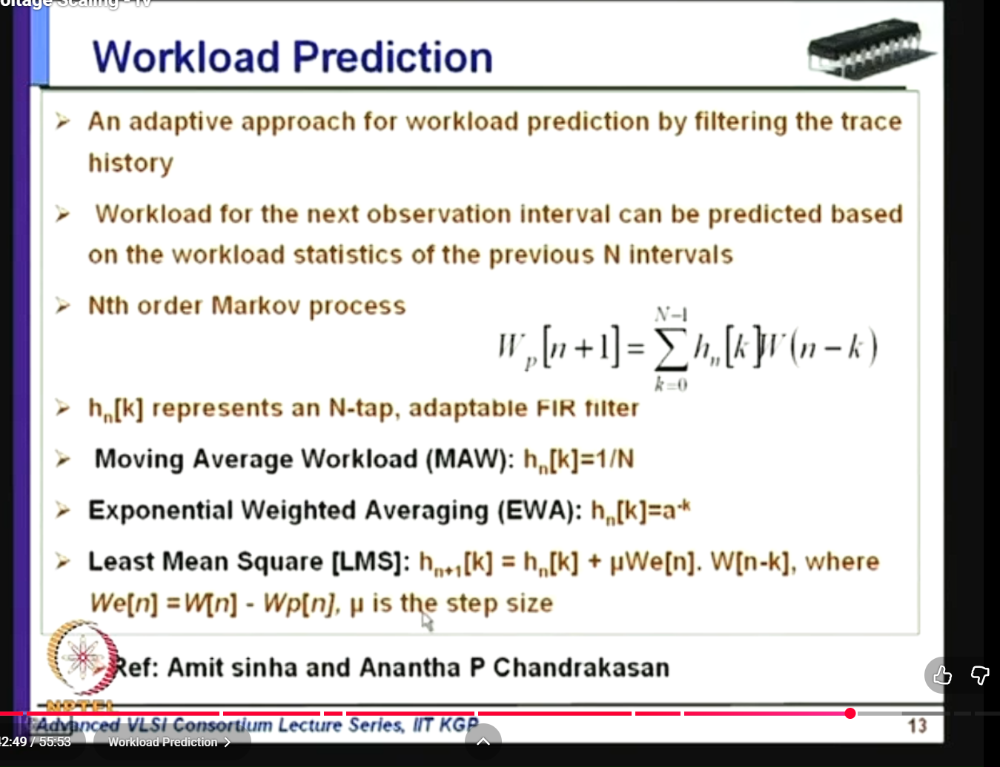

### Definition Of Workload Prediction

Workload prediction means estimating how much work the processor will need to do in the next observation interval.

In DVFS, workload prediction is used to choose the next voltage-frequency pair:

```text
predicted high workload -> high V(r), high f(r)
predicted low workload  -> low V(r), low f(r)
```

This matters because voltage and frequency cannot change instantly.

The controller must predict early enough to avoid performance loss.

### What This Image Shows

The slide describes an adaptive filtering approach for workload prediction.

It says the next workload can be predicted from the previous `N` workload intervals.

The main equation is:

```text
Wp[n+1] = sum from k=0 to N-1 of h_n[k] W(n-k)
```

Meaning:

```text
predicted next workload = weighted sum of recent past workloads
```

### Use Of Each Term In The Equation

| Term | Use |
|---|---|
| `W(n)` | actual workload measured at current interval `n` |
| `W(n-k)` | workload measured `k` intervals ago |
| `Wp[n+1]` | predicted workload for the next interval |
| `N` | number of past intervals used for prediction |
| `h_n[k]` | weight assigned to the `k`th previous workload sample |
| `k` | index over old samples |
| summation | adds weighted past samples to form prediction |

So the equation is a filter over workload history.

The output of the filter is the predicted workload.

### Why It Is Called An N-Tap FIR Filter

The slide says:

```text
h_n[k] represents an N-tap adaptable FIR filter
```

`FIR` means Finite Impulse Response.

Here it means the prediction uses only a finite number of previous samples:

```text
W(n), W(n-1), W(n-2), ..., W(n-N+1)
```

`N-tap` means there are `N` coefficients:

```text
h_n[0], h_n[1], ..., h_n[N-1]
```

Each coefficient controls the importance of one previous workload sample.

### Why It Is Adaptive

The filter is adaptive because the coefficients can change with time.

Workload behavior is not always fixed.

Example:

```text
video workload may be periodic
web workload may be bursty
background workload may be slow-changing
```

An adaptive predictor changes its weights to better match the recent workload pattern.

### Moving Average Workload, MAW

The slide says:

```text
MAW: h_n[k] = 1/N
```

This means all previous `N` samples are given equal weight.

So:

```text
predicted workload = average of last N workloads
```

Use:

```text
simple
stable
good when workload changes slowly
```

Limitation:

```text
slow to react to sudden workload changes
```

Example with `N = 4`:

```text
Wp[n+1] = (W[n] + W[n-1] + W[n-2] + W[n-3]) / 4
```

### Exponential Weighted Averaging, EWA

The slide says:

```text
EWA: h_n[k] = a^-k
```

The usual idea is that recent samples are weighted more than older samples.

So the predictor reacts more strongly to the latest workload.

Use:

```text
better than simple average for changing workload
gives more importance to recent behavior
smooths noise while still tracking trend
```

Interpretation:

```text
recent workload -> larger effect
older workload  -> smaller effect
```

This is useful when the workload changes gradually or has recent trends.

### Least Mean Square, LMS

The slide gives:

```text
h_{n+1}[k] = h_n[k] + mu * We[n] * W[n-k]
```

where:

```text
We[n] = W[n] - Wp[n]
```

LMS updates the filter weights based on prediction error.

If the predictor was wrong, the weights are adjusted.

Use:

```text
learns workload pattern automatically
adapts when workload behavior changes
can improve prediction compared with fixed averaging
```

### Meaning Of `We[n]`

`We[n]` is the workload prediction error.

```text
We[n] = actual workload - predicted workload
```

If:

```text
We[n] > 0
```

the actual workload was higher than predicted.

The controller may need to increase future prediction.

If:

```text
We[n] < 0
```

the actual workload was lower than predicted.

The controller may reduce future prediction.

### Meaning Of `mu`

`mu` is the step size of the LMS update.

It controls how aggressively the predictor changes its weights.

Small `mu`:

```text
slow adaptation
more stable
less sensitive to noise
```

Large `mu`:

```text
fast adaptation
can react quickly
may become unstable or noisy
```

So `mu` controls the tradeoff between speed and stability.

### Why Workload Prediction Is Important For DVFS

DVFS has transition overhead.

Changing voltage/frequency takes time because of:

```text
DC/DC converter settling
PLL lock time
safe voltage-frequency sequencing
software/controller delay
```

So if the system waits until workload is already high, the processor may be too slow during the transition.

Prediction lets the controller prepare the correct operating point for the next interval.

### How Prediction Controls Voltage And Frequency

The predicted workload becomes the basis for choosing `r`.

Example:

```text
predicted workload = low  -> r = 0 -> low V(r), low f(r)
predicted workload = mid  -> r = 1 -> medium V(r), medium f(r)
predicted workload = high -> r = 2 -> high V(r), high f(r)
```

The goal is:

```text
choose the lowest r that still handles the predicted workload
```

This saves power without missing timing or performance deadlines.

### What Happens If Prediction Is Wrong

If workload is over-predicted:

```text
chosen V/f too high
power wasted
```

If workload is under-predicted:

```text
chosen V/f too low
queue grows
latency increases
deadline may be missed
```

So workload prediction quality directly affects DVFS power and performance.

### Short Exam Answer For This Image

Workload prediction estimates the next interval's workload from the previous `N` workload samples. The slide models prediction as an adaptive FIR filter: `Wp[n+1]` is a weighted sum of previous workloads `W(n-k)` using coefficients `h_n[k]`. In Moving Average Workload, all `N` samples have equal weight. In Exponential Weighted Averaging, recent samples are weighted more strongly. In LMS prediction, the coefficients are adapted using the prediction error `We[n] = W[n] - Wp[n]` and step size `mu`. Workload prediction is important in DVFS because voltage and frequency changes have delay, so the system must estimate the next workload early enough to select a safe and power-efficient `V(r), f(r)` pair.

## Image 18: Discrete Processing Rate

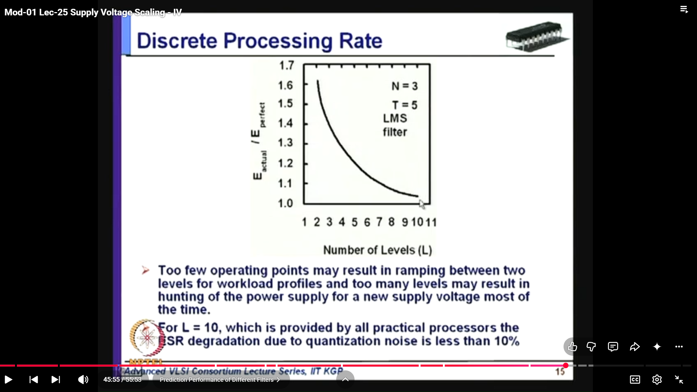

### Definition Of Discrete Processing Rate

Discrete processing rate means the processor cannot use every possible speed continuously.

Instead, it uses a finite set of allowed voltage-frequency operating points.

Example:

```text
level 1 -> 0.70 V, 300 MHz
level 2 -> 0.80 V, 500 MHz
level 3 -> 0.90 V, 700 MHz
level 4 -> 1.00 V, 1 GHz
```

So the processing rate is quantized into levels.

### What This Image Shows

The graph plots:

```text
x-axis -> number of levels L
y-axis -> E_actual / E_perfect
```

Here:

```text
E_actual  -> energy consumed using discrete DVFS levels
E_perfect -> ideal energy if infinitely fine voltage/frequency choices were available
```

So the best possible value is:

```text
E_actual / E_perfect = 1
```

That means no extra energy compared with the ideal continuous case.

### Meaning Of The Curve

The curve decreases as the number of levels `L` increases.

Meaning:

```text
more DVFS levels -> closer to ideal energy
```

If there are only a few levels, the controller may be forced to choose a voltage/frequency higher than necessary.

That wastes energy.

If there are more levels, the controller can choose a point closer to the exact workload requirement.

That reduces energy waste.

### Use Of Each Quantity In The Graph

| Quantity | Use |
|---|---|
| `L` | number of available processing-rate levels |
| `E_actual` | energy consumed with practical discrete levels |
| `E_perfect` | energy consumed by ideal continuous scaling |
| `E_actual / E_perfect` | energy penalty due to discrete quantization |
| `N = 3` | predictor/filter uses three previous intervals |
| `T = 5` | observation/control interval parameter used in the experiment |
| `LMS filter` | workload predictor used to select DVFS level |

### Why Too Few Levels Are Bad

Suppose the workload needs:

```text
550 MHz
```

but the processor only supports:

```text
300 MHz
1 GHz
```

Then 300 MHz may be too slow, so the controller chooses 1 GHz.

That wastes power.

This is why the slide says too few operating points may cause ramping between two levels.

The controller may keep jumping between:

```text
too low
too high
too low
too high
```

because there is no good middle level.

### Why Too Many Levels Can Also Be Bad

Too many levels sound ideal, but they create control overhead.

If many small levels are available, the controller may keep chasing tiny workload changes.

The slide calls this:

```text
hunting of the power supply
```

Meaning:

```text
the supply voltage keeps changing most of the time
```

This is bad because every change has overhead:

```text
DC/DC converter settling
PLL/frequency adjustment
control decision time
possible voltage noise
energy spent during transition
```

So the number of levels must be enough for efficiency, but not so many that the system constantly transitions.

### What The Slide Means By `L = 10`

The slide says for:

```text
L = 10
```

the degradation due to quantization noise is less than `10%`.

Meaning:

With around ten operating levels, the actual energy is close to ideal:

```text
E_actual / E_perfect < about 1.1
```

So the energy penalty is less than 10%.

That is a practical design point:

```text
enough levels to approximate ideal DVFS
not too many levels to cause excessive control overhead
```

### Short Exam Answer For This Image

Discrete processing rate means that a practical DVFS processor supports only a finite number of voltage-frequency levels. The graph shows `E_actual/E_perfect` versus the number of levels `L`. With few levels, the processor cannot closely match the required workload, so it may use a higher voltage/frequency than necessary, wasting energy. As `L` increases, the energy approaches the ideal continuous-scaling case. However, too many levels can cause frequent supply-voltage hunting and transition overhead. The slide indicates that around `L = 10` levels can keep quantization energy degradation below about 10% in the shown example.

## Image 19: Latency Overhead

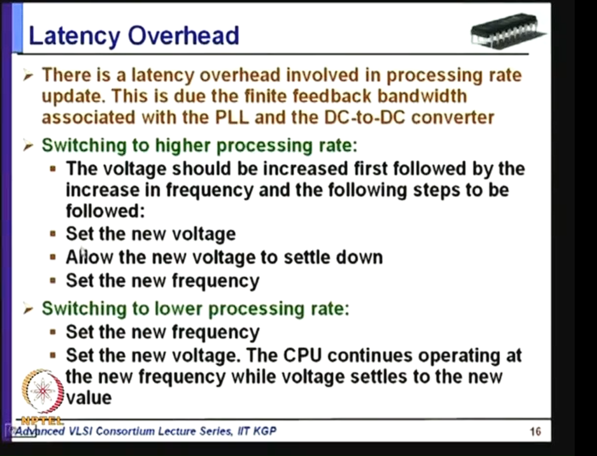

### Definition Of Latency Overhead In DVFS

Latency overhead is the extra time taken to change the processing rate.

In DVFS, changing processing rate requires changing:

```text
voltage
frequency
```

These changes are not instantaneous.

The slide says latency overhead occurs because of finite feedback bandwidth in:

```text
PLL
DC-to-DC converter
```

### Use Of Each Item Mentioned

| Item | Use |
|---|---|
| processing rate update | changing processor speed by changing `V(r)` and `f(r)` |
| PLL | changes or locks the new clock frequency |
| DC-to-DC converter | changes the processor supply voltage |
| feedback bandwidth | determines how quickly the converter/PLL can respond |
| voltage settling | waiting until new voltage becomes stable |
| frequency update | setting the new clock frequency safely |

### Why Latency Overhead Exists

The DC/DC converter cannot jump instantly from one voltage to another.

It must ramp and settle:

```text
old VDD -> transition -> stable new VDD
```

Similarly, the PLL or clock generator needs time to lock or settle at the new frequency.

So DVFS has a delay whenever the operating point changes.

This delay is called latency overhead.

### The Deep Reason Voltage And Frequency Must Be Ordered

A digital circuit is safe only if:

```text
clock period >= worst-case path delay
```

Clock period is the inverse of frequency:

```text
T_clk = 1 / f
```

So:

```text
higher frequency -> smaller T_clk -> less time for logic
lower frequency  -> larger T_clk  -> more time for logic
```

Supply voltage controls transistor speed.

Higher voltage gives more drive current:

```text
higher VDD -> smaller gate delay -> faster circuit
```

Lower voltage gives less drive current:

```text
lower VDD -> larger gate delay -> slower circuit
```

Therefore each frequency requires a minimum safe voltage.

You can remember it like this:

```text
frequency asks: how much time is available?
voltage decides: how fast can gates finish?
```

If you ask the circuit to run faster without first giving it enough voltage, the data may not arrive before the next clock edge.

That is a timing failure.

### Switching To Higher Processing Rate

The slide says:

```text
increase voltage first
then increase frequency
```

Steps:

```text
1. set the new voltage
2. allow the new voltage to settle
3. set the new frequency
```

Reason:

Higher frequency means shorter clock period.

The circuit needs stronger transistor drive to meet that shorter period.

Stronger drive requires higher `VDD`.

If frequency is increased before voltage settles:

```text
clock is too fast for the current low voltage
```

Then setup timing can fail.

So for up-scaling:

```text
VDD up first -> wait -> frequency up
```

### Why Higher Rate Needs Voltage First

Suppose the processor is currently running at:

```text
VDD = 0.7 V
f = 300 MHz
```

At `0.7 V`, the gates are slow, but `300 MHz` gives a long enough clock period.

Now suppose workload increases and the processor must move to:

```text
VDD = 1.0 V
f = 1 GHz
```

If the system increases frequency first:

```text
VDD still 0.7 V
f becomes 1 GHz
```

then the gates are still slow, but the clock period has become short.

So a critical path may need, for example:

```text
delay at 0.7 V = 2 ns
clock period at 1 GHz = 1 ns
```

That is impossible:

```text
2 ns delay > 1 ns clock period
```

The processor can capture wrong data.

So the safe sequence is:

```text
1. increase VDD
2. wait until VDD settles
3. increase frequency
```

After voltage settles:

```text
delay at 1.0 V may become 0.8 ns
clock period at 1 GHz = 1 ns
```

Now timing is safe:

```text
0.8 ns delay < 1 ns clock period
```

That is the exact reason voltage comes first when moving to a higher processing rate.

### Switching To Lower Processing Rate

The slide says:

```text
set the new frequency first
then set the new voltage
```

Meaning:

```text
1. reduce clock frequency
2. reduce supply voltage
3. CPU continues operating while voltage settles
```

Reason:

If voltage is lowered first while frequency is still high:

```text
transistors slow down but clock is still fast
```

That can violate timing.

So for down-scaling:

```text
frequency down first -> voltage down after
```

This keeps the clock slow enough for the reduced voltage.

### Why Lower Rate Needs Frequency First

Suppose the processor is currently running at:

```text
VDD = 1.0 V
f = 1 GHz
```

Now workload decreases, so the system wants:

```text
VDD = 0.7 V
f = 300 MHz
```

If the system lowers voltage first:

```text
VDD becomes 0.7 V
f is still 1 GHz
```

then gates become slow while the clock is still fast.

Example:

```text
delay at 0.7 V = 2 ns
clock period at 1 GHz = 1 ns
```

Again:

```text
2 ns delay > 1 ns clock period
```

Timing fails.

So the safe sequence is:

```text
1. reduce frequency
2. reduce voltage
```

After frequency is reduced:

```text
clock period at 300 MHz ~= 3.33 ns
```

Then even if voltage is reduced and gate delay becomes:

```text
delay at 0.7 V = 2 ns
```

timing is still safe:

```text
2 ns delay < 3.33 ns clock period
```

That is why frequency comes first when moving to a lower processing rate.

### Why CPU Can Continue While Voltage Settles During Down-Scaling

During down-scaling, the frequency has already been lowered.

Lower frequency gives longer clock period.

So while voltage is moving downward, the processor is still safe because the clock is already slow.

That is why the slide says the CPU continues operating at the new frequency while voltage settles to the new value.

### Why Waiting For Voltage Settling Is Necessary

When the controller sets a new voltage, the output of the DC/DC converter does not instantly equal the target value.

It passes through a transition:

```text
old voltage -> ramping voltage -> settled new voltage
```

During this time, the voltage may be between old and new values, and it can have ripple or transient error.

If the frequency is raised before voltage is fully settled:

```text
the circuit may still be operating at an insufficient VDD
```

That creates timing risk.

This is why the slide explicitly says:

```text
allow the new voltage to settle down
```

before setting the higher frequency.

### Memory Rule

For exam memory:

```text
Going faster:
first make gates fast enough by raising VDD,
then shorten the clock period by raising frequency.

Going slower:
first lengthen the clock period by lowering frequency,
then make gates slower by lowering VDD.
```

Compact form:

```text
up-scaling   -> V first, f second
down-scaling -> f first, V second
```

### Why This Matters For Workload Prediction

Because DVFS transitions have latency, the controller must predict future workload.

If workload suddenly increases and the controller reacts late:

```text
voltage must rise
voltage must settle
frequency must rise
```

During that time, the processor may be too slow.

So workload prediction helps the system move to a higher processing rate before the queue becomes too large.

### Short Exam Answer For This Image

DVFS has latency overhead because voltage and frequency cannot change instantly. The DC/DC converter has finite bandwidth and needs time for the new voltage to settle, while the PLL or clock generator needs time to produce or lock to the new frequency. When switching to a higher processing rate, voltage must be increased first and allowed to settle, then frequency is increased, because high frequency requires sufficient supply voltage to meet timing. When switching to a lower processing rate, frequency is reduced first, then voltage is reduced; the CPU can continue at the lower frequency while the voltage settles. This sequencing prevents timing violations during DVFS transitions.

## Dynamic Voltage And Frequency Scaling

Dynamic Voltage and Frequency Scaling, or `DVFS`, means the system changes both supply voltage and clock frequency dynamically according to workload.

The key word is:

```text
dynamic
```

The slide says DVFS is an extension of MVS where many voltage levels are dynamically applied for different workloads.

Meaning:

```text
high workload -> high frequency + high voltage
low workload  -> low frequency + low voltage
```

### Why Frequency Is Also Changed

Voltage and frequency are linked.

If the voltage is lowered, the circuit becomes slower. Therefore the maximum safe clock frequency also becomes lower.

So DVFS changes both:

```text
VDD
f
```

Typical rule:

```text
lower performance demand -> reduce f first, then reduce VDD enough for that f
```

This saves power because:

```text
P_dynamic = alpha * C_L * VDD^2 * f
```

DVFS reduces both:

```text
VDD
f
```

So power can reduce strongly during low-workload periods.

### What Workload Means

Workload means how much computation the system currently needs to perform.

Examples:

```text
CPU decoding video -> high workload
CPU waiting for user input -> low workload
sensor node sleeping -> very low workload
processor handling burst request -> temporary high workload
```

DVFS is useful because real workloads are not constant.

### DVFS Example

Suppose a processor can run in three modes:

| Mode | Voltage | Frequency | Use Case |
|---|---:|---:|---|
| High performance | `1.0 V` | `1.0 GHz` | heavy workload |
| Medium | `0.8 V` | `600 MHz` | moderate workload |
| Low power | `0.6 V` | `250 MHz` | light workload |

When the workload is light, running at `1.0 V` and `1.0 GHz` wastes power.

DVFS selects a lower operating point.

## SVS Vs MVS Vs DVFS

| Feature | SVS | MVS | DVFS |
|---|---|---|---|
| Full name | Static Voltage Scaling | Multi-level Voltage Scaling | Dynamic Voltage and Frequency Scaling |
| Voltage choice | fixed per block/subsystem | two or few fixed levels | many levels adjusted dynamically |
| Runtime adaptation | low | moderate | high |
| Frequency scaling | usually no | sometimes | yes |
| Best for | blocks with known timing needs | multiple voltage domains/modes | variable workload systems |
| Main benefit | simple power reduction | better power/performance tradeoff than SVS | strong runtime power saving |
| Main cost | not adaptive | level shifters and domain complexity | regulators, PLL control, OS/hardware management |
| Example | peripheral at low fixed VDD | high/low voltage islands | CPU changes V/f with load |

Compact memory:

```text
SVS  -> fixed voltage assignment
MVS  -> choose among few voltage levels
DVFS -> dynamically change voltage and frequency with workload
```

## Main Challenges

Supply voltage scaling is powerful, but it creates design problems.

### 1. Delay Increases

Lower voltage slows down gates.

```text
lower VDD -> lower drive current -> larger delay
```

If timing is violated, the circuit gives wrong results.

### 2. Lower Limit Of VDD

Voltage cannot be reduced arbitrarily.

As `VDD` approaches threshold voltage `Vth`, delay rises sharply and noise margins reduce.

### 3. Analog Blocks May Suffer

Digital power improves with voltage scaling, but analog circuits often need voltage headroom and signal swing.

So:

```text
voltage scaling helps digital logic
but can hurt analog performance
```

### 4. Level Converters Are Needed

Multiple voltage domains need safe crossing circuits.

This adds:

```text
area
delay
power
verification complexity
```

### 5. Power Grid And Floorplanning Become Harder

Multiple Vdd domains require:

```text
separate power rails
voltage islands
careful placement
careful routing
power sequencing
```

### 6. Clock Distribution Becomes Harder

If the clock crosses voltage domains, clock buffers and level shifters must be designed carefully.

Clock skew and timing closure become more complicated.

### 7. DVFS Has Transition Overhead

Changing voltage and frequency is not instantaneous.

DVFS needs:

```text
voltage regulator settling time
PLL/frequency lock time
control policy
workload prediction
safe operating points
```

If the system changes voltage too often, the transition overhead can reduce the benefit.

## Relation To Previous Low-Power Techniques

Earlier files focused on reducing switching activity or switched capacitance.

Those techniques mainly reduce:

```text
alpha
C_L
sometimes f
```

Supply voltage scaling reduces:

```text
VDD
```

So the full dynamic power equation connects the topics:

```text
P_dynamic = alpha * C_L * VDD^2 * f
```

| Technique | Main Term Reduced |
|---|---|
| Bus encoding | `alpha` |
| Clock gating | `alpha` and effective clock activity |
| FSM encoding | `alpha` |
| FSM partitioning | active `C_L` and `alpha` |
| Operand isolation | `alpha` |
| Supply voltage scaling | `VDD^2` |
| DFS | `f` |
| DVFS | `VDD^2` and `f` |

This is why supply voltage scaling is very important: it attacks the squared term in the power equation.

## Short Exam Answer

Supply voltage scaling is a low-power technique in which the supply voltage of a circuit or subsystem is reduced or adjusted to reduce power. Since CMOS dynamic power is `P_dynamic = alpha*C_L*VDD^2*f`, reducing `VDD` gives a quadratic reduction in dynamic power. Static voltage scaling assigns fixed voltages to different blocks. Multi-level voltage scaling uses two or a few fixed voltage levels or voltage domains. Dynamic voltage and frequency scaling changes both voltage and frequency at runtime according to workload. The main limitation is that lowering voltage increases delay, so timing, level conversion, power distribution, clock distribution, and voltage-transition overhead must be handled carefully.

## Sources Used

- Local slide deck: `PPT/PVL 207 Lec 7 (Voltage Scaling for low power).pptx`
- Local slide deck: `PPT/PVL 207 Lec 8 (Multilevel Voltage scaling).pptx`
- Local slide deck: `PPT/PVL 207 Lec 9 (DFS and DVFS).pptx`
- NPTEL course page, Low Power VLSI Circuits & Systems, IIT Kharagpur: https://nptel.ac.in/courses/106105034
- NPTEL/Digimat page for `Lecture 22 - Supply Voltage Scaling - I`: https://digimat.in/nptel/courses/video/106105034/L22.html
- NPTEL/Digimat page for `Lecture 25 - Supply Voltage Scaling - IV`: https://digimat.in/nptel/courses/video/106105034/L25.html
- NPTEL syllabus PDF listing voltage scaling and switched-capacitance minimization topics: https://archive.nptel.ac.in/content/syllabus_pdf/106105034.pdf
- USENIX OSDI paper on interval-based voltage/frequency scheduling: https://www.usenix.org/legacy/event/osdi00/full_papers/weiser/weiser.pdf
- Amit Sinha and Anantha P. Chandrakasan, `Dynamic Voltage Scheduling Using Adaptive Filtering of Workload Traces`: https://citeseerx.ist.psu.edu/document?doi=b268a046a2a104d17f9a7477c15e6904e6512789&repid=rep1&type=pdf
- Intel documentation, `Building Blocks of a PLL`: https://www.intel.com/content/www/us/en/docs/programmable/683732/17-0/building-blocks-of-a-pll.html
- Springer chapter by Ajit Pal, `Supply Voltage Scaling`, in *Low-Power VLSI Circuits and Systems*: https://link.springer.com/chapter/10.1007/978-81-322-1937-8_7
